# 前后端通信文档

此文档为详细版api文档

## 返回码一览

#### HTTP返回码
| 200 | OK                 |                               |
|-----|--------------------|-------------------------------|
| 201 | Created            | POST创建新数据                |
| 202 | Accepted           | 请求成功，但还未执行（用于异步） |
| 302 | Found              | 重定向                        |
| 400 | Bad Request        | 请求格式错误                  |
| 401 | Unauthorized       | 身份未认证                    |
| 403 | Forbidden          | 身份已认证，但没有权限         |
| 404 | Not Found          | 资源不存在                    |
| 405 | Method Not Allowed | 请求方法错误                  |

#### 业务返回码
- 0: 成功
- 登录&注册相关
    - 1001: 注册失败，用户名或密码缺失
    - 1002: 注册失败，用户名被占用
    - 1003: 登录失败，用户名不存在
    - 1004: 登录失败，密码错误
- 查询个人信息相关
    - 1101: JWT解析错误
    - 1102: 用户不存在
- 消息发送相关
    - 2001: 消息不合法
    - 2002: 身份验证失败
    - 2003: 聊天室不存在
    - 2004: 好友不存在
    - 2010: 进入会话时JWT token验证失败 / url格式错误（没有token或者c）
    - 2011: 会话不存在（用户试图加入不存在的会话时报错）
    - 2012: 无权进入会话（用户试图进入没有权限的会话时报错）
- 历史记录相关
    - 3001: 消息缺少Autorization
    - 3002: JWT Token认证失败
    - 3003: conversation不存在
    - 3004: 用户不属于此会话
- 好友相关
    - 4001: 身份验证失败
    - 4002: 试图添加重复的好友
    - 4003: 试图添加不存在的人为好友
    - 4004: 试图重复邀请
    - 4005: 试图同意不存在的好友申请
    - 4006: 试图添加自己为好友

- 好友相关
    - 4001: 身份验证失败
    - 4002: 试图添加重复的好友
    - 4003: 试图添加不存在的人为好友
    - 4004: 试图重复邀请
    - 4005: 试图同意不存在的好友申请
    - 4006: 试图添加自己为好友

- 其他内部错误
    - 9001: 找不到用户数据（在jwt验证成功时）（可能是数据库损坏导致）

# API文档与通信流程

## 登录 & 注册
### 注册
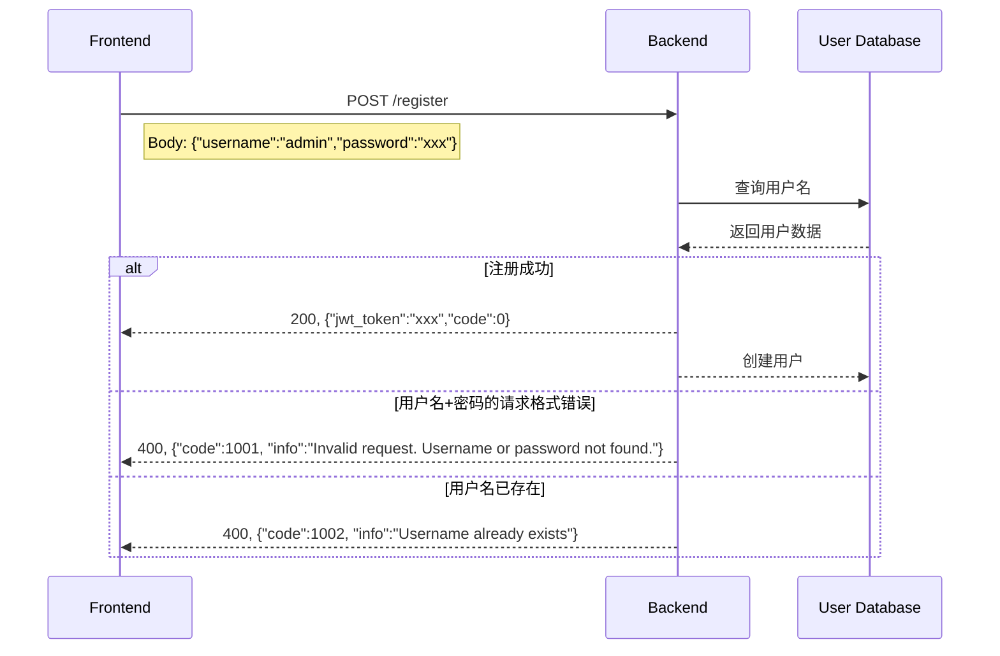

### 登录
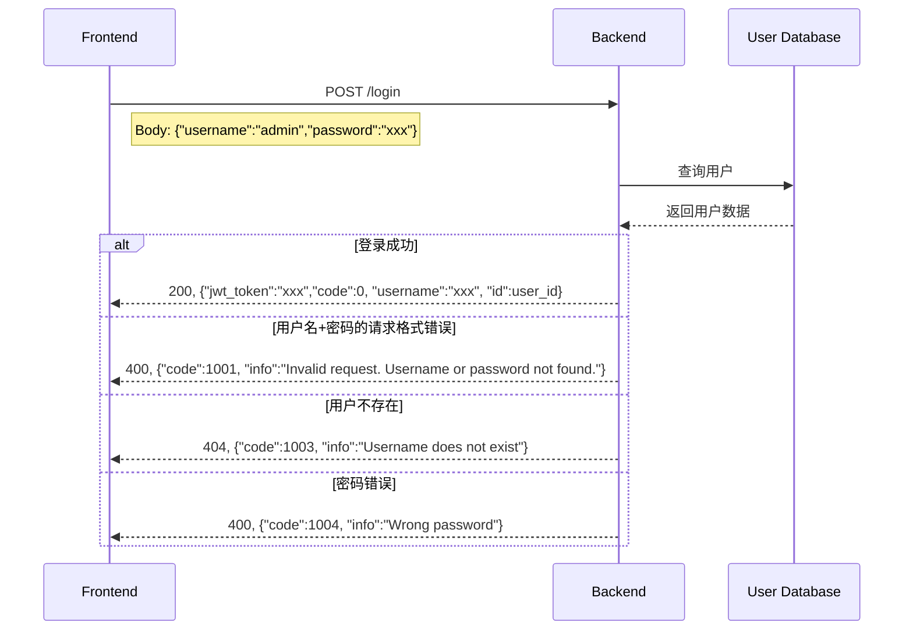

### 上传个人Profile
**TODO: 上传Avatar和Info**

## 好友 & 个人信息

注意，所有user在登录的时候，要主动向服务器请求好友信息，以备有任何变更、新的申请。

### 搜索指定人
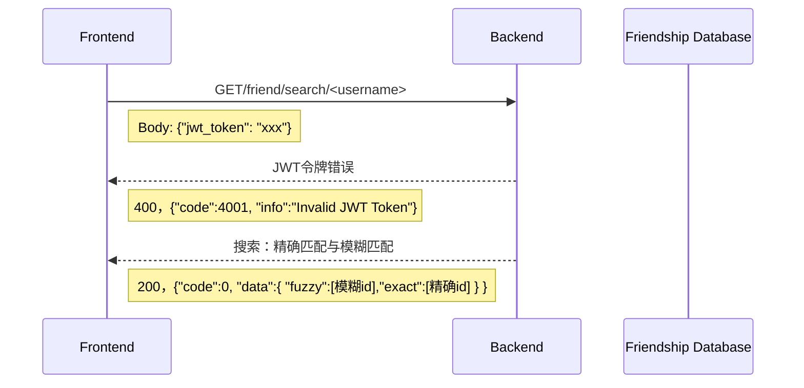

### 申请添加好友
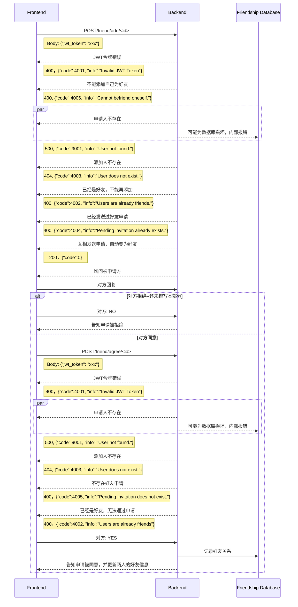

### 同意好友申请
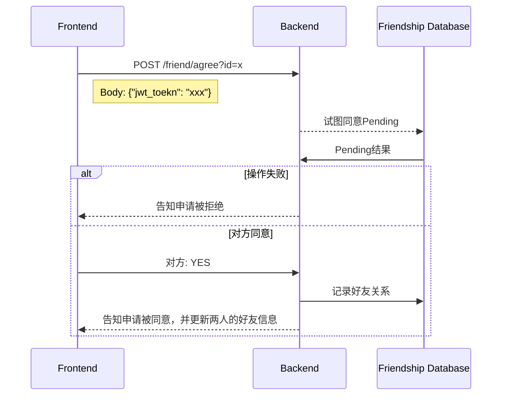

### 获得好友列表
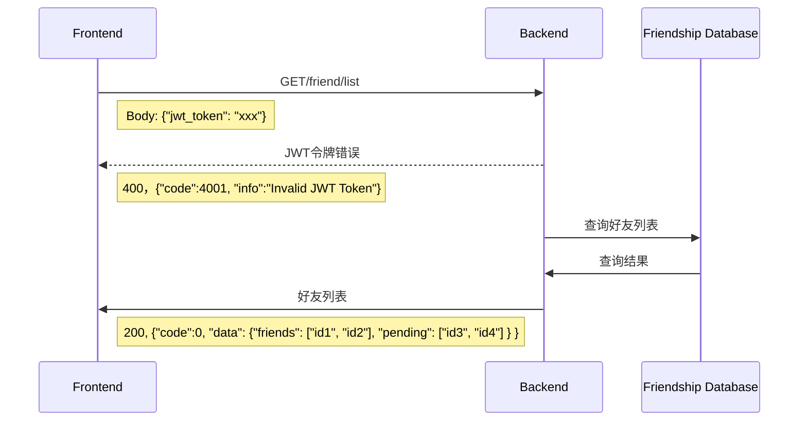

### 请求个人信息
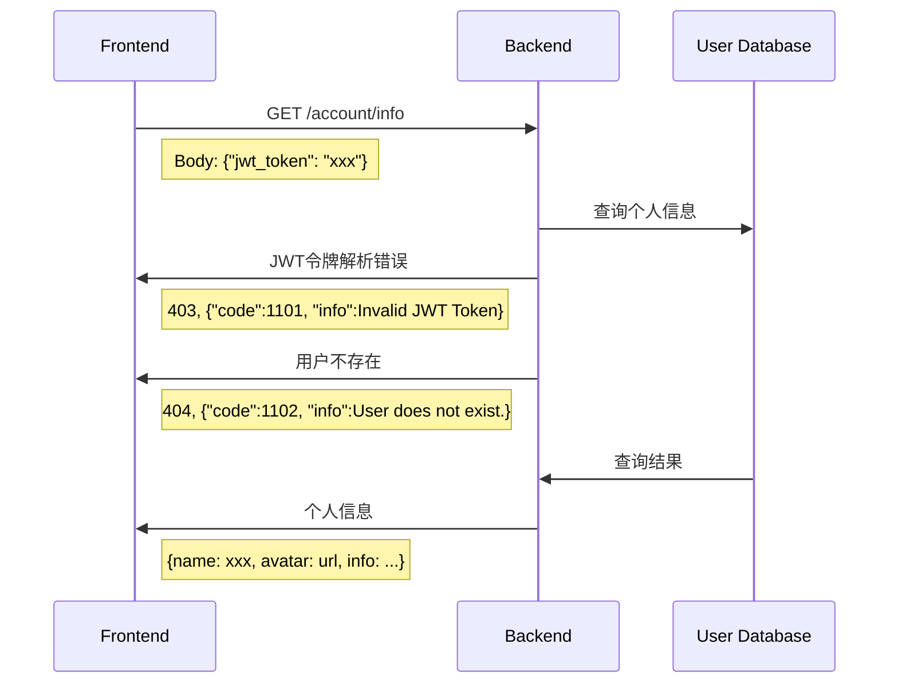

## 消息

### 请求创建好友会话
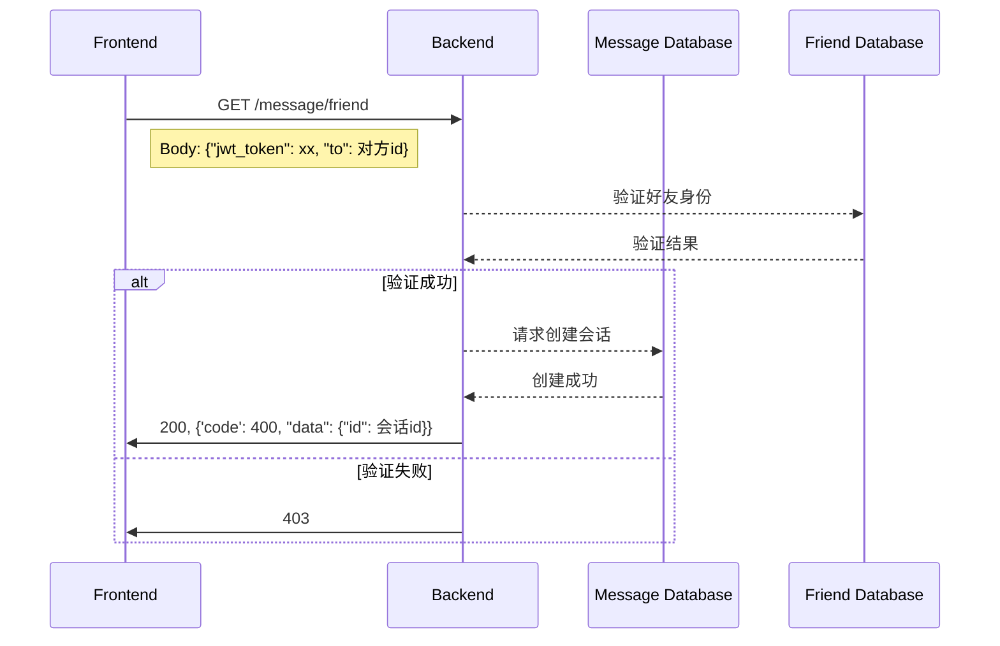

### 请求创建群组会话


### 请求消息记录
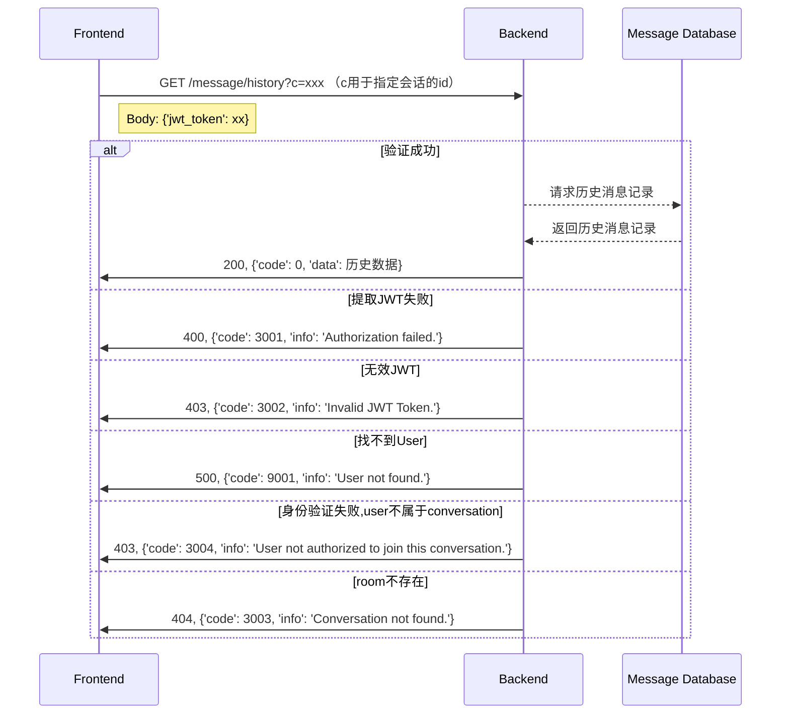

### 请求创建好友会话
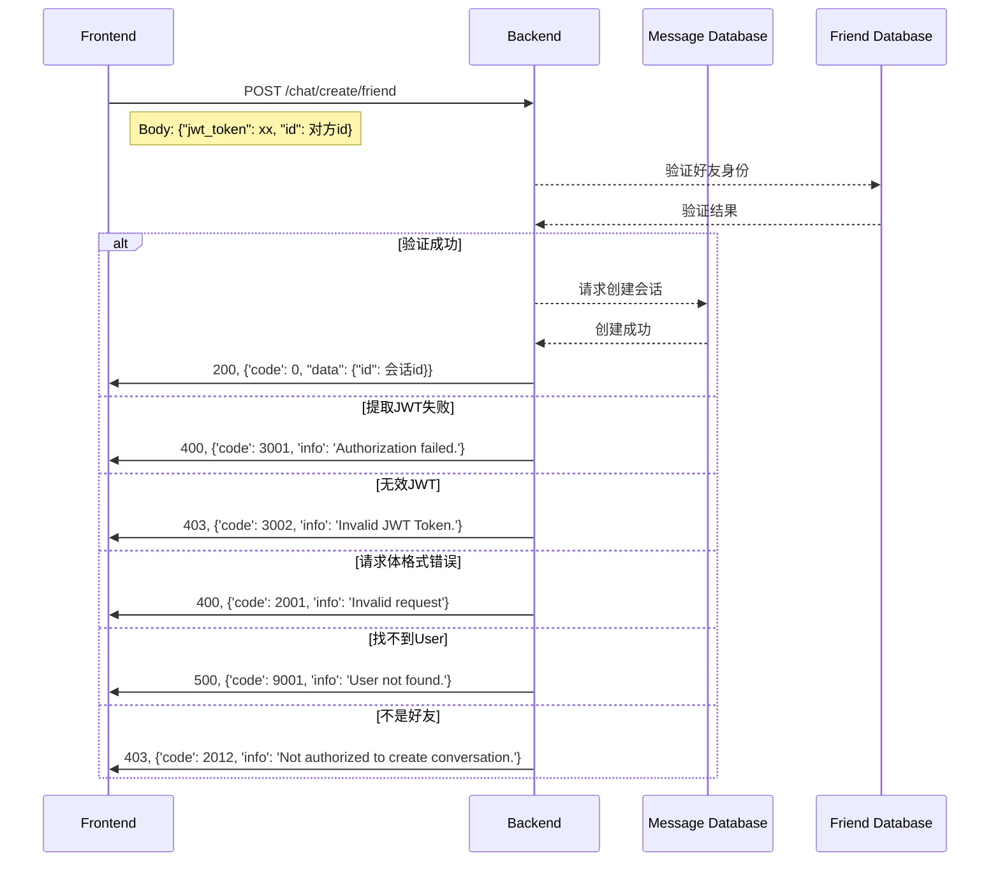

### 发送消息

使用websocket实现

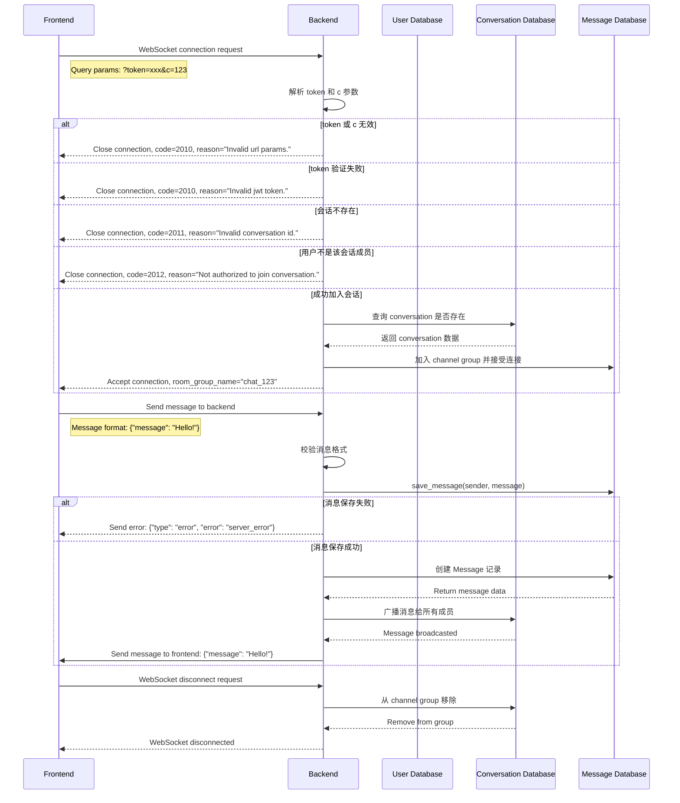

发送的具体消息json为
```json
payload: {
    "message": "..."
}
```
注意这里的url用于发送图片

#### 发送消息全过程示意图
```
┌──────────────────────────────────────────────────────┐
│                 用户A打开聊天界面                     │
└──────────────────────────────────────────────────────┘
             │
  [1] 前端 fetch 历史消息（HTTP）
             │
  向后端 /message/history 请求历史消息
             │
  后端从数据库 Message 取出 → 返回 JSON
             │
  前端渲染聊天记录（完成历史加载）
             │
┌────────────────────────────────────────────┐
│ [2] 前端通过 WebSocket 连接后端 /ws/chat/    │
└────────────────────────────────────────────┘
             │
后端 consumer 建立一个 WebSocket 连接对象（scope.user = A）
             │
后端将 A 加入对应的房间组 (Group)
  └── 比如: conversation_3  (一个群/私聊)
             │
┌────────────────────────────────────────────┐
│ [3] 用户 A 发送一条新消息                     │
└────────────────────────────────────────────┘
             │
前端 WebSocket send({
    "type": "chat.message",
    "conversation_id": 3,
    "content": "Hello!"
})
             │
后端 consumer 接收到消息
  ├── 保存到数据库 Message
  └── 将消息广播到该 conversation 的 group
             │
[其他成员（如用户 B）的 consumer] 收到 group 消息
             │
前端 B 的 WebSocket onmessage() 回调触发
  └── 新消息出现在聊天窗口
             │
┌────────────────────────────────────────────┐
│ [4] 用户离开聊天界面                          │
└────────────────────────────────────────────┘
             │
前端执行 websocket.close()
             │
后端 consumer 的 disconnect() 被调用
  └── 将用户从 group 移除
             │
连接关闭，结束。
```

### 接收消息
接收格式为
```json
{
    "sender": "xxx",
    "text": "......"
}
```


## 其他隐藏API

### 上传图片

前端上传一张图片到后端，后端返回url


