# API文档
[跳转附录](#appendix)
## 一、用户管理部分

### 1、用户注册（基本管理）
格式规定：
【username】1-30字符，只能包含汉字、字母、数字、下划线、点（不能以后两个开头或结尾）
【password】8-128字符，必须包含字母和数字，不能包含空格

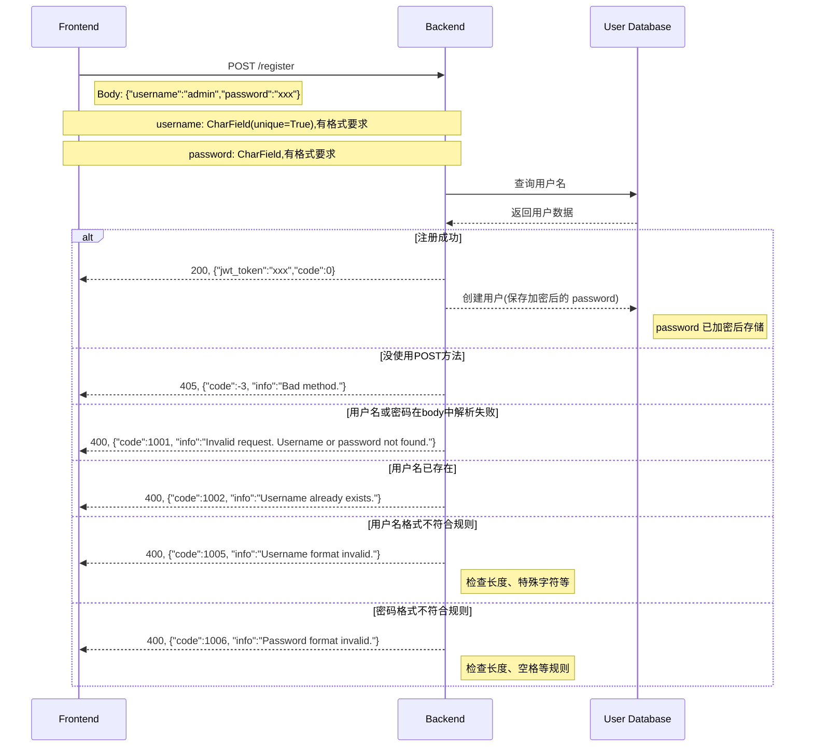
```mermaid
sequenceDiagram
    participant F as Frontend
    participant B as Backend
    participant UDB as User Database

    F->>B: POST /register
    Note right of F: Body: {"username":"admin","password":"xxx"}

    Note over F,B: username: CharField(unique=True),有格式要求
    Note over F,B:password: CharField,有格式要求

    B->>UDB: 查询用户名
    UDB-->>B: 返回用户数据

    alt 注册成功
        B-->>F: 200, {"jwt_token":"xxx","code":0}
        B-->>UDB: 创建用户(保存加密后的 password)
        Note right of UDB: password 已加密后存储

    else 没使用POST方法
        B-->>F: 405, {"code":-3, "info":"Bad method."}

    else 用户名或密码在body中解析失败
        B-->>F: 400, {"code":1001, "info":"Invalid request. Username or password not found."}

    else 用户名已存在
        B-->>F: 400, {"code":1002, "info":"Username already exists."}

    else 用户名格式不符合规则
        B-->>F: 400, {"code":1005, "info":"Username format invalid."}
        Note right of B: 检查长度、特殊字符等

    else 密码格式不符合规则
        B-->>F: 400, {"code":1006, "info":"Password format invalid."}
        Note right of B: 检查长度、空格等规则

    end

```

### 2、用户注销（基本管理）

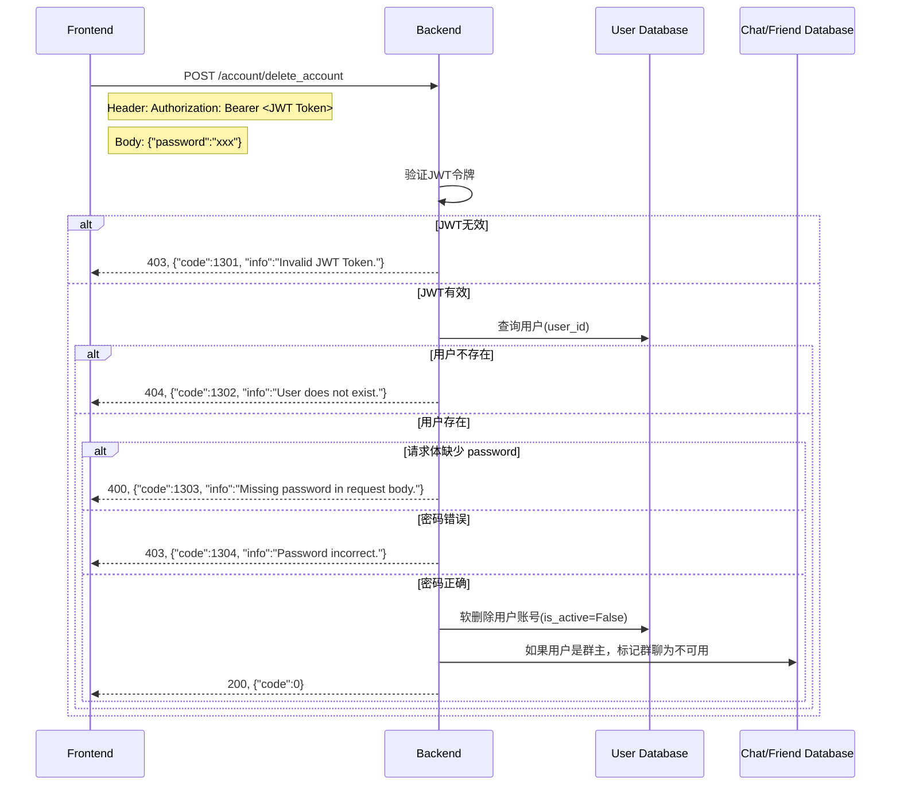
```mermaid
sequenceDiagram
    participant F as Frontend
    participant B as Backend
    participant UDB as User Database
    participant CDB as Chat/Friend Database

    F->>B: POST /account/delete_account
    Note right of F: Header: Authorization: Bearer <JWT Token>
    Note right of F: Body: {"password":"xxx"}

    B->>B: 验证JWT令牌
    alt JWT无效
        B-->>F: 403, {"code":1301, "info":"Invalid JWT Token."}
    else JWT有效
        B->>UDB: 查询用户(user_id)
        alt 用户不存在
            B-->>F: 404, {"code":1302, "info":"User does not exist."}
        else 用户存在
            alt 请求体缺少 password
                B-->>F: 400, {"code":1303, "info":"Missing password in request body."}
            else 密码错误
                B-->>F: 403, {"code":1304, "info":"Password incorrect."}
            else 密码正确
                B->>UDB: 软删除用户账号(is_active=False)
                B->>CDB: 如果用户是群主，标记群聊为不可用
                B-->>F: 200, {"code":0}
            end
        end
    end
```

### 3、登录登出（用户认证）
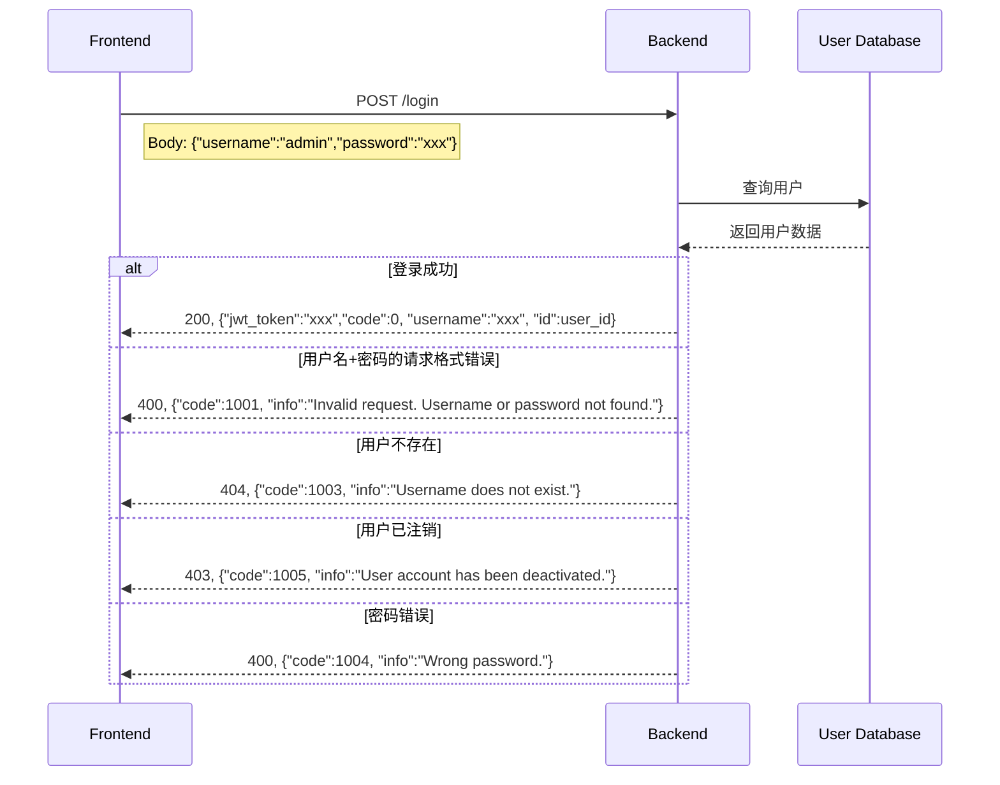
```mermaid
sequenceDiagram
    participant F as Frontend
    participant B as Backend
    participant UDB as User Database

    F->>B: POST /login
    Note right of F: Body: {"username":"admin","password":"xxx"}
    B->>UDB: 查询用户
    UDB-->>B: 返回用户数据
    alt 登录成功
        B-->>F: 200, {"jwt_token":"xxx","code":0, "username":"xxx", "id":user_id}
    else 用户名+密码的请求格式错误
        B-->>F: 400, {"code":1001, "info":"Invalid request. Username or password not found."}
    else 用户不存在
        B-->>F: 404, {"code":1003, "info":"Username does not exist."}
    else 用户已注销
        B-->>F: 403, {"code":1005, "info":"User account has been deactivated."}
    else 密码错误
        B-->>F: 400, {"code":1004, "info":"Wrong password."}
    end
```
-
### 4、信息编辑（用户认证）
**修改个人信息**
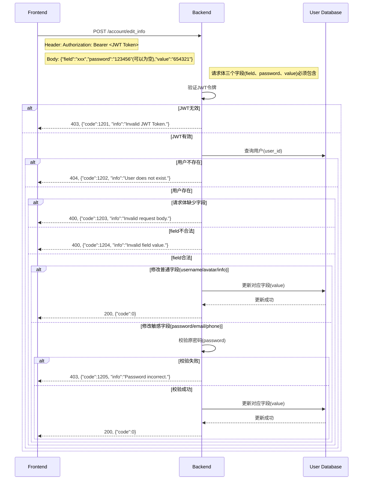
```mermaid
sequenceDiagram
    participant F as Frontend
    participant B as Backend
    participant UDB as User Database

    F->>B: POST /account/edit_info
    Note right of F: Header: Authorization: Bearer <JWT Token>
    Note right of F: Body: {"field":"xxx","password":"123456"(可以为空),"value":"654321"}
    Note right of B: 请求体三个字段(field、password、value)必须包含

    B->>B: 验证JWT令牌
    alt JWT无效
        B-->>F: 403, {"code":1201, "info":"Invalid JWT Token."}
    else JWT有效
        B->>UDB: 查询用户(user_id)
        alt 用户不存在
            B-->>F: 404, {"code":1202, "info":"User does not exist."}
        else 用户存在
            alt 请求体缺少字段
                B-->>F: 400, {"code":1203, "info":"Invalid request body."}
            else field不合法
                B-->>F: 400, {"code":1204, "info":"Invalid field value."}
            else field合法
                alt 修改普通字段(username/avatar/info)
                    B->>UDB: 更新对应字段(value)
                    UDB-->>B: 更新成功
                    B-->>F: 200, {"code":0}
                else 修改敏感字段(password/email/phone)
                    B->>B: 校验原密码(password)
                    alt 校验失败
                        B-->>F: 403, {"code":1205, "info":"Password incorrect."}
                    else 校验成功
                        B->>UDB: 更新对应字段(value)
                        UDB-->>B: 更新成功
                        B-->>F: 200, {"code":0}
                    end
                end
            end
        end
    end

```

### 5、用户查找（好友关系）

**查找用户**
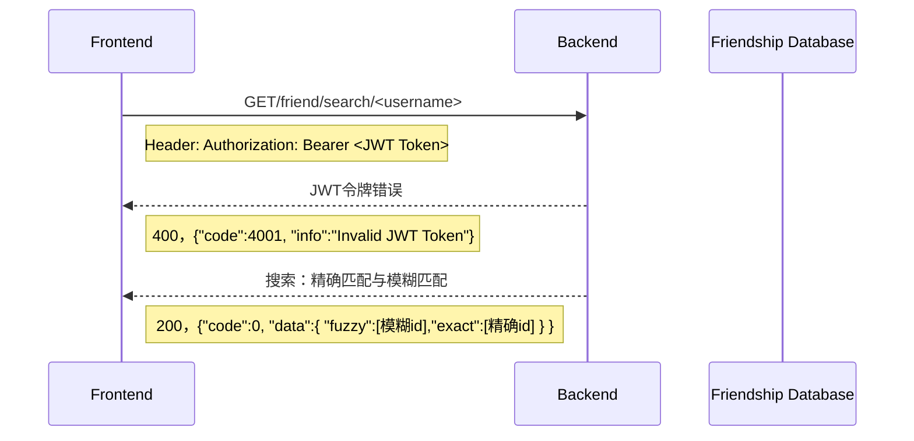
```mermaid
sequenceDiagram
    participant F as Frontend
    participant B as Backend
    participant FDB as Friendship Database
    
    F->>B: GET/friend/search/<username>
    Note right of F: Header: Authorization: Bearer <JWT Token>
    B-->>F: JWT令牌错误
    Note right of F: 400，{"code":4001, "info":"Invalid JWT Token"}
    B-->>F: 搜索：精确匹配与模糊匹配
    Note right of F: 200，{"code":0, "data":{ "fuzzy":[模糊id],"exact":[精确id] } }
```

### 6、好友申请（好友关系）
##### (申请添加好友+同意拒绝)
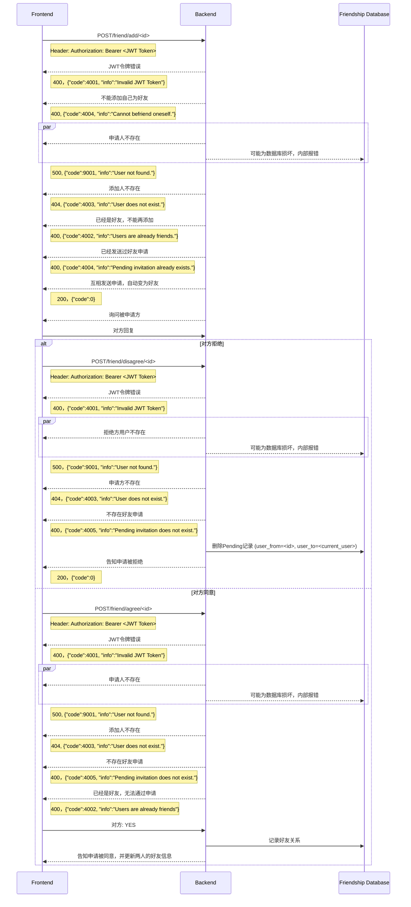
```mermaid
sequenceDiagram
    participant F as Frontend
    participant B as Backend
    participant FDB as Friendship Database
    
    F->>B: POST/friend/add/<id>
    Note right of F: Header: Authorization: Bearer <JWT Token>
    B-->>F: JWT令牌错误
    Note right of F: 400，{"code":4001, "info":"Invalid JWT Token"}
    B-->>F: 不能添加自己为好友
    Note right of F: 400, {"code":4004, "info":"Cannot befriend oneself."}
    par
        B-->>F: 申请人不存在
        B-->>FDB: 可能为数据库损坏，内部报错
    end
    Note right of F: 500, {"code":9001, "info":"User not found."}
    B-->>F: 添加人不存在
    Note right of F: 404, {"code":4003, "info":"User does not exist."}
    B-->>F: 已经是好友，不能再添加
    Note right of F: 400, {"code":4002, "info":"Users are already friends."}
    B-->>F: 已经发送过好友申请
    Note right of F: 400, {"code":4004, "info":"Pending invitation already exists."}
    B-->>F: 互相发送申请，自动变为好友
    Note right of F: 200，{"code":0}
    B-->>F: 询问被申请方
    F->>B: 对方回复
    alt 对方拒绝
        F->>B: POST/friend/disagree/<id>
    Note right of F: Header: Authorization: Bearer <JWT Token>
        B-->>F: JWT令牌错误
        Note right of F: 400，{"code":4001, "info":"Invalid JWT Token"}
        par
            B-->>F: 拒绝方用户不存在
            B-->>FDB: 可能为数据库损坏，内部报错
        end
        Note right of F: 500，{"code":9001, "info":"User not found."}
        B-->>F: 申请方不存在
        Note right of F: 404，{"code":4003, "info":"User does not exist."}
        B-->>F: 不存在好友申请
        Note right of F: 400，{"code":4005, "info":"Pending invitation does not exist."}
        B->>FDB: 删除Pending记录 (user_from=<id>, user_to=<current_user>)
        B-->>F: 告知申请被拒绝
        Note right of F: 200，{"code":0}
    else 对方同意
        F->>B: POST/friend/agree/<id>
        Note right of F: Header: Authorization: Bearer <JWT Token>
        B-->>F: JWT令牌错误
        Note right of F: 400，{"code":4001, "info":"Invalid JWT Token"}
        par
            B-->>F: 申请人不存在
            B-->>FDB: 可能为数据库损坏，内部报错
        end
        Note right of F: 500, {"code":9001, "info":"User not found."}
        B-->>F: 添加人不存在
        Note right of F: 404, {"code":4003, "info":"User does not exist."}
        B-->>F: 不存在好友申请
        Note right of F: 400，{"code":4005, "info":"Pending invitation does not exist."}
        B-->>F: 已经是好友，无法通过申请
        Note right of F: 400，{"code":4002, "info":"Users are already friends"}
        F->>B: 对方: YES
        B->>FDB: 记录好友关系
        B-->>F: 告知申请被同意，并更新两人的好友信息
    end
```

### 7、好友删除（好友关系）
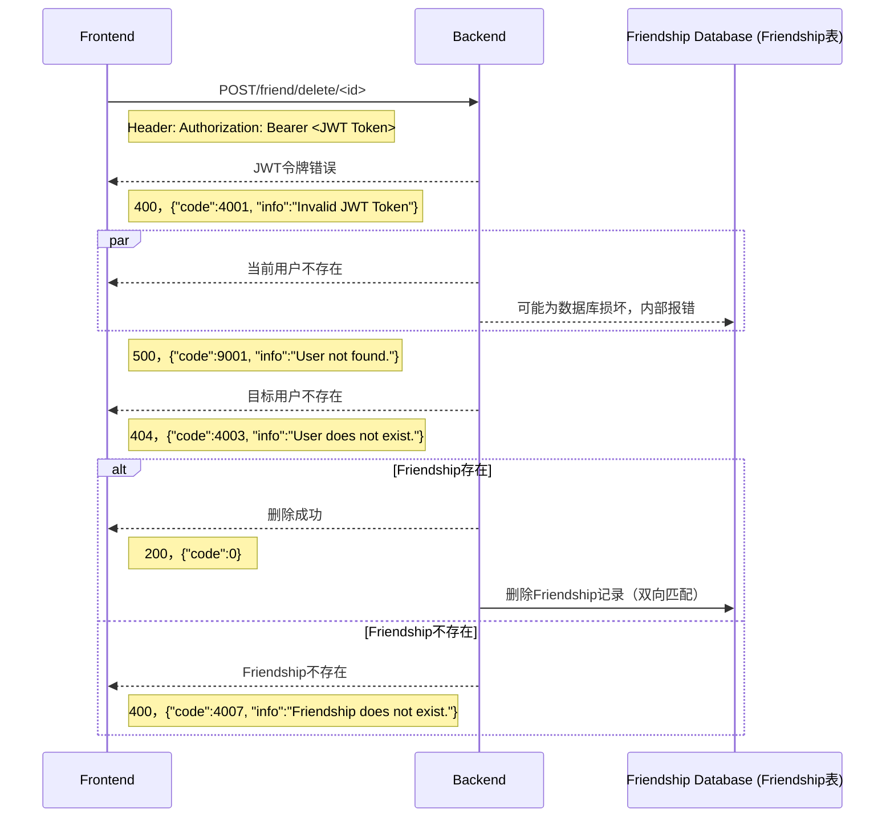
```mermaid
sequenceDiagram
    participant F as Frontend
    participant B as Backend
    participant FDB as Friendship Database (Friendship表)

    F->>B: POST/friend/delete/<id>
    Note right of F: Header: Authorization: Bearer <JWT Token>
    B-->>F: JWT令牌错误
    Note right of F: 400，{"code":4001, "info":"Invalid JWT Token"}

    par
        B-->>F: 当前用户不存在
        B-->>FDB: 可能为数据库损坏，内部报错
    end
    Note right of F: 500，{"code":9001, "info":"User not found."}

    B-->>F: 目标用户不存在
    Note right of F: 404，{"code":4003, "info":"User does not exist."}

    alt Friendship存在
        B-->>F: 删除成功
        Note right of F: 200，{"code":0}
        B->>FDB: 删除Friendship记录（双向匹配）
    else Friendship不存在
        B-->>F: Friendship不存在
        Note right of F: 400，{"code":4007, "info":"Friendship does not exist."}
    end
```

### 8、好友列表

**获取好友列表**
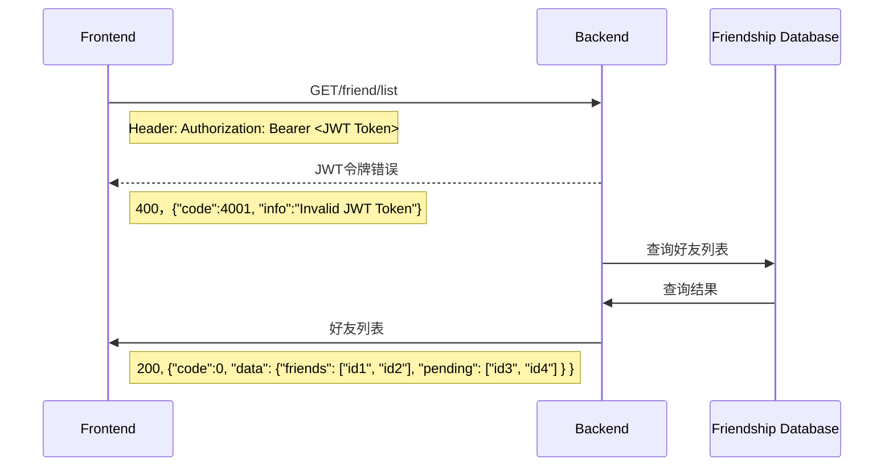
```mermaid
sequenceDiagram
    participant F as Frontend
    participant B as Backend
    participant FDB as Friendship Database
    
    F->>B: GET/friend/list
    Note right of F: Header: Authorization: Bearer <JWT Token>
    B-->>F: JWT令牌错误
    Note right of F: 400，{"code":4001, "info":"Invalid JWT Token"}
    B->>FDB: 查询好友列表
    FDB->>B: 查询结果 
    B->>F: 好友列表
    Note right of F: 200, {"code":0, "data": {"friends": ["id1", "id2"], "pending": ["id3", "id4"] } } 
```

### 9、检查好友关系

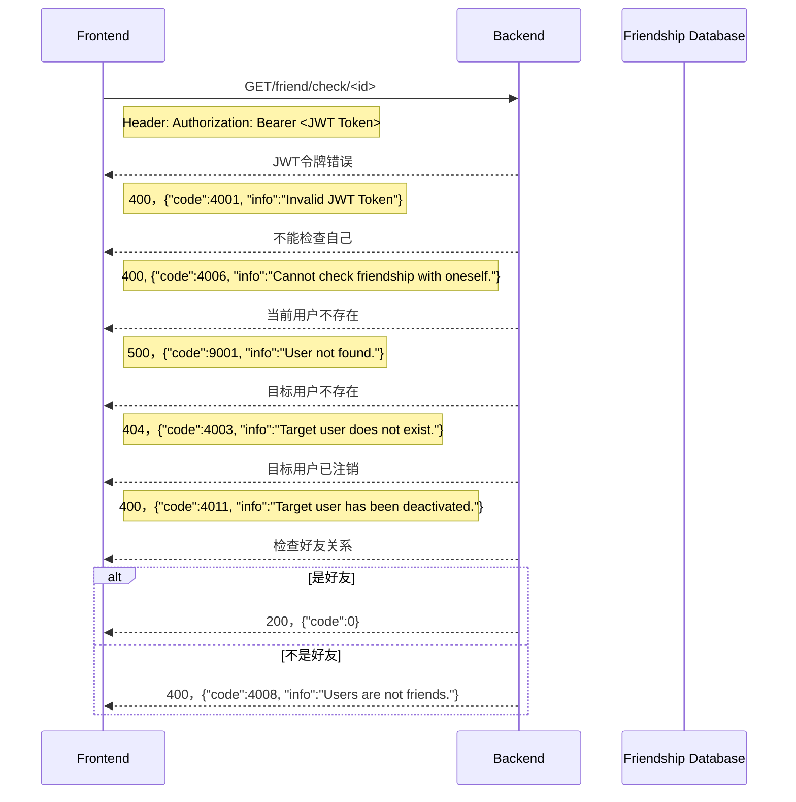
```mermaid
sequenceDiagram
    participant F as Frontend
    participant B as Backend
    participant FDB as Friendship Database
    
    F->>B: GET/friend/check/<id>
    Note right of F: Header: Authorization: Bearer <JWT Token>
    B-->>F: JWT令牌错误
    Note right of F: 400，{"code":4001, "info":"Invalid JWT Token"}
    B-->>F: 不能检查自己
    Note right of F: 400, {"code":4006, "info":"Cannot check friendship with oneself."}
    B-->>F: 当前用户不存在
    Note right of F: 500，{"code":9001, "info":"User not found."}
    B-->>F: 目标用户不存在
    Note right of F: 404，{"code":4003, "info":"Target user does not exist."}
    B-->>F: 目标用户已注销
    Note right of F: 400，{"code":4011, "info":"Target user has been deactivated."}
    B-->>F: 检查好友关系
    alt 是好友
        B-->>F: 200，{"code":0}
    else 不是好友
        B-->>F: 400，{"code":4008, "info":"Users are not friends."}
    end
```

### 10、好友分组

#### 创建好友分组
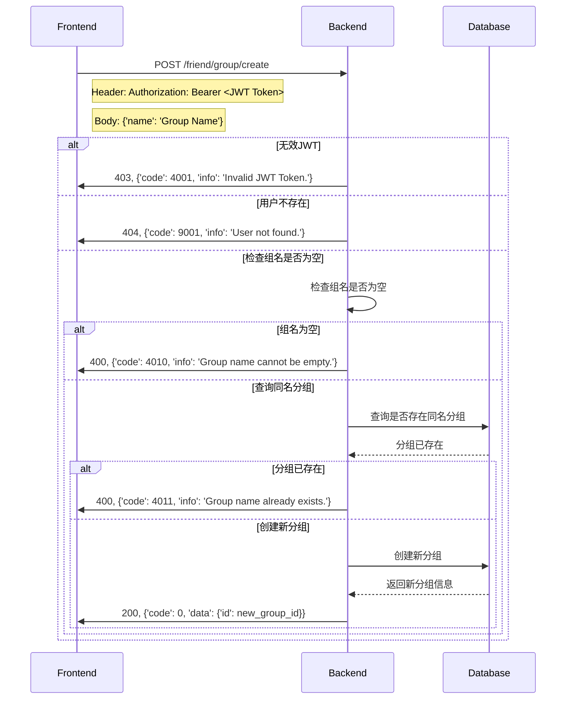
```mermaid

sequenceDiagram
    participant F as Frontend
    participant B as Backend
    participant DB as Database

    F->>B: POST /friend/group/create
    Note right of F: Header: Authorization: Bearer <JWT Token>
    Note right of F: Body: {'name': 'Group Name'}
    alt 无效JWT
        B->>F: 403, {'code': 4001, 'info': 'Invalid JWT Token.'}
    else 用户不存在
        B->>F: 404, {'code': 9001, 'info': 'User not found.'}
    else 检查组名是否为空
        B->>B: 检查组名是否为空
        alt 组名为空
            B->>F: 400, {'code': 4010, 'info': 'Group name cannot be empty.'}
        else 查询同名分组
            B->>DB: 查询是否存在同名分组
            DB-->>B: 分组已存在
            alt 分组已存在
                B->>F: 400, {'code': 4011, 'info': 'Group name already exists.'}
            else 创建新分组
                B->>DB: 创建新分组
                DB-->>B: 返回新分组信息
                B->>F: 200, {'code': 0, 'data': {'id': new_group_id}}
            end
        end
    end


```

#### 列出好友分组
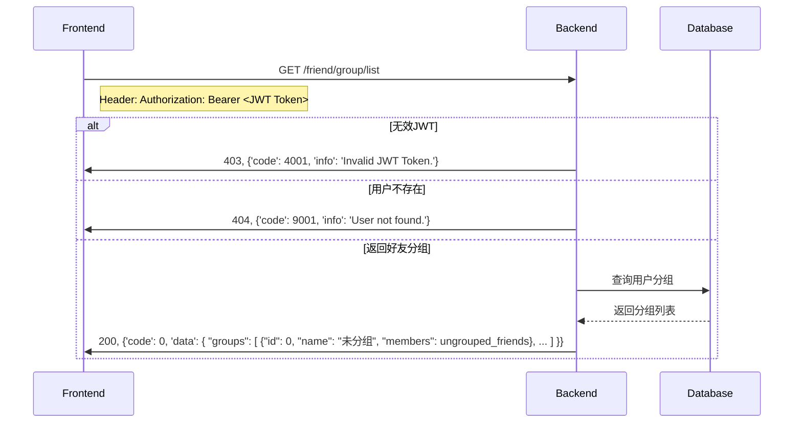
```mermaid

sequenceDiagram
    participant F as Frontend
    participant B as Backend
    participant DB as Database

    F->>B: GET /friend/group/list
    Note right of F: Header: Authorization: Bearer <JWT Token>
    alt 无效JWT
        B->>F: 403, {'code': 4001, 'info': 'Invalid JWT Token.'}
    else 用户不存在
        B->>F: 404, {'code': 9001, 'info': 'User not found.'}
    else 返回好友分组
        B->>DB: 查询用户分组
        DB-->>B: 返回分组列表
        B->>F: 200, {'code': 0, 'data': { "groups": [ {"id": 0, "name": "未分组", "members": ungrouped_friends}, ... ] }}
    end

```

#### 把好友添加到分组里
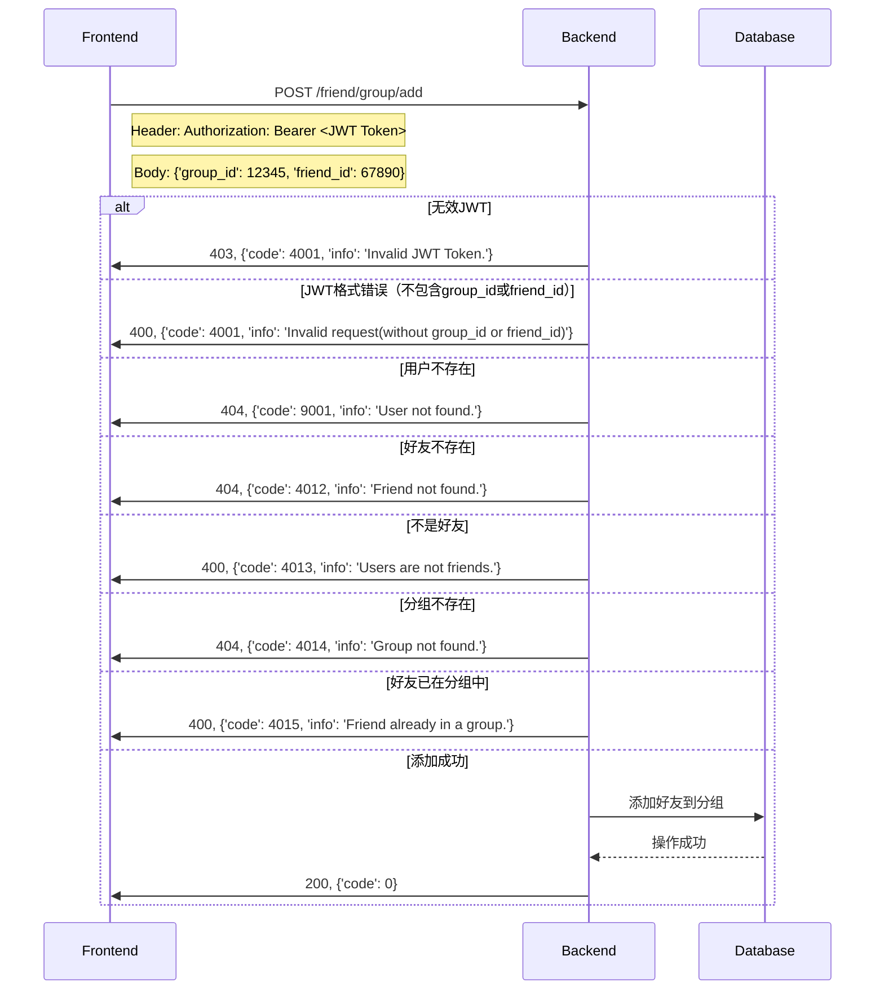
```mermaid

sequenceDiagram
    participant F as Frontend
    participant B as Backend
    participant DB as Database

    F->>B: POST /friend/group/add
    Note right of F: Header: Authorization: Bearer <JWT Token>
    Note right of F: Body: {'group_id': 12345, 'friend_id': 67890}
    alt 无效JWT
        B->>F: 403, {'code': 4001, 'info': 'Invalid JWT Token.'}
    else JWT格式错误（不包含group_id或friend_id）
        B->>F: 400, {'code': 4001, 'info': 'Invalid request(without group_id or friend_id)'}
    else 用户不存在
        B->>F: 404, {'code': 9001, 'info': 'User not found.'}
    else 好友不存在
        B->>F: 404, {'code': 4012, 'info': 'Friend not found.'}
    else 不是好友
        B->>F: 400, {'code': 4013, 'info': 'Users are not friends.'}
    else 分组不存在
        B->>F: 404, {'code': 4014, 'info': 'Group not found.'}
    else 好友已在分组中
        B->>F: 400, {'code': 4015, 'info': 'Friend already in a group.'}
    else 添加成功
        B->>DB: 添加好友到分组
        DB-->>B: 操作成功
        B->>F: 200, {'code': 0}
    end

```

#### 从分组移除好友
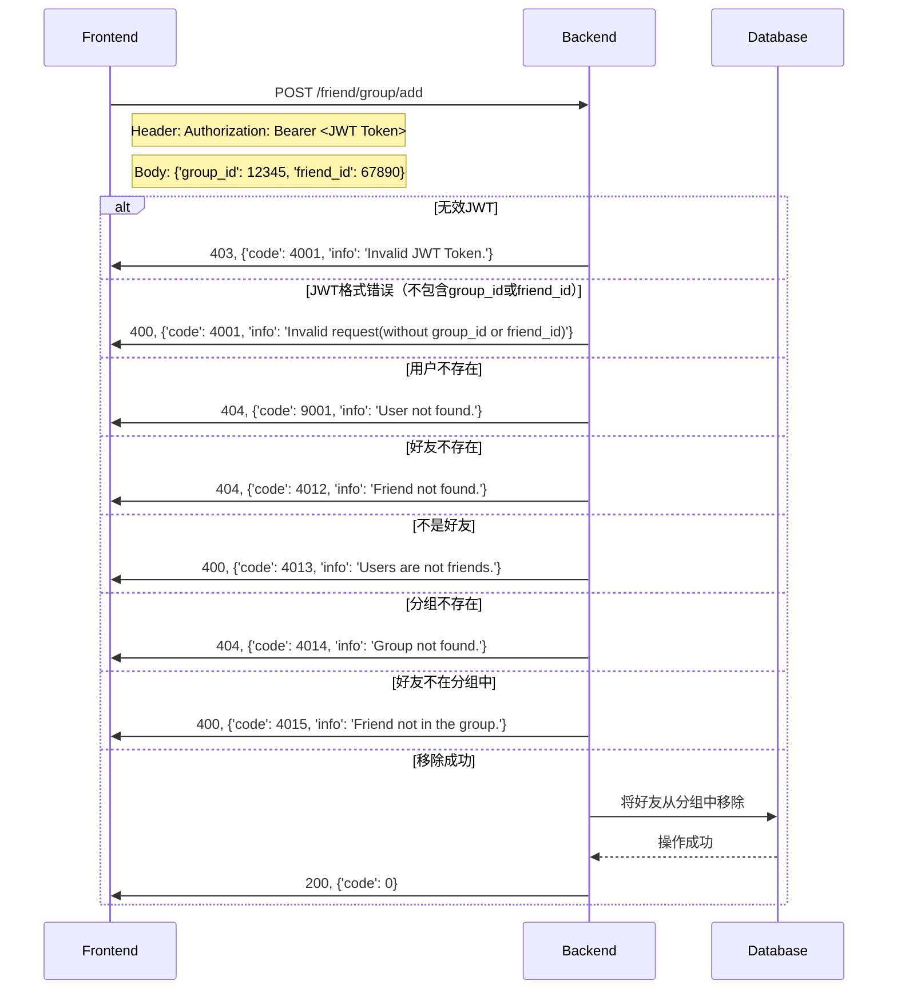
```mermaid

sequenceDiagram
    participant F as Frontend
    participant B as Backend
    participant DB as Database

    F->>B: POST /friend/group/add
    Note right of F: Header: Authorization: Bearer <JWT Token>
    Note right of F: Body: {'group_id': 12345, 'friend_id': 67890}
    alt 无效JWT
        B->>F: 403, {'code': 4001, 'info': 'Invalid JWT Token.'}
    else JWT格式错误（不包含group_id或friend_id）
        B->>F: 400, {'code': 4001, 'info': 'Invalid request(without group_id or friend_id)'}
    else 用户不存在
        B->>F: 404, {'code': 9001, 'info': 'User not found.'}
    else 好友不存在
        B->>F: 404, {'code': 4012, 'info': 'Friend not found.'}
    else 不是好友
        B->>F: 400, {'code': 4013, 'info': 'Users are not friends.'}
    else 分组不存在
        B->>F: 404, {'code': 4014, 'info': 'Group not found.'}
    else 好友不在分组中
        B->>F: 400, {'code': 4015, 'info': 'Friend not in the group.'}
    else 移除成功
        B->>DB: 将好友从分组中移除
        DB-->>B: 操作成功
        B->>F: 200, {'code': 0}
    end
```

#### 重命名分组
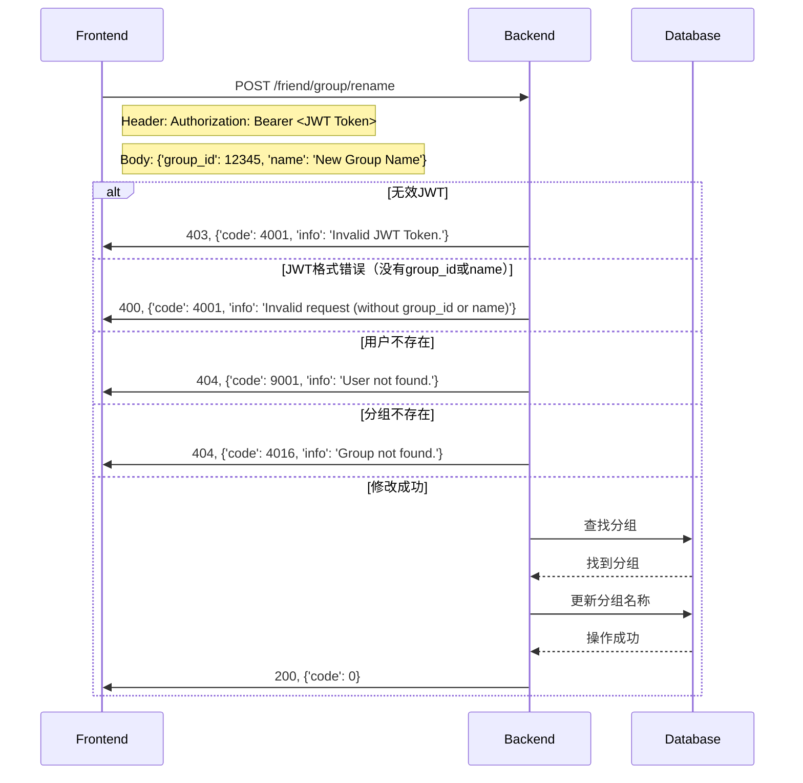
```mermaid

sequenceDiagram
    participant F as Frontend
    participant B as Backend
    participant DB as Database

    F->>B: POST /friend/group/rename
    Note right of F: Header: Authorization: Bearer <JWT Token>
    Note right of F: Body: {'group_id': 12345, 'name': 'New Group Name'}
    alt 无效JWT
        B->>F: 403, {'code': 4001, 'info': 'Invalid JWT Token.'}
    else JWT格式错误（没有group_id或name）
        B->>F: 400, {'code': 4001, 'info': 'Invalid request (without group_id or name)'}
    else 用户不存在
        B->>F: 404, {'code': 9001, 'info': 'User not found.'}
    else 分组不存在
        B->>F: 404, {'code': 4016, 'info': 'Group not found.'}
    else 修改成功
        B->>DB: 查找分组
        DB-->>B: 找到分组
        B->>DB: 更新分组名称
        DB-->>B: 操作成功
        B->>F: 200, {'code': 0}
    end

```

#### 删除分组
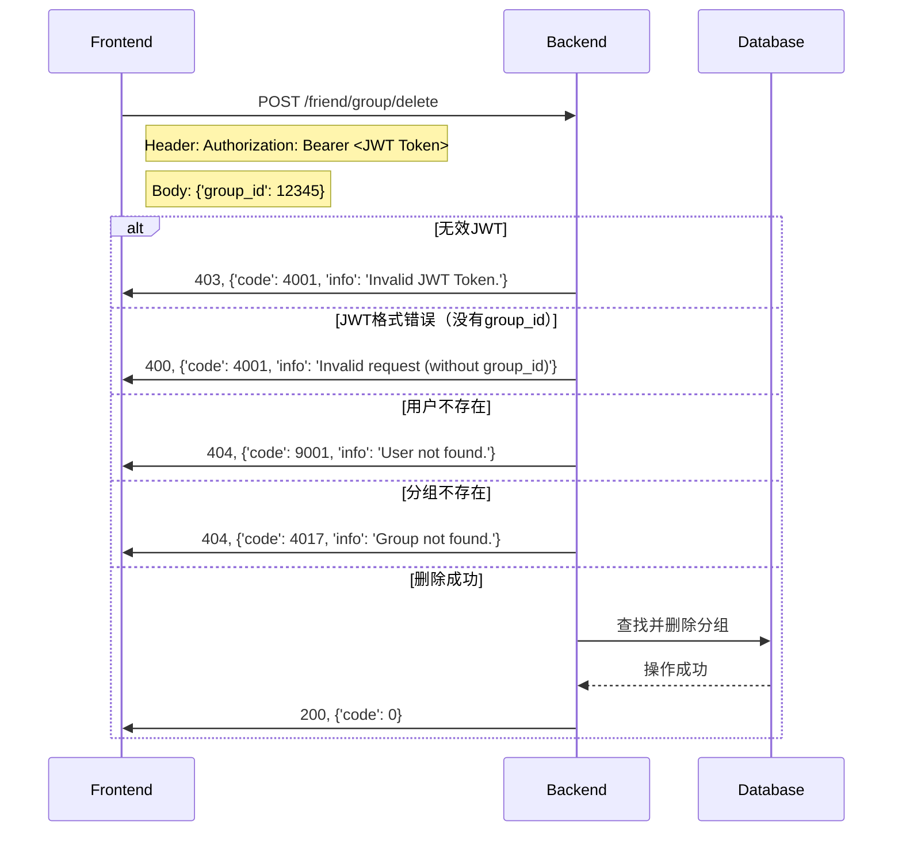
```mermaid

sequenceDiagram
    participant F as Frontend
    participant B as Backend
    participant DB as Database

    F->>B: POST /friend/group/delete
    Note right of F: Header: Authorization: Bearer <JWT Token>
    Note right of F: Body: {'group_id': 12345}
    alt 无效JWT
        B->>F: 403, {'code': 4001, 'info': 'Invalid JWT Token.'}
    else JWT格式错误（没有group_id）
        B->>F: 400, {'code': 4001, 'info': 'Invalid request (without group_id)'}
    else 用户不存在
        B->>F: 404, {'code': 9001, 'info': 'User not found.'}
    else 分组不存在
        B->>F: 404, {'code': 4017, 'info': 'Group not found.'}
    else 删除成功
        B->>DB: 查找并删除分组
        DB-->>B: 操作成功
        B->>F: 200, {'code': 0}
    end

```

## 二、在线会话通用部分（25分）

### 请求消息记录
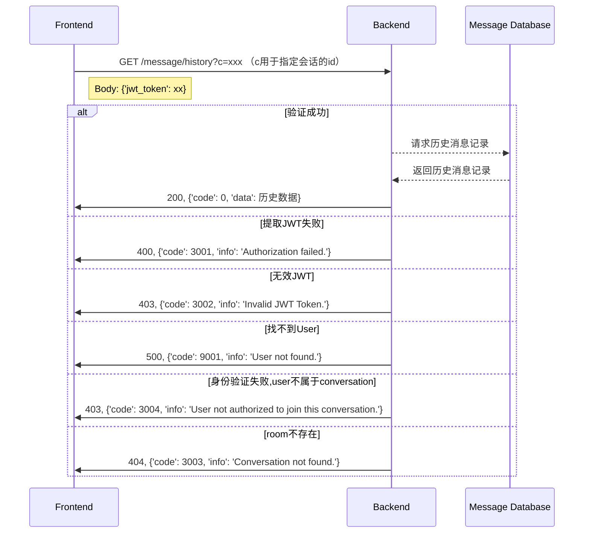
```mermaid
sequenceDiagram
    participant F as Frontend
    participant B as Backend
    participant MDB as Message Database

    F->>B: GET /message/history?c=xxx （c用于指定会话的id）
    Note right of F: Body: {'jwt_token': xx}
    alt 验证成功
        B-->>MDB: 请求历史消息记录
        MDB-->>B: 返回历史消息记录
        B->>F: 200, {'code': 0, 'data': 历史数据}
    else 提取JWT失败
        B->>F: 400, {'code': 3001, 'info': 'Authorization failed.'}
    else 无效JWT
        B->>F: 403, {'code': 3002, 'info': 'Invalid JWT Token.'}
    else 找不到User
        B->>F: 500, {'code': 9001, 'info': 'User not found.'} 
    
    else 身份验证失败,user不属于conversation
        B->>F: 403, {'code': 3004, 'info': 'User not authorized to join this conversation.'}
    else room不存在
        B->>F: 404, {'code': 3003, 'info': 'Conversation not found.'}
    end
```

### 请求创建好友会话
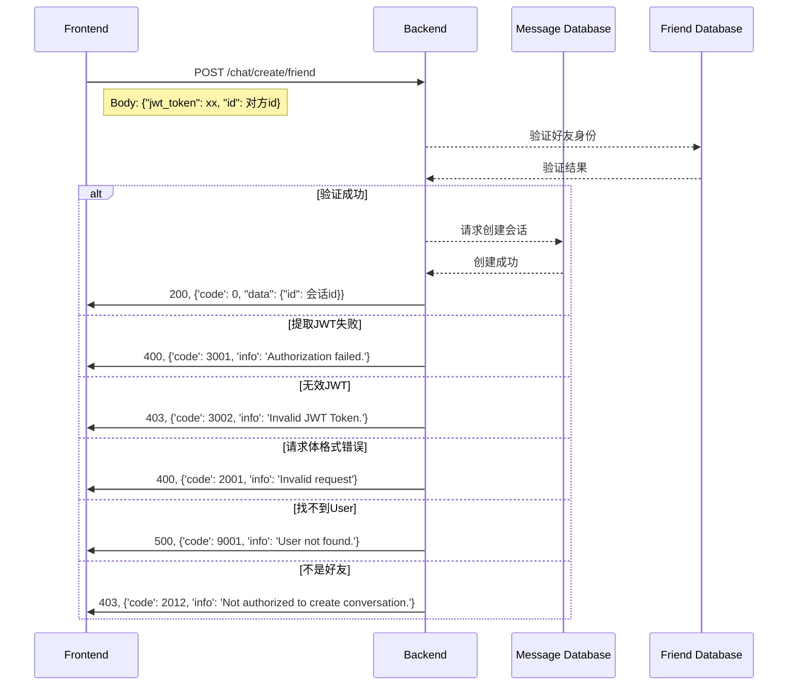
```mermaid
sequenceDiagram
    participant F as Frontend
    participant B as Backend
    participant MDB as Message Database
    participant FDB as Friend Database

    F->>B: POST /chat/create/friend
    Note right of F: Body: {"jwt_token": xx, "id": 对方id}
    B-->>FDB: 验证好友身份
    FDB-->>B: 验证结果
    alt 验证成功
        B-->>MDB: 请求创建会话
        MDB-->>B: 创建成功
        B->>F: 200, {'code': 0, "data": {"id": 会话id}}
    else 提取JWT失败
        B->>F: 400, {'code': 3001, 'info': 'Authorization failed.'}
    else 无效JWT
        B->>F: 403, {'code': 3002, 'info': 'Invalid JWT Token.'}
    else 请求体格式错误
        B->>F: 400, {'code': 2001, 'info': 'Invalid request'}
    else 找不到User
        B->>F: 500, {'code': 9001, 'info': 'User not found.'}
    else 不是好友
        B->>F: 403, {'code': 2012, 'info': 'Not authorized to create conversation.'}
    end
```

### 标记已读
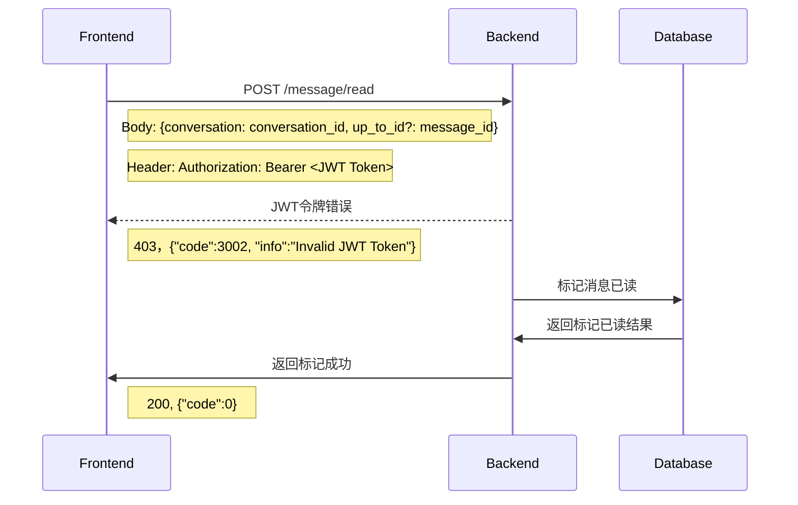
```mermaid

sequenceDiagram
    participant F as Frontend
    participant B as Backend
    participant DB as Database
    
    F->>B: POST /message/read
    Note right of F: Body: {conversation: conversation_id, up_to_id?: message_id}
    Note right of F: Header: Authorization: Bearer <JWT Token>
    B-->>F: JWT令牌错误
    Note right of F: 403，{"code":3002, "info":"Invalid JWT Token"}
    B->>DB: 标记消息已读
    DB->>B: 返回标记已读结果
    B->>F: 返回标记成功
    Note right of F: 200, {"code":0}

```

### 编辑消息

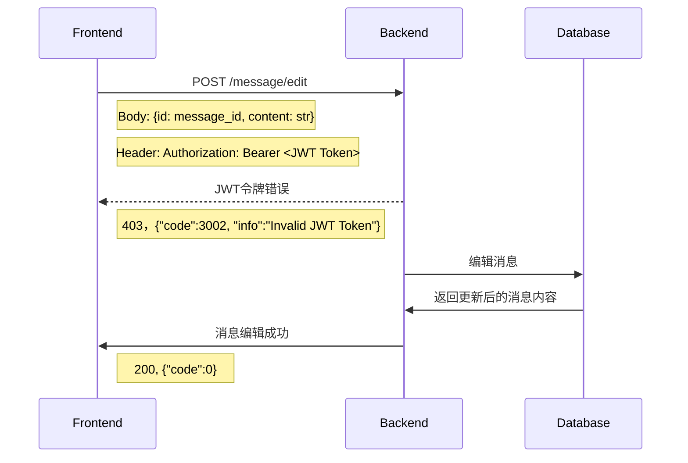
```mermaid

sequenceDiagram
    participant F as Frontend
    participant B as Backend
    participant DB as Database
    
    F->>B: POST /message/edit
    Note right of F: Body: {id: message_id, content: str}
    Note right of F: Header: Authorization: Bearer <JWT Token>
    B-->>F: JWT令牌错误
    Note right of F: 403，{"code":3002, "info":"Invalid JWT Token"}
    B->>DB: 编辑消息
    DB->>B: 返回更新后的消息内容
    B->>F: 消息编辑成功
    Note right of F: 200, {"code":0}

```

### 撤回消息

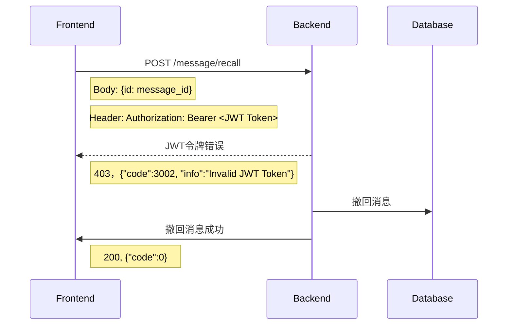
```mermaid

sequenceDiagram
    participant F as Frontend
    participant B as Backend
    participant DB as Database
    
    F->>B: POST /message/recall
    Note right of F: Body: {id: message_id}
    Note right of F: Header: Authorization: Bearer <JWT Token>
    B-->>F: JWT令牌错误
    Note right of F: 403，{"code":3002, "info":"Invalid JWT Token"}
    B->>DB: 撤回消息
    B->>F: 撤回消息成功
    Note right of F: 200, {"code":0}

```

### 删除消息
```mermaid

sequenceDiagram
    participant F as Frontend
    participant B as Backend
    participant DB as Database
    
    F->>B: POST /message/delete
    Note right of F: Body: {id: message_id}
    Note right of F: Header: Authorization: Bearer <JWT Token>
    B-->>F: JWT令牌错误
    Note right of F: 403，{"code":3002, "info":"Invalid JWT Token"}
    B->>DB: 删除消息
    DB->>B: 返回删除成功
    B->>F: 删除成功
    Note right of F: 200, {"code":0}

```
 

### 设置免打扰和置顶
```mermaid

sequenceDiagram
    participant F as Frontend
    participant B as Backend
    participant DB as Database
    
    F->>B: POST /member/set
    Note right of F: Body: {id: conversation_id, mute: bool, pinned: bool}
    Note right of F: Header: Authorization: Bearer <JWT Token>
    B-->>F: JWT令牌错误
    Note right of F: 403，{"code":3002, "info":"Invalid JWT Token"}
    B->>DB: 更新成员的免打扰和置顶状态
    DB->>B: 返回更新后的成员状态
    B->>F: 设置成功
    Note right of F: 200, {"code":0}

```

### 置顶会话
```mermaid
sequenceDiagram
    participant F as Frontend
    participant B as Backend
    participant DB as Database
    
    F->>B: POST /conversation/pin
    Note right of F: Body: {id: conversation_id}
    Note right of F: Header: Authorization: Bearer <JWT Token>
    B-->>F: JWT令牌错误
    Note right of F: 403，{"code":3002, "info":"Invalid JWT Token"}
    B-->>F: 会话不存在或用户不是成员
    Note right of F: 404，{"code":3003, "info":"Conversation not found or user not a member."}
    B-->>F: 会话已经置顶
    Note right of F: 400，{"code":3005, "info":"Conversation already pinned."}
    B->>DB: 创建置顶记录
    DB->>B: 返回成功
    B->>F: 置顶成功
    Note right of F: 200, {"code":0}
```

### 取消置顶会话
```mermaid
sequenceDiagram
    participant F as Frontend
    participant B as Backend
    participant DB as Database
    
    F->>B: POST /conversation/unpin
    Note right of F: Body: {id: conversation_id}
    Note right of F: Header: Authorization: Bearer <JWT Token>
    B-->>F: JWT令牌错误
    Note right of F: 403，{"code":3002, "info":"Invalid JWT Token"}
    B-->>F: 会话不存在或用户不是成员
    Note right of F: 404，{"code":3003, "info":"Conversation not found or user not a member."}
    B-->>F: 会话未置顶
    Note right of F: 400，{"code":3006, "info":"Conversation not pinned."}
    B->>DB: 删除置顶记录，更新其他置顶会话顺序
    DB->>B: 返回成功
    B->>F: 取消置顶成功
    Note right of F: 200, {"code":0}
```

### 获取置顶会话列表
```mermaid
sequenceDiagram
    participant F as Frontend
    participant B as Backend
    participant DB as Database
    
    F->>B: GET /conversation/pinned
    Note right of F: Header: Authorization: Bearer <JWT Token>
    B-->>F: JWT令牌错误
    Note right of F: 403，{"code":3002, "info":"Invalid JWT Token"}
    B->>DB: 查询用户的置顶会话列表
    DB->>B: 返回置顶会话数据
    B->>F: 返回置顶会话列表
    Note right of F: 200, {"code":0, "data": {"pinned": [conversation_id]}}
```


### 文件上传
```mermaid

sequenceDiagram
    participant F as Frontend
    participant B as Backend
    participant DB as Database
    
    F->>B: POST /upload
    Note right of F: Form-data: {file: <file>, type?: "image"/"file"}
    Note right of F: Header: Authorization: Bearer <JWT Token>
    B-->>F: JWT令牌错误
    Note right of F: 403，{"code":3002, "info":"Invalid JWT Token"}
    B->>DB: 存储文件
    DB->>B: 返回文件的可访问URL
    B->>F: 文件上传成功
    Note right of F: 200, {"code":0, "data": {"url": "<file_url>"}}

```

## 三、在线会话群聊部分（12分）

### 创建群聊
```mermaid
sequenceDiagram
    participant F as Frontend
    participant B as Backend
    participant DB as Database
    
    F->>B: POST /group/create
    Note right of F: Body: {name: str, members: [user_id], avatar?: str}
    Note right of F: Header: Authorization: Bearer <JWT Token>
    B-->>F: JWT令牌错误
    Note right of F: 403，{"code":3002, "info":"Invalid JWT Token"}
    B->>DB: 创建群聊，添加群成员
    DB->>B: 返回群聊信息
    B->>F: 群聊创建成功
    Note right of F: 200, {"code":0, "data": {"id": <conversation_id>}}

```

### 更新群信息
```mermaid

sequenceDiagram
    participant F as Frontend
    participant B as Backend
    participant DB as Database
    
    F->>B: POST /group/update
    Note right of F: Body: {id: conversation_id, name?: str, avatar?: str}
    Note right of F: Header: Authorization: Bearer <JWT Token>
    B-->>F: JWT令牌错误
    Note right of F: 403，{"code":3002, "info":"Invalid JWT Token"}
    B->>DB: 更新群聊信息
    DB->>B: 返回更新后的群聊信息
    B->>F: 群聊信息更新成功
    Note right of F: 200, {"code":0}

```

### 查询群聊信息
```mermaid

sequenceDiagram
    participant F as Frontend
    participant B as Backend
    participant DB as Database
    
    F->>B: GET /group/info
    Note right of F: Params: {id: conversation_id}
    Note right of F: Header: Authorization: Bearer <JWT Token>
    B-->>F: JWT令牌错误
    Note right of F: 403，{"code":3002, "info":"Invalid JWT Token"}
    B->>DB: 查询群聊信息
    DB->>B: 返回群聊信息和成员列表
    B->>F: 返回群聊信息
    Note right of F: 200, {"code":0, "data": {"id": <conversation_id>, "name": <name>, "avatar": <avatar>, "role": <role>, "members": [{id, nickname, avatar}]} }

```

### 设置群聊昵称
```mermaid

sequenceDiagram
    participant F as Frontend
    participant B as Backend
    participant DB as Database
    
    F->>B: POST /group/nickname
    Note right of F: Body: {id: conversation_id, nickname: str}
    Note right of F: Header: Authorization: Bearer <JWT Token>
    B-->>F: JWT令牌错误
    Note right of F: 403，{"code":3002, "info":"Invalid JWT Token"}
    B->>DB: 设置群聊昵称
    DB->>B: 返回更新后的成员信息
    B->>F: 返回设置成功
    Note right of F: 200, {"code":0}

```

### 设置成员角色
```mermaid

sequenceDiagram
    participant F as Frontend
    participant B as Backend
    participant DB as Database
    
    F->>B: POST /group/role
    Note right of F: Body: {id: conversation_id, user_id: target_id, role: "admin" or "member"}
    Note right of F: Header: Authorization: Bearer <JWT Token>
    B-->>F: JWT令牌错误
    Note right of F: 403，{"code":3002, "info":"Invalid JWT Token"}
    B->>DB: 设置成员角色
    DB->>B: 返回更新后的成员角色
    B->>F: 成员角色更新成功
    Note right of F: 200, {"code":0}

```

### 转移群主
```mermaid

sequenceDiagram
    participant F as Frontend
    participant B as Backend
    participant DB as Database
    
    F->>B: POST /group/transfer
    Note right of F: Body: {id: conversation_id, to: target_user_id}
    Note right of F: Header: Authorization: Bearer <JWT Token>
    B-->>F: JWT令牌错误
    Note right of F: 403，{"code":3002, "info":"Invalid JWT Token"}
    B->>DB: 转移群主
    DB->>B: 返回更新后的群聊和成员信息
    B->>F: 转移成功
    Note right of F: 200, {"code":0}\

```

### 发布公告
```mermaid

sequenceDiagram
    participant F as Frontend
    participant B as Backend
    participant DB as Database
    
    F->>B: POST /group/announce
    Note right of F: Body: {id: conversation_id, content: str}
    Note right of F: Header: Authorization: Bearer <JWT Token>
    B-->>F: JWT令牌错误
    Note right of F: 403，{"code":3002, "info":"Invalid JWT Token"}
    B->>DB: 发布公告
    DB->>B: 返回公告信息
    B->>F: 公告发布成功
    Note right of F: 200, {"code":0}

```

### 移除成员
```mermaid

sequenceDiagram
    participant F as Frontend
    participant B as Backend
    participant DB as Database
    
    F->>B: POST /group/remove
    Note right of F: Body: {id: conversation_id, user_id: target_user_id}
    Note right of F: Header: Authorization: Bearer <JWT Token>
    B-->>F: JWT令牌错误
    Note right of F: 403，{"code":3002, "info":"Invalid JWT Token"}
    B->>DB: 移除成员
    DB->>B: 返回更新后的成员信息
    B->>F: 成员移除成功
    Note right of F: 200, {"code":0}

```

### 退出群聊
```mermaid

sequenceDiagram
    participant F as Frontend
    participant B as Backend
    participant DB as Database
    
    F->>B: POST /group/exit
    Note right of F: Body: {id: conversation_id}
    Note right of F: Header: Authorization: Bearer <JWT Token>
    B-->>F: JWT令牌错误
    Note right of F: 403，{"code":3002, "info":"Invalid JWT Token"}
    B->>DB: 退出群聊
    DB->>B: 返回成功
    B->>F: 退出成功
    Note right of F: 200, {"code":0}

```

### 获取群聊历史公告
```mermaid
sequenceDiagram
    participant F as Frontend
    participant B as Backend
    participant DB as Database
    
    F->>B: GET /group/announcements
    Note right of F: Params: {id: conversation_id, limit?: int, offset?: int}
    Note right of F: Header: Authorization: Bearer <JWT Token>
    B-->>F: JWT令牌错误
    Note right of F: 403，{"code":3002, "info":"Invalid JWT Token"}
    B-->>F: 会话不存在
    Note right of F: 404，{"code":3003, "info":"Conversation not found."}
    B-->>F: 不是群成员
    Note right of F: 403，{"code":3004, "info":"Not a member of this group."}
    B->>DB: 查询群聊公告列表
    DB->>B: 返回公告数据
    B->>F: 返回公告列表
    Note right of F: 200, {"code":0, "data": {"announcements": [{"id", "content", "author_id", "author_name", "author_nickname", "created_at"}]}}
```

### 解散群聊
```mermaid
sequenceDiagram
    participant F as Frontend
    participant B as Backend
    participant DB as Database
    
    F->>B: POST /group/disband
    Note right of F: Body: {id: conversation_id}
    Note right of F: Header: Authorization: Bearer <JWT Token>
    B-->>F: JWT令牌错误
    Note right of F: 403，{"code":3002, "info":"Invalid JWT Token"}
    B-->>F: 会话不存在
    Note right of F: 404，{"code":3003, "info":"Conversation not found."}
    B-->>F: 不是群主
    Note right of F: 403，{"code":2012, "info":"Only owner can disband group."}
    B->>DB: 标记群聊为不可用，失效所有未处理的群邀请
    DB->>B: 返回成功
    B->>F: 解散成功
    Note right of F: 200, {"code":0}
```

### 邀请好友加入群聊
```mermaid
sequenceDiagram
    participant F as Frontend
    participant B as Backend
    participant DB as Database
    
    F->>B: POST /group/invite
    Note right of F: Body: {group_id: int, friend_id: int, message?: str}
    Note right of F: Header: Authorization: Bearer <JWT Token>
    B-->>F: JWT令牌错误
    Note right of F: 403，{"code":3002, "info":"Invalid JWT Token"}
    B-->>F: 缺少group_id或friend_id
    Note right of F: 400，{"code":2001, "info":"Missing group_id or friend_id."}
    B-->>F: 用户不存在
    Note right of F: 404，{"code":9001, "info":"User not found."}
    B-->>F: 好友不存在
    Note right of F: 404，{"code":2004, "info":"Friend not found."}
    B-->>F: 群聊不存在
    Note right of F: 404，{"code":3003, "info":"Group not found."}
    B-->>F: 群聊已解散
    Note right of F: 403，{"code":2012, "info":"Conversation is inactive."}
    B-->>F: 不是群成员
    Note right of F: 403，{"code":3004, "info":"You are not a member of this group."}
    B-->>F: 被邀请者已经是群成员
    Note right of F: 400，{"code":3005, "info":"User is already a member of this group."}
    B-->>F: 不是好友关系
    Note right of F: 403，{"code":3006, "info":"You can only invite your friends."}
    B-->>F: 已有待处理的邀请
    Note right of F: 400，{"code":3007, "info":"There is already a pending invitation for this user."}
    B->>DB: 创建或更新邀请记录
    DB->>B: 返回成功
    B->>F: 邀请创建成功
    Note right of F: 200, {"code":0, "data": {"id": invitation_id}}
```

### 获取群聊邀请列表
```mermaid
sequenceDiagram
    participant F as Frontend
    participant B as Backend
    participant DB as Database
    
    F->>B: GET /group/invitations
    Note right of F: Params: {group_id: int, status?: "pending"/"approved"/"rejected"/"expired"}
    Note right of F: Header: Authorization: Bearer <JWT Token>
    B-->>F: JWT令牌错误
    Note right of F: 403，{"code":3002, "info":"Invalid JWT Token"}
    B-->>F: 缺少group_id
    Note right of F: 400，{"code":2001, "info":"Missing group_id."}
    B-->>F: 群聊不存在
    Note right of F: 404，{"code":3003, "info":"Group not found."}
    B-->>F: 不是群成员
    Note right of F: 403，{"code":3004, "info":"You are not a member of this group."}
    B-->>F: 不是群主或管理员
    Note right of F: 403，{"code":3008, "info":"Only owner and admin can view invitations."}
    B->>DB: 查询群聊邀请列表
    DB->>B: 返回邀请数据
    B->>F: 返回邀请列表
    Note right of F: 200, {"code":0, "data": {"invitations": [{"id", "inviter_id", "inviter_name", "inviter_nickname", "invitee_id", "invitee_name", "invitee_nickname", "status", "created_at", "message", "reviewer_id", "reviewer_name", "reviewer_nickname", "review_time", "review_comment"}]}}
```

### 审核群聊邀请
```mermaid
sequenceDiagram
    participant F as Frontend
    participant B as Backend
    participant DB as Database
    
    F->>B: POST /group/invitation/review
    Note right of F: Body: {invitation_id: int, action: "approve"/"reject", comment?: str}
    Note right of F: Header: Authorization: Bearer <JWT Token>
    B-->>F: JWT令牌错误
    Note right of F: 403，{"code":3002, "info":"Invalid JWT Token"}
    B-->>F: 缺少invitation_id或action
    Note right of F: 400，{"code":2001, "info":"Missing invitation_id or action."}
    B-->>F: action无效
    Note right of F: 400，{"code":2001, "info":"Invalid action. Must be 'approve' or 'reject'."}
    B-->>F: 用户不存在
    Note right of F: 404，{"code":9001, "info":"User not found."}
    B-->>F: 邀请不存在
    Note right of F: 404，{"code":3009, "info":"Invitation not found."}
    B-->>F: 群聊已解散
    Note right of F: 403，{"code":2012, "info":"Conversation is inactive."}
    B-->>F: 邀请已被处理
    Note right of F: 400，{"code":3010, "info":"Invitation has already been processed."}
    B-->>F: 不是群主或管理员
    Note right of F: 403，{"code":3008, "info":"Only owner and admin can review invitations."}
    B->>DB: 更新邀请状态，如果通过则添加成员
    DB->>B: 返回成功
    B->>F: 审核成功
    Note right of F: 200, {"code":0}
```

### 获取用户收到的群聊邀请列表
```mermaid
sequenceDiagram
    participant F as Frontend
    participant B as Backend
    participant DB as Database
    
    F->>B: GET /group/user/invitations
    Note right of F: Params: {status?: "pending"/"approved"/"rejected"/"expired"}
    Note right of F: Header: Authorization: Bearer <JWT Token>
    B-->>F: JWT令牌错误
    Note right of F: 403，{"code":3002, "info":"Invalid JWT Token"}
    B-->>F: 用户不存在
    Note right of F: 404，{"code":9001, "info":"User not found."}
    B->>DB: 查询用户收到的邀请列表
    DB->>B: 返回邀请数据
    B->>F: 返回邀请列表
    Note right of F: 200, {"code":0, "data": {"invitations": [{"id", "group_id", "group_name", "inviter_id", "inviter_name", "inviter_nickname", "reviewer_id", "reviewer_name", "reviewer_nickname", "status", "created_at", "message"}]}}
```


## 公用

### 显示主界面（请求会话信息）
```mermaid
sequenceDiagram
    participant F as Frontend
    participant B as Backend
    participant UDB as User Database

    F->>B: GET /new/home
    Note right of F: Header: {"Authorization": "Bearer <jwt_token>"}

    B->>B: 解析并验证 JWT
    alt JWT 无效
        B-->>F: 403 Forbidden
        Note right of F: {"code":5001, "info":"Invalid JWT token."}
    else 找不到用户
        B-->>F: 500, {'code': 9001, 'info': 'User not found.'} 

    else 找到用户
        B->>UDB: 查询用户参与的会话、消息、成员等信息
        UDB-->>B: 返回会话与关联数据
        B-->>F: 200 OK
        Note right of F: 返回数据见下面json
    end
```
```json
{
    "conversations":
    [
        {
        "id": 1,
        "name": "Python开发群",
        "avatar": "https://cdn.example.com/group_avatars/python.jpg",
        "unread_count": 3,
        "muted": false,
        "pinned": true,
        "type": "group"
        "members": [
            {"id":1, "nickname":"alice", "avatar":"https://cdn.example.com/avatars/alice.png"},
            ...
        ]
        "messages": [
            { "id": 101, "sender": 12, "content": "大家早上好！", "time":"2025-01-15T10:15:00Z", "is_edited":false, "valid":true,
            "read_list":[1, 3], "is_deleted":false
            },
            ...
        },

        {
        "id": 2,
        "name": "Bob",
        "avatar": "https://cdn.example.com/avatars/bob.png",
        "unread_count": 0,
        "muted": false,
        "pinned": false,
        "type": "private"
        "members": [
            {"id":2, "nickname":"bob", "avatar":"https://cdn.example.com/avatars/bob.png"},
            ...
        ]
        "messages": [
            ...
        }
    ],
}
""
```

### 请求个人信息
```mermaid
sequenceDiagram
    participant F as Frontend
    participant B as Backend
    participant UDB as User Database

    F->>B: GET /account/get_info?target=<user_id>
    Note right of F: Header: {"Authorization": "Bearer <jwt_token>"}

    B->>B: 解析并验证 JWT
    alt JWT 无效
        B->>F: 403 Forbidden
        Note right of F: {"code":1101, "info":"Invalid JWT token."}
    else JWT 有效
        B->>UDB: 查询 target 用户信息
        alt 用户不存在
            B->>F: 404 Not Found
            Note right of F: {"code":1102, "info":"User does not exist."}
        else 用户存在
            alt target == jwt_user_id
                alt 用户已注销
                    UDB->>B: 返回已注销信息
                    B->>F: 200 OK
                    Note right of F: {"username": "...", "avatar": "", "email": "", "phone": "", "info": "", "is_active": false}
                else 用户正常
                    UDB->>B: 返回完整信息 (含邮箱、手机号、密码等)
                    B->>F: 200 OK
                    Note right of F: {"username": "...", "avatar": "...", "email": "...", "phone": "...", "info": "...", "is_active": true}
                end
            else target != jwt_user_id
                alt 目标用户已注销
                    UDB->>B: 返回已注销信息
                    B->>F: 200 OK
                    Note right of F: {"username": "...", "avatar": "", "info": "此用户已注销", "is_active": false}
                else 目标用户正常
                    UDB->>B: 返回公开信息 (仅用户名、头像、简介)
                    B->>F: 200 OK
                    Note right of F: {"username": "...", "avatar": "...", "info": "...", "is_active": true}
                end
            end
        end
    end
```


### 发送消息

使用websocket实现

```mermaid
sequenceDiagram
    participant F as Frontend
    participant B as Backend
    participant UDB as User Database
    participant CDB as Conversation Database
    participant MDB as Message Database

    F->>B: WebSocket connection request
    Note right of F: Query params: ?token=xxx&c=123
    B->>B: 解析 token 和 c 参数
    alt token 或 c 无效
        B-->>F: Close connection, code=2010, reason="Invalid url params."
    else token 验证失败
        B-->>F: Close connection, code=2010, reason="Invalid jwt token."
    else 会话不存在
        B-->>F: Close connection, code=2011, reason="Invalid conversation id."
    else 用户不是该会话成员
        B-->>F: Close connection, code=2012, reason="Not authorized to join conversation."
    else 成功加入会话
        B->>CDB: 查询 conversation 是否存在
        CDB-->>B: 返回 conversation 数据
        B->>MDB: 加入 channel group 并接受连接
        B-->>F: Accept connection, room_group_name="chat_123"
    end

    F->>B: Send message to backend
    Note right of F: Message format: {"message": "Hello!"} 
    B->>B: 校验消息格式
    B->>MDB: save_message(sender, message)
    alt 消息保存失败
        B-->>F: Send error: {"type": "error", "error": "server_error"}
    else 消息保存成功
        B->>MDB: 创建 Message 记录
        MDB-->>B: Return message data
        B->>CDB: 广播消息给所有成员
        CDB-->>B: Message broadcasted
        B->>F: Send message to frontend: {"message": "Hello!"} 
    end

    F->>B: WebSocket disconnect request
    B->>CDB: 从 channel group 移除
    CDB-->>B: Remove from group
    B-->>F: WebSocket disconnected
```

发送的具体消息json为
```json
payload: {
    "message": "..."
}
```
注意这里的url用于发送图片

#### 发送消息全过程示意图
```
┌──────────────────────────────────────────────────────┐
│                 用户A打开聊天界面                     │
└──────────────────────────────────────────────────────┘
             │
  [1] 前端 fetch 历史消息（HTTP）
             │
  向后端 /message/history 请求历史消息
             │
  后端从数据库 Message 取出 → 返回 JSON
             │
  前端渲染聊天记录（完成历史加载）
             │
┌────────────────────────────────────────────┐
│ [2] 前端通过 WebSocket 连接后端 /ws/chat/    │
└────────────────────────────────────────────┘
             │
后端 consumer 建立一个 WebSocket 连接对象（scope.user = A）
             │
后端将 A 加入对应的房间组 (Group)
  └── 比如: conversation_3  (一个群/私聊)
             │
┌────────────────────────────────────────────┐
│ [3] 用户 A 发送一条新消息                     │
└────────────────────────────────────────────┘
             │
前端 WebSocket send({
    "type": "chat.message",
    "conversation_id": 3,
    "content": "Hello!"
})
             │
后端 consumer 接收到消息
  ├── 保存到数据库 Message
  └── 将消息广播到该 conversation 的 group
             │
[其他成员（如用户 B）的 consumer] 收到 group 消息
             │
前端 B 的 WebSocket onmessage() 回调触发
  └── 新消息出现在聊天窗口
             │
┌────────────────────────────────────────────┐
│ [4] 用户离开聊天界面                          │
└────────────────────────────────────────────┘
             │
前端执行 websocket.close()
             │
后端 consumer 的 disconnect() 被调用
  └── 将用户从 group 移除
             │
连接关闭，结束。
```


[return](#api文档)
# Appendix

## 返回码一览

#### HTTP返回码
| 200 | OK                 |                               |
|-----|--------------------|-------------------------------|
| 201 | Created            | POST创建新数据                |
| 202 | Accepted           | 请求成功，但还未执行（用于异步） |
| 302 | Found              | 重定向                        |
| 400 | Bad Request        | 请求格式错误                  |
| 401 | Unauthorized       | 身份未认证                    |
| 403 | Forbidden          | 身份已认证，但没有权限         |
| 404 | Not Found          | 资源不存在                    |
| 405 | Method Not Allowed | 请求方法错误                  |

#### 业务返回码
- 0: 成功
- 登录&注册相关
    - 1001: 注册失败，用户名或密码缺失
    - 1002: 注册失败，用户名被占用
    - 1003: 登录失败，用户名不存在
    - 1004: 登录失败，密码错误
    - 1005: 用户账号已注销
    - 1006：注册失败，密码格式错误
- 查询个人信息相关
    - 1101: JWT解析错误
    - 1102: 用户不存在
- 修改个人信息相关
    - 1201: JWT解析错误
    - 1202：用户不存在
    - 1203：请求体缺少字段
    - 1204：要修改的field不存在
    - 1205：修改敏感信息时密码错误
    - 1206：密码格式无效
- 用户注销相关
    - 1301：JWT解析错误
    - 1302：用户不存在
    - 1303：请求体缺少字段(password)
    - 1304：密码错误
- 消息发送相关
    - 2001: 消息不合法
    - 2002: 身份验证失败
    - 2003: 聊天室不存在
    - 2004: 好友不存在
    - 2005: 不能添加已注销用户到群聊
    - 2006: 不能与已注销用户聊天
    - 2010: 进入会话时JWT token验证失败 / url格式错误（没有token或者c）
    - 2011: 会话不存在（用户试图加入不存在的会话时报错）
    - 2012: 无权进入会话（用户试图进入没有权限的会话时报错）/ 会话已不可用
    - 2013: 用户账号已注销
- 历史记录相关
    - 3001: 消息缺少Autorization
    - 3002: JWT Token认证失败
    - 3003: conversation不存在
    - 3004: 用户不属于此会话
    - 3005: 会话已经置顶
    - 3006: 会话未置顶
    - 3007: 已有待处理的邀请
    - 3008: 只有群主和管理员可以查看/审核邀请
    - 3009: 邀请不存在
    - 3010: 邀请已被处理

- 好友相关
    - 4001: 身份验证失败
    - 4002: 试图添加重复的好友
    - 4003: 试图添加不存在的人为好友
    - 4004: 试图重复邀请
    - 4005: 试图同意不存在的好友申请
    - 4006: 试图添加自己为好友
    - 4007: 好友关系不存在
    - 4008: 用户不是好友关系
    - 4009: 不能添加已注销用户为好友
    - 4010: 不能与已注销用户建立好友关系
    - 4011: 目标用户已注销
    - 4012: 好友不存在
    - 4013: 用户不是好友关系
    - 4014: 分组不存在
    - 4015: 好友已在分组中 / 好友不在分组中
    - 4016: 分组不存在
    - 4017: 分组不存在

- 主页面显示
    - 5001: JWT令牌无效

- 其他内部错误
    - 9001: 找不到用户数据（在jwt验证成功时）（可能是数据库损坏导致）

