# 即时通讯系统大作业汇总文档

> MrFan (组员：杜逸凡、陈鸣旸、李波、付琮皓)

## 1. 需求分析

### 1.1 用户故事 (User Stories)

#### 1.1.1 账户与个人信息管理
- **US-001**: 作为一名新用户，我希望能够通过用户名和密码注册账号，以便使用系统。
- **US-002**: 作为一名用户，我希望能够安全登录和退出系统，保护我的账户安全。
- **US-003**: 作为一名用户，我希望能够上传和修改我的头像及个人昵称，以便展示个性化信息。
- **US-004**: 作为一名用户，我希望能够查看其他用户的在线状态，以便知道谁可以即时回复。

#### 1.1.2 好友管理
- **US-005**: 作为一名用户，我希望能够通过用户名搜索其他用户，并发送好友申请。
- **US-006**: 作为一名用户，我希望能够查看、接受或拒绝收到的好友申请。
- **US-007**: 作为一名用户，我希望能够将好友进行分组管理（如“家人”、“同事”），以便更好地组织联系人。
- **US-008**: 作为一名用户，我希望能够删除好友，解除好友关系。

#### 1.1.3 消息通信 (单聊/群聊)
- **US-009**: 作为一名用户，我希望能够与好友进行一对一的私聊。
- **US-010**: 作为一名用户，我希望能够发送文本、图片、视频和音频消息，丰富沟通方式。
- **US-011**: 作为一名用户，我希望能够看到消息的“已读”状态，了解对方是否阅读了消息。
- **US-012**: 作为一名用户，我希望能够在发送消息后的一段时间内撤回消息，以纠正发送错误。
- **US-013**: 作为一名用户，我希望能够编辑已发送的消息内容。
- **US-014**: 作为一名用户，我希望能够引用某条特定消息进行回复，保持上下文连贯。
- **US-015**: 作为一名用户，我希望能够查看历史消息记录，支持按关键词或日期搜索。

#### 1.1.4 会话管理
- **US-016**: 作为一名用户，我希望能够将重要的会话（单聊或群聊）置顶，以便快速访问。
- **US-017**: 作为一名用户，我希望能够设置会话免打扰，不再接收特定会话的通知提醒。

#### 1.1.5 群组管理
- **US-018**: 作为一名用户，我希望能够创建群聊，并邀请好友加入。
- **US-019**: 作为群主，我希望能够发布群公告，重要信息置顶显示。
- **US-020**: 作为群主，我希望能够任命管理员、移除群成员或转让群主权限。
- **US-021**: 作为群主，我希望能够解散群聊；作为群成员，我希望能够主动退出群聊。

### 1.2 系统建模与流程图

#### 1.2.1 好友添加与会话建立流程

此流程描述了用户A查找用户B，发送请求，用户B接受后系统自动创建会话的过程。

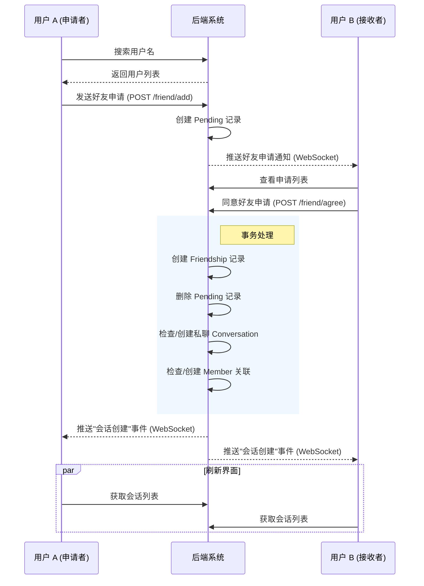
```mermaid
sequenceDiagram
    participant UserA as 用户 A (申请者)
    participant System as 后端系统
    participant UserB as 用户 B (接收者)

    UserA->>System: 搜索用户名
    System-->>UserA: 返回用户列表
    UserA->>System: 发送好友申请 (POST /friend/add)
    System->>System: 创建 Pending 记录
    System-->>UserB: 推送好友申请通知 (WebSocket)
    
    UserB->>System: 查看申请列表
    UserB->>System: 同意好友申请 (POST /friend/agree)
    
    rect rgb(240, 248, 255)
        note right of System: 事务处理
        System->>System: 创建 Friendship 记录
        System->>System: 删除 Pending 记录
        System->>System: 检查/创建私聊 Conversation
        System->>System: 检查/创建 Member 关联
    end
    
    System-->>UserA: 推送"会话创建"事件 (WebSocket)
    System-->>UserB: 推送"会话创建"事件 (WebSocket)
    
    par 刷新界面
        UserA->>System: 获取会话列表
        UserB->>System: 获取会话列表
    end
```

#### 1.2.2 群聊创建与消息发送流程

此流程描述了用户创建一个群组，并发送一条消息，消息如何分发给所有群成员。

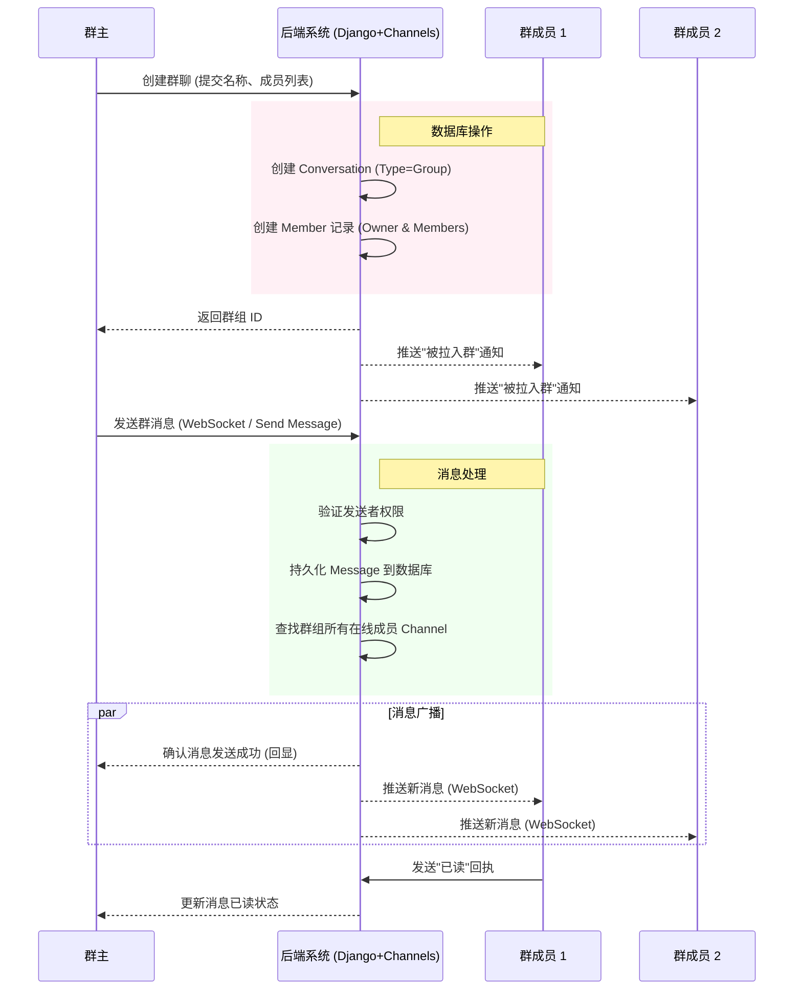
```mermaid
sequenceDiagram
    participant Owner as 群主
    participant System as 后端系统 (Django+Channels)
    participant Member1 as 群成员 1
    participant Member2 as 群成员 2

    Owner->>System: 创建群聊 (提交名称、成员列表)
    
    rect rgb(255, 240, 245)
        note right of System: 数据库操作
        System->>System: 创建 Conversation (Type=Group)
        System->>System: 创建 Member 记录 (Owner & Members)
    end
    
    System-->>Owner: 返回群组 ID
    System-->>Member1: 推送"被拉入群"通知
    System-->>Member2: 推送"被拉入群"通知

    Owner->>System: 发送群消息 (WebSocket / Send Message)
    
    rect rgb(240, 255, 240)
        note right of System: 消息处理
        System->>System: 验证发送者权限
        System->>System: 持久化 Message 到数据库
        System->>System: 查找群组所有在线成员 Channel
    end
    
    par 消息广播
        System-->>Owner: 确认消息发送成功 (回显)
        System-->>Member1: 推送新消息 (WebSocket)
        System-->>Member2: 推送新消息 (WebSocket)
    end
    
    Member1->>System: 发送"已读"回执
    System-->>Owner: 更新消息已读状态
```

### 1.3 总结

RG 系统通过上述模块的协同工作，实现了一个闭环的社交与通讯生态。
1.  **前端** 负责交互体验与实时数据的展示，利用 WebSocket 保持与服务器的长连接。
2.  **后端** 负责业务逻辑校验、数据持久化以及消息的路由分发。
3.  **数据库** 存储了用户关系、会话结构及海量的历史消息。

该设计满足了用户对于即时性、可靠性和功能丰富性的需求。

---

## 2. 模块设计

### 2.1 技术栈

**后端：**
- 框架：Django + Django Channels（WebSocket支持）
- 数据库：Django ORM
- 认证：自定义JWT Token
- 实时通信：WebSocket（Django Channels）

**前端：**
- 框架：Next.js（React）
- 状态管理：React Context API
- 样式：CSS-in-JS（styled-jsx）
- 类型：TypeScript

#### 2.1.2 整体架构图

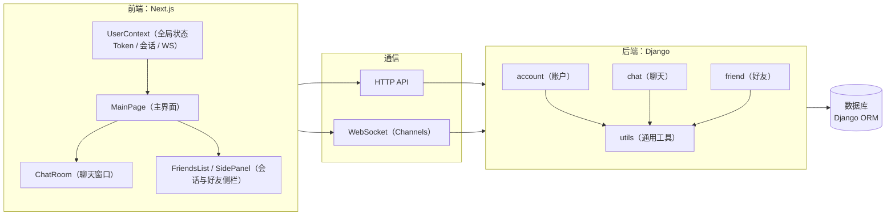
```mermaid
flowchart LR
    subgraph FE[前端：Next.js]
        MP[MainPage（主界面）]
        CR[ChatRoom（聊天窗口）]
        FL[FriendsList / SidePanel（会话与好友侧栏）]
        UC[UserContext（全局状态<br/>Token / 会话 / WS）]
        MP --> CR
        MP --> FL
        UC --> MP
    end

    subgraph NET[通信]
        HTTP[HTTP API]
        WS[WebSocket（Channels）]
    end

    subgraph BE[后端：Django]
        ACC[account（账户）]
        CHAT[chat（聊天）]
        FR[friend（好友）]
        UTL[utils（通用工具）]
        ACC --> UTL
        CHAT --> UTL
        FR --> UTL
    end

    DB[(数据库<br/>Django ORM)]

    FE --> HTTP --> BE
    FE --> WS --> BE
    BE --> DB
```

### 2.2 后端模块设计

#### 2.2.1 account 模块（账户管理）

##### 2.2.1.1 模块职责

`account` 模块负责用户账户的生命周期管理，包括用户注册、登录、信息修改、账户注销等核心功能。

##### 2.2.1.2 核心数据模型

**User 模型** (`backend/account/models.py`)

- 关键字段：`username`、`avatar`、`info`、`is_active`、`created_at`（以及可选 `email/phone`）
- 约束与校验：用户名/密码/手机号等格式由后端校验器统一约束
- 生命周期：注销采用软删除（`is_active=False`），并保留 `deactivated_username` 用于历史展示

#### 2.2.2 chat 模块

##### 2.2.2.1 模块职责

`chat` 模块负责即时通讯的核心功能，包括：
- 会话（Conversation）管理（私聊和群聊）
- 消息发送、接收、编辑、撤回
- WebSocket 实时通信
- 消息历史记录查询
- 群聊管理（成员管理、权限控制）
- 消息已读状态管理
- 会话置顶和免打扰功能

##### 2.2.2.2 核心数据模型

- `Conversation`：`type`（私聊/群聊）、`name/avatar`（群聊信息）、`is_active`、`created_at`
- `Member`：`mute`（免打扰）、`pinned`（是否置顶）、`role`（member/admin/owner）、`is_active`
- `Message`：`type`、`content`、`reply_to`、`valid`（撤回）、已读/删除关联列表
- `PinnedConversation`：置顶排序（`pin_order`）
- `GroupAnnouncement`：群公告
- `GroupInvitation`：入群邀请（pending/approved/rejected/expired）

##### 2.2.2.3 实时通信

- 客户端通过 WebSocket 建立连接（token 鉴权）
- 服务端按“用户维度”组织连接与事件分发，并将会话相关事件路由到会话成员

#### 2.2.3 friend 模块

##### 2.2.3.1 模块职责

`friend` 模块负责用户之间的好友关系管理，包括：
- 好友申请、同意、拒绝
- 好友删除
- 好友分组管理
- 用户搜索

##### 2.2.3.2 核心数据模型

- `Friendship`：好友关系（按 user_a/user_b 存一条记录）
- `Pending`：好友申请（from/to）
- `FriendGroup`：好友分组（name + user + friends）
#### 2.2.4 utils 模块
##### 2.2.4.1 模块职责

`utils` 模块提供通用的工具函数和类，供其他模块复用。

##### 2.2.4.2 子模块说明

- `utils/jwt.py`：JWT 生成与解析（供 HTTP/WS 鉴权使用）
- `utils/network.py`：统一 JSON 响应封装（成功/失败/方法错误）
- `utils/tools.py`：请求体解析、token 读取等通用工具

### 2.3 前端模块设计

#### 2.3.1 context 模块

##### 2.3.1.1 模块职责

`context` 模块使用 React Context API 管理全局状态，包括用户状态、会话状态、WebSocket 连接等。

##### 2.3.1.2 UserContext

`UserContext` 负责统一管理：
- 登录态（token/selfId 等）与用户信息缓存
- 会话列表与消息增量更新（HTTP 拉取 + WS 推送）
- WebSocket 生命周期（连接、重连、消息分发）
- 置顶/免打扰等会话偏好设置

#### 2.3.2 components 模块（UI组件）

**职责：**
- 应用主布局
- 左侧导航栏（聊天、好友、设置）
- 侧边栏（会话列表/好友管理/设置面板）
- 右侧内容区（聊天室/空状态）

**布局结构：**

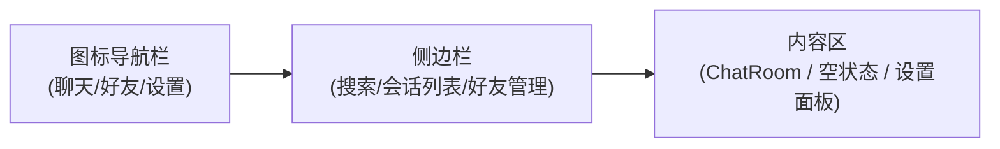
```mermaid
flowchart LR
    Nav["图标导航栏<br/>(聊天/好友/设置)"] --> Side["侧边栏<br/>(搜索/会话列表/好友管理)"]
    Side --> Content["内容区<br/>(ChatRoom / 空状态 / 设置面板)"]
```

##### 2.3.2.2 ChatRoom（聊天室）

**职责：**
- 显示消息列表
- 发送消息（文本、图片、音频、视频）
- 消息操作（回复、编辑、撤回、删除）
- 已读状态显示
- 历史记录搜索
- 文件上传

##### 2.3.2.3 FriendsList（好友/会话列表）

**职责：**
- 显示会话列表
- 会话搜索和过滤
- 显示未读消息数
- 显示置顶和免打扰状态
- 右键菜单（置顶/取消置顶、开启/关闭免打扰）

**排序规则：**
1. 置顶会话在前，按 pinOrder 排序
2. 非置顶会话在后，按最后消息时间排序

##### 2.3.2.4 其他组件

| 组件 | 职责 |
|------|------|
| `Avatar` | 头像显示组件，支持默认头像 |
| `Profile` | 用户资料面板 |
| `SettingsPanel` | 设置面板 |
| `SocialPanel` | 社交面板（好友管理） |
| `GroupInfoPanel` | 群聊信息面板 |
| `GroupInvitationsPanel` | 群聊邀请面板 |
| `SearchBar` | 搜索栏组件 |

---

## 3. 数据库设计

### 3.1 用户模块 (Account)

#### 3.1.1 User (用户表)
继承自 Django 的 `AbstractUser`，存储用户的基本信息。

| 字段名 | 类型 | 必填 | 描述 |
| :--- | :--- | :--- | :--- |
| `id` | AutoField | 是 | 主键 ID |
| `username` | CharField(30) | 是 | 用户名，唯一。支持字母、数字、下划线、点和中文。 |
| `password` | CharField | 是 | 加密后的密码 |
| `email` | EmailField | 否 | 邮箱地址 |
| `phone` | CharField(11) | 否 | 手机号，需符合中国大陆手机号格式 |
| `avatar` | URLField | 否 | 用户头像 URL |
| `info` | TextField(1000) | 否 | 个人简介 |
| `deactivated_username` | CharField(30) | 否 | 注销后的用户名备份，用于历史数据显示 |
| `is_active` | BooleanField | 是 | 账户是否激活 |
| `is_staff` | BooleanField | 是 | 是否为管理员 |
| `is_superuser` | BooleanField | 是 | 是否为超级管理员 |
| `date_joined` | DateTimeField | 是 | 注册时间 |
| `last_login` | DateTimeField | 否 | 最后登录时间 |

**表间关系:** 被 `chat.Member` 引用 (一对多)；被 `chat.PinnedConversation` 引用 (一对多)；被 `chat.GroupInvitation` 引用 (作为邀请人、被邀请人、审核人)；被 `friend.Friendship` 引用 (作为 user_a, user_b)；被 `friend.Pending` 引用 (作为 user_from, user_to)；被 `friend.FriendGroup` 引用 (作为拥有者和分组成员)。

### 3.2 聊天模块 (Chat)


| 字段名 | 类型 | 必填 | 描述 |
| :--- | :--- | :--- | :--- |
| `id` | AutoField | 是 | 主键 ID |
| `name` | CharField(50) | 否 | 会话名称（群聊名称） |
| `type` | CharField(10) | 是 | 会话类型：`private` (私聊), `group` (群聊) |
| `is_active` | BooleanField | 是 | 是否活跃（群解散后为 False） |
| `avatar` | URLField(150) | 否 | 会话头像 |
| `created_at` | DateTimeField | 是 | 创建时间 |

**表间关系:** 被 `chat.Member` 引用 (一对多)；被 `chat.Message` 引用 (一对多)；被 `chat.PinnedConversation` 引用 (一对多)；被 `chat.GroupAnnouncement` 引用 (一对多)；被 `chat.GroupInvitation` 引用 (一对多)。

#### 3.2.2 Member (会话成员表)
存储用户在特定会话中的状态和设置。

| 字段名 | 类型 | 必填 | 描述 |
| :--- | :--- | :--- | :--- |
| `id` | AutoField | 是 | 主键 ID |
| `conversation` | ForeignKey | 是 | 关联的会话 |
| `user` | ForeignKey | 是 | 关联的用户 |
| `nickname` | CharField(30) | 否 | 在该会话中的昵称 |
| `role` | CharField(10) | 是 | 角色：`member` (成员), `admin` (管理员), `owner` (群主) |
| `mute` | BooleanField | 是 | 是否被禁言 |
| `pinned` | BooleanField | 是 | 是否置顶（简单标记） |
| `time` | DateTimeField | 否 | 上次关闭会话的时间（用于计算未读） |
| `is_active` | BooleanField | 是 | 是否活跃（软删除，退出群聊后为 False） |

**表间关系:** 关联 `Conversation` 和 `User`；被 `chat.Message` 引用 (一对多)；被 `chat.Message.read_list` 引用 (多对多)；被 `chat.Message.delete_list` 引用 (多对多)；被 `chat.GroupAnnouncement` 引用 (一对多)。

#### 3.2.3 Message (消息表)
存储会话中的所有消息记录。

| 字段名 | 类型 | 必填 | 描述 |
| :--- | :--- | :--- | :--- |
| `id` | AutoField | 是 | 主键 ID |
| `conversation` | ForeignKey | 是 | 所属会话 |
| `member` | ForeignKey | 是 | 发送者（成员） |
| `type` | CharField(20) | 是 | 消息类型：`text`, `image`, `emoji`, `video`, `audio` |
| `content` | TextField | 否 | 消息内容或资源 URL |
| `reply_to` | ForeignKey | 否 | 回复的消息（自关联） |
| `time` | DateTimeField | 是 | 发送时间 |
| `is_edited` | BooleanField | 是 | 是否已编辑 |
| `valid` | BooleanField | 是 | 是否有效（用于撤回） |
| `read_list` | ManyToMany | 否 | 已读该消息的成员列表 |
| `delete_list` | ManyToMany | 否 | 删除该消息的成员列表（软删除） |

**表间关系:** 关联 `Conversation` 和 `Member`；自关联 `reply_to`。

#### 3.2.4 PinnedConversation (置顶会话表)
存储用户的置顶会话及其顺序。

| 字段名 | 类型 | 必填 | 描述 |
| :--- | :--- | :--- | :--- |
| `id` | AutoField | 是 | 主键 ID |
| `user` | ForeignKey | 是 | 所属用户 |
| `conversation` | ForeignKey | 是 | 被置顶的会话 |
| `pin_order` | PositiveIntegerField | 是 | 置顶顺序（数字越小越靠前） |
| `created_at` | DateTimeField | 是 | 创建时间 |

**表间关系:** 关联 `User` 和 `Conversation`；联合唯一约束：`user` + `conversation`。

#### 3.2.5 GroupAnnouncement (群公告表)
存储群聊的公告信息。

| 字段名 | 类型 | 必填 | 描述 |
| :--- | :--- | :--- | :--- |
| `id` | AutoField | 是 | 主键 ID |
| `conversation` | ForeignKey | 是 | 所属群聊 |
| `author` | ForeignKey | 否 | 发布者（成员） |
| `content` | TextField | 是 | 公告内容 |
| `created_at` | DateTimeField | 是 | 发布时间 |

**表间关系:** 关联 `Conversation` 和 `Member`。

#### 3.2.6 GroupInvitation (群邀请表)
存储群聊邀请记录及审核状态。

| 字段名 | 类型 | 必填 | 描述 |
| :--- | :--- | :--- | :--- |
| `id` | AutoField | 是 | 主键 ID |
| `conversation` | ForeignKey | 是 | 目标群聊 |
| `inviter` | ForeignKey | 是 | 邀请人 (User) |
| `invitee` | ForeignKey | 是 | 被邀请人 (User) |
| `status` | CharField(10) | 是 | 状态：`pending`, `approved`, `rejected`, `expired` |
| `message` | TextField | 否 | 邀请附言 |
| `reviewer` | ForeignKey | 否 | 审核人 (User) |
| `review_comment` | TextField | 否 | 审核意见 |
| `created_at` | DateTimeField | 是 | 创建时间 |
| `updated_at` | DateTimeField | 是 | 更新时间 |
| `review_time` | DateTimeField | 否 | 审核时间 |

**表间关系:** 关联 `Conversation` 和 `User` (inviter, invitee, reviewer)；联合唯一约束：`conversation` + `invitee`。

---

### 3.3 好友模块 (Friend)

#### 3.3.1 Friendship (好友关系表)
存储双向好友关系。
| :--- | :--- | :--- | :--- |
| `id` | AutoField | 是 | 主键 ID |
| `user_a` | ForeignKey | 是 | 用户 A (ID 较小者) |
| `user_b` | ForeignKey | 是 | 用户 B (ID 较大者) |
| `created_at` | DateTimeField | 是 | 建立关系时间 |

**表间关系:** 关联两个 `User`；约束：`user_a` != `user_b`，且 `(user_a, user_b)` 唯一；逻辑上无方向，代码层面强制 `user_a_id < user_b_id`。

#### 3.3.2 Pending (好友申请表)
存储待处理的好友申请。

| 字段名 | 类型 | 必填 | 描述 |
| :--- | :--- | :--- | :--- |
| `id` | AutoField | 是 | 主键 ID |
| `user_from` | ForeignKey | 是 | 申请发起人 |
| `user_to` | ForeignKey | 是 | 申请接收人 |
| `created_at` | DateTimeField | 是 | 申请时间 |

**表间关系:** 关联两个 `User`。

#### 3.3.3 FriendGroup (好友分组表)
存储用户自定义的好友分组。

| 字段名 | 类型 | 必填 | 描述 |
| :--- | :--- | :--- | :--- |
| `id` | AutoField | 是 | 主键 ID |
| `name` | CharField(100) | 是 | 分组名称 |
| `user` | ForeignKey | 是 | 分组所属用户 |
| `friends` | ManyToMany | 否 | 分组内的好友列表 |

**表间关系:** 关联 `User` (作为拥有者)；多对多关联 `User` (作为分组成员)。

<div style="page-break-after: always;"></div>

# API文档

<a href="#appendix">跳转附录</a>

## 约定

### 路由前缀

- 规范前缀（推荐写法）：
    - 账户：`/account/*`
    - 好友：`/friend/*`
    - 会话/群聊/消息：`/chat/*`
- 兼容前缀（与 `/chat/*` 等价）：`/new/*`、`/message/*`（历史遗留别名）

### 鉴权

- HTTP API：`Authorization: Bearer <JWT Token>`
- WebSocket：`ws://<host>/ws/chat?token=<JWT Token>`

### 返回格式

- 成功：HTTP 200，固定包含 `{"code": 0, "info": "Succeed."}`，并在同一层级返回该接口的业务字段（例如 `jwt_token`、`friends`、`messages` 等；部分接口会使用 `data` 字段承载主要数据）。
- 失败：HTTP 非 200，`{"code": <业务码>, "info": "..."}`

> 说明：为便于阅读，本文部分成功响应示例可能省略固定字段 `info`，以实际返回为准。

## 一、用户管理部分

### 1、用户注册（基本管理）
格式规定：
【username】1-30字符，只能包含汉字、字母、数字、下划线、点（不能以后两个开头或结尾）
【password】8-128字符，必须包含字母和数字，不能包含空格

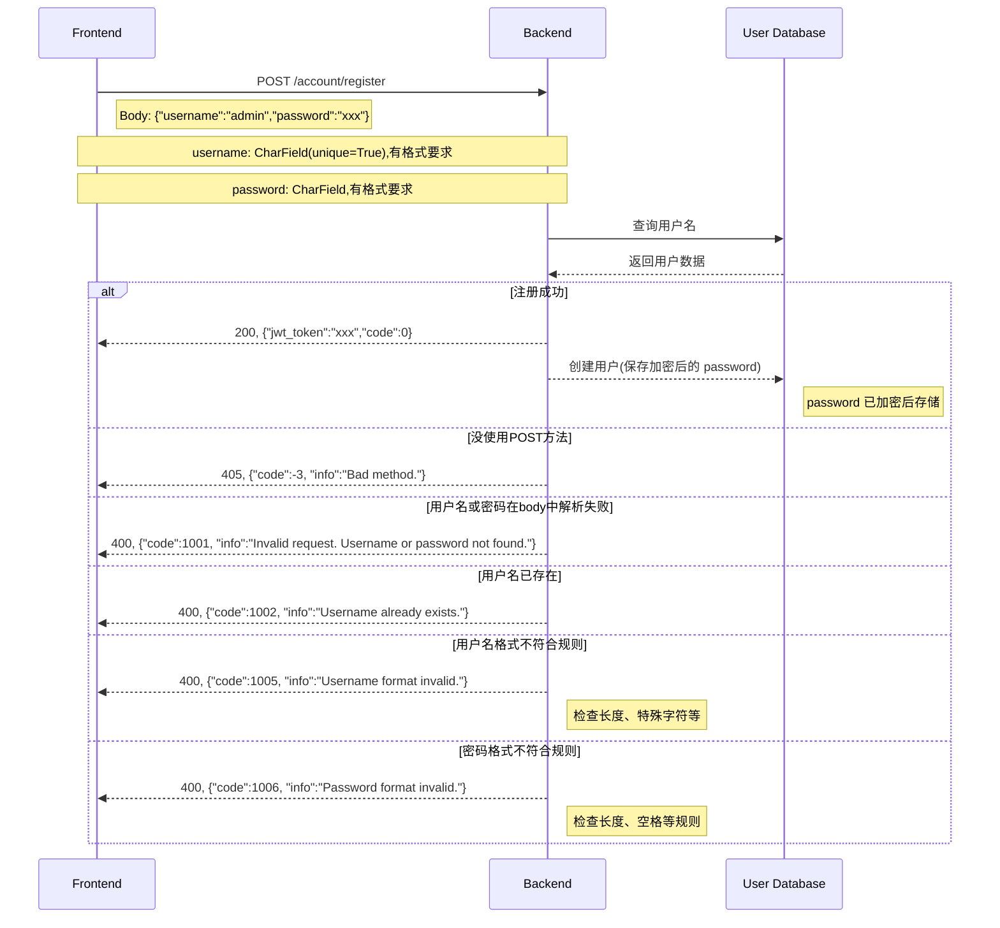
```mermaid
sequenceDiagram
    participant F as Frontend
    participant B as Backend
    participant UDB as User Database

    F->>B: POST /account/register
    Note right of F: Body: {"username":"admin","password":"xxx"}

    Note over F,B: username: CharField(unique=True),有格式要求
    Note over F,B:password: CharField,有格式要求

    B->>UDB: 查询用户名
    UDB-->>B: 返回用户数据

    alt 注册成功
        B-->>F: 200, {"jwt_token":"xxx","code":0}
        B-->>UDB: 创建用户(保存加密后的 password)
        Note right of UDB: password 已加密后存储

    else 没使用POST方法
        B-->>F: 405, {"code":-3, "info":"Bad method."}

    else 用户名或密码在body中解析失败
        B-->>F: 400, {"code":1001, "info":"Invalid request. Username or password not found."}

    else 用户名已存在
        B-->>F: 400, {"code":1002, "info":"Username already exists."}

    else 用户名格式不符合规则
        B-->>F: 400, {"code":1005, "info":"Username format invalid."}
        Note right of B: 检查长度、特殊字符等

    else 密码格式不符合规则
        B-->>F: 400, {"code":1006, "info":"Password format invalid."}
        Note right of B: 检查长度、空格等规则

    end

```

### 2、用户注销（基本管理）

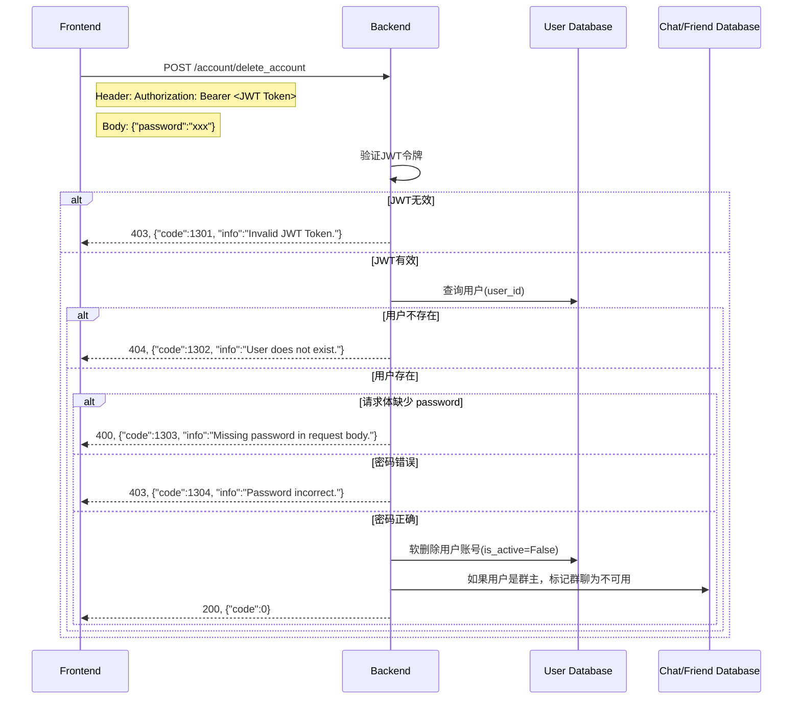
```mermaid
sequenceDiagram
    participant F as Frontend
    participant B as Backend
    participant UDB as User Database
    participant CDB as Chat/Friend Database

    F->>B: POST /account/delete_account
    Note right of F: Header: Authorization: Bearer <JWT Token>
    Note right of F: Body: {"password":"xxx"}

    B->>B: 验证JWT令牌
    alt JWT无效
        B-->>F: 403, {"code":1301, "info":"Invalid JWT Token."}
    else JWT有效
        B->>UDB: 查询用户(user_id)
        alt 用户不存在
            B-->>F: 404, {"code":1302, "info":"User does not exist."}
        else 用户存在
            alt 请求体缺少 password
                B-->>F: 400, {"code":1303, "info":"Missing password in request body."}
            else 密码错误
                B-->>F: 403, {"code":1304, "info":"Password incorrect."}
            else 密码正确
                B->>UDB: 软删除用户账号(is_active=False)
                B->>CDB: 如果用户是群主，标记群聊为不可用
                B-->>F: 200, {"code":0}
            end
        end
    end
```

### 3、登录登出（用户认证）
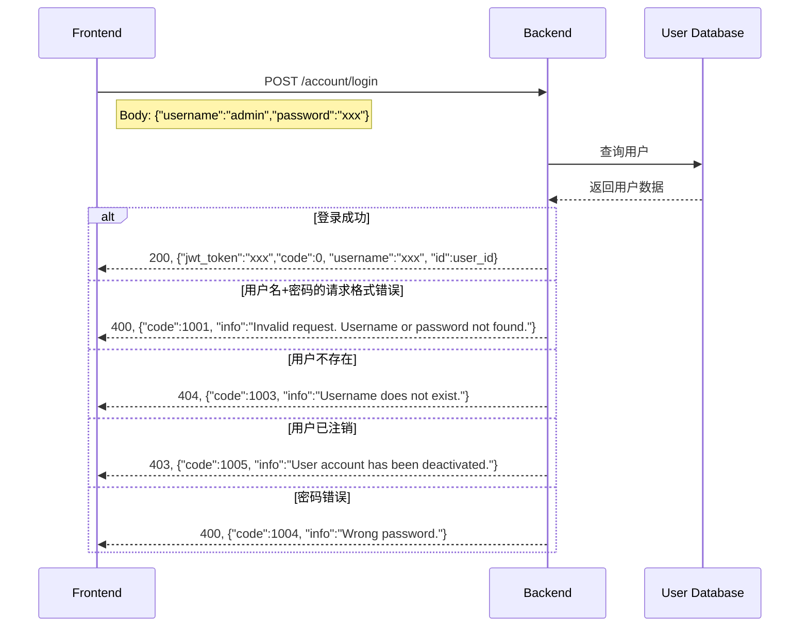
```mermaid
sequenceDiagram
    participant F as Frontend
    participant B as Backend
    participant UDB as User Database

    F->>B: POST /account/login
    Note right of F: Body: {"username":"admin","password":"xxx"}
    B->>UDB: 查询用户
    UDB-->>B: 返回用户数据
    alt 登录成功
        B-->>F: 200, {"jwt_token":"xxx","code":0, "username":"xxx", "id":user_id}
    else 用户名+密码的请求格式错误
        B-->>F: 400, {"code":1001, "info":"Invalid request. Username or password not found."}
    else 用户不存在
        B-->>F: 404, {"code":1003, "info":"Username does not exist."}
    else 用户已注销
        B-->>F: 403, {"code":1005, "info":"User account has been deactivated."}
    else 密码错误
        B-->>F: 400, {"code":1004, "info":"Wrong password."}
    end
```

### 4、信息编辑（用户认证）
**修改个人信息**
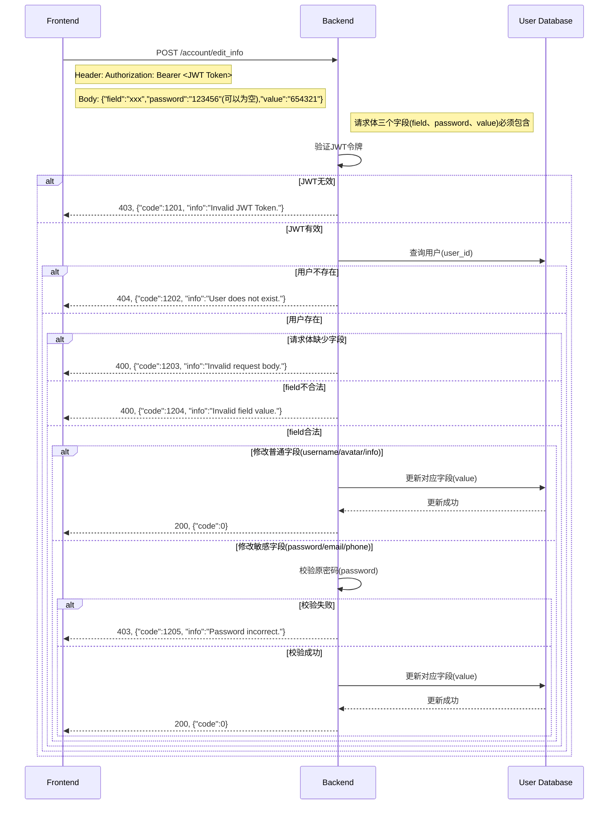
```mermaid
sequenceDiagram
    participant F as Frontend
    participant B as Backend
    participant UDB as User Database

    F->>B: POST /account/edit_info
    Note right of F: Header: Authorization: Bearer <JWT Token>
    Note right of F: Body: {"field":"xxx","password":"123456"(可以为空),"value":"654321"}
    Note right of B: 请求体三个字段(field、password、value)必须包含

    B->>B: 验证JWT令牌
    alt JWT无效
        B-->>F: 403, {"code":1201, "info":"Invalid JWT Token."}
    else JWT有效
        B->>UDB: 查询用户(user_id)
        alt 用户不存在
            B-->>F: 404, {"code":1202, "info":"User does not exist."}
        else 用户存在
            alt 请求体缺少字段
                B-->>F: 400, {"code":1203, "info":"Invalid request body."}
            else field不合法
                B-->>F: 400, {"code":1204, "info":"Invalid field value."}
            else field合法
                alt 修改普通字段(username/avatar/info)
                    B->>UDB: 更新对应字段(value)
                    UDB-->>B: 更新成功
                    B-->>F: 200, {"code":0}
                else 修改敏感字段(password/email/phone)
                    B->>B: 校验原密码(password)
                    alt 校验失败
                        B-->>F: 403, {"code":1205, "info":"Password incorrect."}
                    else 校验成功
                        B->>UDB: 更新对应字段(value)
                        UDB-->>B: 更新成功
                        B-->>F: 200, {"code":0}
                    end
                end
            end
        end
    end

```

### 5、用户查找（好友关系）

**查找用户**
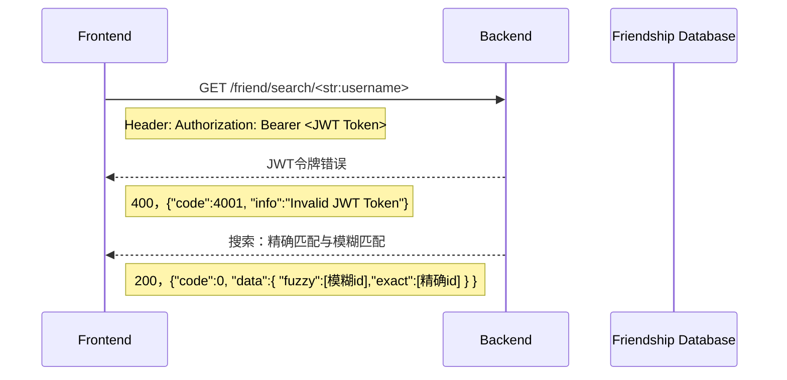
```mermaid
sequenceDiagram
    participant F as Frontend
    participant B as Backend
    participant FDB as Friendship Database
    
    F->>B: GET /friend/search/<str:username>
    Note right of F: Header: Authorization: Bearer <JWT Token>
    B-->>F: JWT令牌错误
    Note right of F: 400，{"code":4001, "info":"Invalid JWT Token"}
    B-->>F: 搜索：精确匹配与模糊匹配
    Note right of F: 200，{"code":0, "data":{ "fuzzy":[模糊id],"exact":[精确id] } }
```

### 6、好友申请（好友关系）
##### (申请添加好友+同意拒绝)
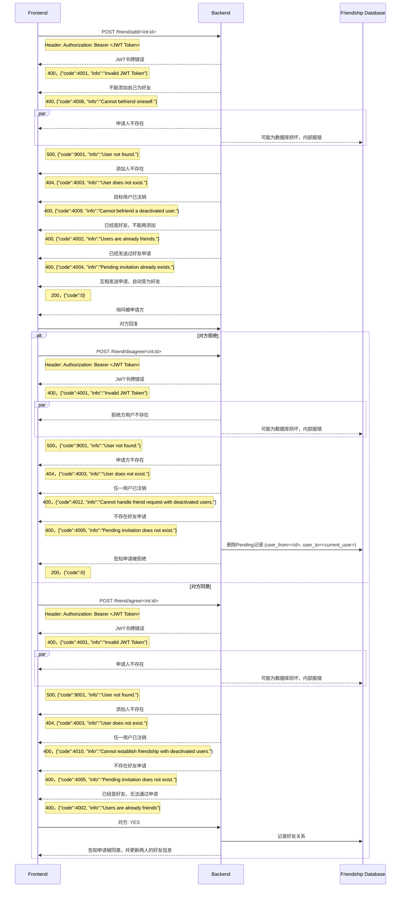
```mermaid
sequenceDiagram
    participant F as Frontend
    participant B as Backend
    participant FDB as Friendship Database
    
    F->>B: POST /friend/add/<int:id>
    Note right of F: Header: Authorization: Bearer <JWT Token>
    B-->>F: JWT令牌错误
    Note right of F: 400，{"code":4001, "info":"Invalid JWT Token"}
    B-->>F: 不能添加自己为好友
    Note right of F: 400, {"code":4006, "info":"Cannot befriend oneself."}
    par
        B-->>F: 申请人不存在
        B-->>FDB: 可能为数据库损坏，内部报错
    end
    Note right of F: 500, {"code":9001, "info":"User not found."}
    B-->>F: 添加人不存在
    Note right of F: 404, {"code":4003, "info":"User does not exist."}
    B-->>F: 目标用户已注销
    Note right of F: 400, {"code":4009, "info":"Cannot befriend a deactivated user."}
    B-->>F: 已经是好友，不能再添加
    Note right of F: 400, {"code":4002, "info":"Users are already friends."}
    B-->>F: 已经发送过好友申请
    Note right of F: 400, {"code":4004, "info":"Pending invitation already exists."}
    B-->>F: 互相发送申请，自动变为好友
    Note right of F: 200，{"code":0}
    B-->>F: 询问被申请方
    F->>B: 对方回复
    alt 对方拒绝
        F->>B: POST /friend/disagree/<int:id>
    Note right of F: Header: Authorization: Bearer <JWT Token>
        B-->>F: JWT令牌错误
        Note right of F: 400，{"code":4001, "info":"Invalid JWT Token"}
        par
            B-->>F: 拒绝方用户不存在
            B-->>FDB: 可能为数据库损坏，内部报错
        end
        Note right of F: 500，{"code":9001, "info":"User not found."}
        B-->>F: 申请方不存在
        Note right of F: 404，{"code":4003, "info":"User does not exist."}
        B-->>F: 任一用户已注销
        Note right of F: 400，{"code":4012, "info":"Cannot handle friend request with deactivated users."}
        B-->>F: 不存在好友申请
        Note right of F: 400，{"code":4005, "info":"Pending invitation does not exist."}
        B->>FDB: 删除Pending记录 (user_from=<id>, user_to=<current_user>)
        B-->>F: 告知申请被拒绝
        Note right of F: 200，{"code":0}
    else 对方同意
        F->>B: POST /friend/agree/<int:id>
        Note right of F: Header: Authorization: Bearer <JWT Token>
        B-->>F: JWT令牌错误
        Note right of F: 400，{"code":4001, "info":"Invalid JWT Token"}
        par
            B-->>F: 申请人不存在
            B-->>FDB: 可能为数据库损坏，内部报错
        end
        Note right of F: 500, {"code":9001, "info":"User not found."}
        B-->>F: 添加人不存在
        Note right of F: 404, {"code":4003, "info":"User does not exist."}
        B-->>F: 任一用户已注销
        Note right of F: 400，{"code":4010, "info":"Cannot establish friendship with deactivated users."}
        B-->>F: 不存在好友申请
        Note right of F: 400，{"code":4005, "info":"Pending invitation does not exist."}
        B-->>F: 已经是好友，无法通过申请
        Note right of F: 400，{"code":4002, "info":"Users are already friends"}
        F->>B: 对方: YES
        B->>FDB: 记录好友关系
        B-->>F: 告知申请被同意，并更新两人的好友信息
    end
```

### 7、好友删除（好友关系）
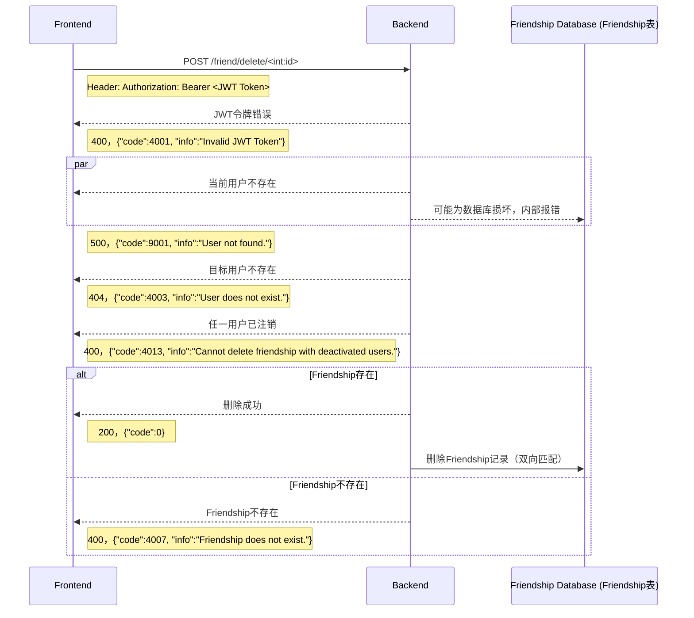
```mermaid
sequenceDiagram
    participant F as Frontend
    participant B as Backend
    participant FDB as Friendship Database (Friendship表)

    F->>B: POST /friend/delete/<int:id>
    Note right of F: Header: Authorization: Bearer <JWT Token>
    B-->>F: JWT令牌错误
    Note right of F: 400，{"code":4001, "info":"Invalid JWT Token"}

    par
        B-->>F: 当前用户不存在
        B-->>FDB: 可能为数据库损坏，内部报错
    end
    Note right of F: 500，{"code":9001, "info":"User not found."}

    B-->>F: 目标用户不存在
    Note right of F: 404，{"code":4003, "info":"User does not exist."}

    B-->>F: 任一用户已注销
    Note right of F: 400，{"code":4013, "info":"Cannot delete friendship with deactivated users."}

    alt Friendship存在
        B-->>F: 删除成功
        Note right of F: 200，{"code":0}
        B->>FDB: 删除Friendship记录（双向匹配）
    else Friendship不存在
        B-->>F: Friendship不存在
        Note right of F: 400，{"code":4007, "info":"Friendship does not exist."}
    end
```

### 8、好友列表

**获取好友列表**
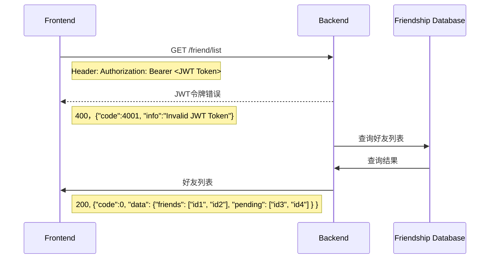
```mermaid
sequenceDiagram
    participant F as Frontend
    participant B as Backend
    participant FDB as Friendship Database
    
    F->>B: GET /friend/list
    Note right of F: Header: Authorization: Bearer <JWT Token>
    B-->>F: JWT令牌错误
    Note right of F: 400，{"code":4001, "info":"Invalid JWT Token"}
    B->>FDB: 查询好友列表
    FDB->>B: 查询结果 
    B->>F: 好友列表
    Note right of F: 200, {"code":0, "data": {"friends": ["id1", "id2"], "pending": ["id3", "id4"] } } 
```

### 9、检查好友关系

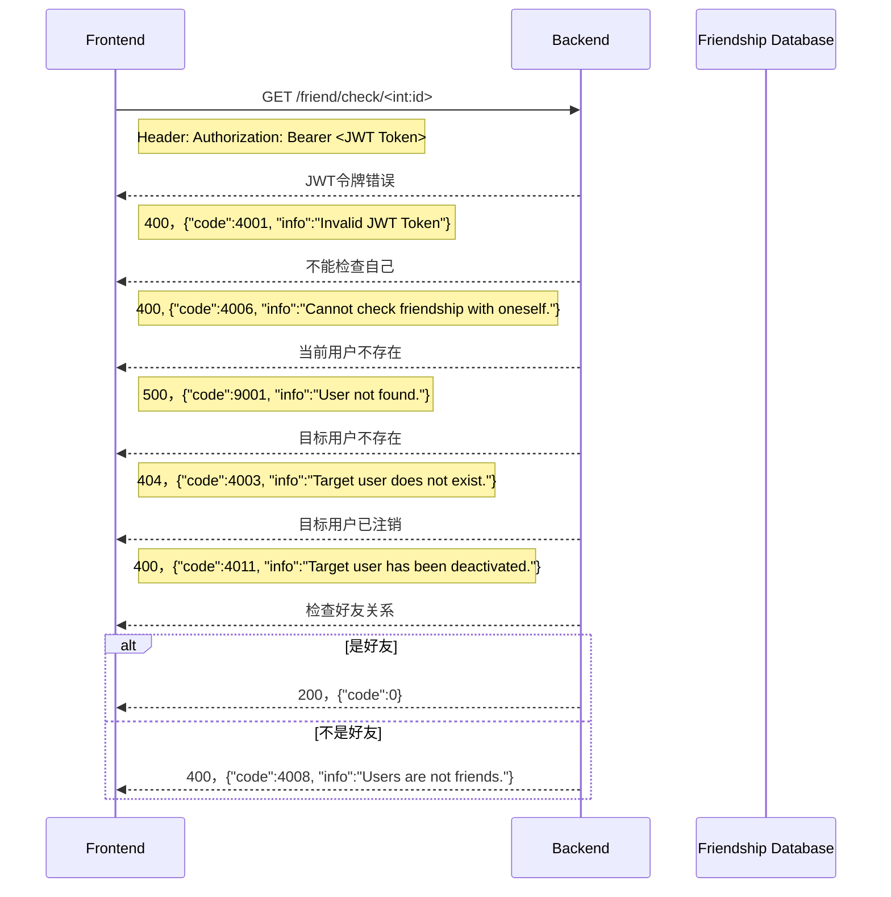
```mermaid
sequenceDiagram
    participant F as Frontend
    participant B as Backend
    participant FDB as Friendship Database
    
    F->>B: GET /friend/check/<int:id>
    Note right of F: Header: Authorization: Bearer <JWT Token>
    B-->>F: JWT令牌错误
    Note right of F: 400，{"code":4001, "info":"Invalid JWT Token"}
    B-->>F: 不能检查自己
    Note right of F: 400, {"code":4006, "info":"Cannot check friendship with oneself."}
    B-->>F: 当前用户不存在
    Note right of F: 500，{"code":9001, "info":"User not found."}
    B-->>F: 目标用户不存在
    Note right of F: 404，{"code":4003, "info":"Target user does not exist."}
    B-->>F: 目标用户已注销
    Note right of F: 400，{"code":4011, "info":"Target user has been deactivated."}
    B-->>F: 检查好友关系
    alt 是好友
        B-->>F: 200，{"code":0}
    else 不是好友
        B-->>F: 400，{"code":4008, "info":"Users are not friends."}
    end
```

### 10、好友分组

#### 创建好友分组
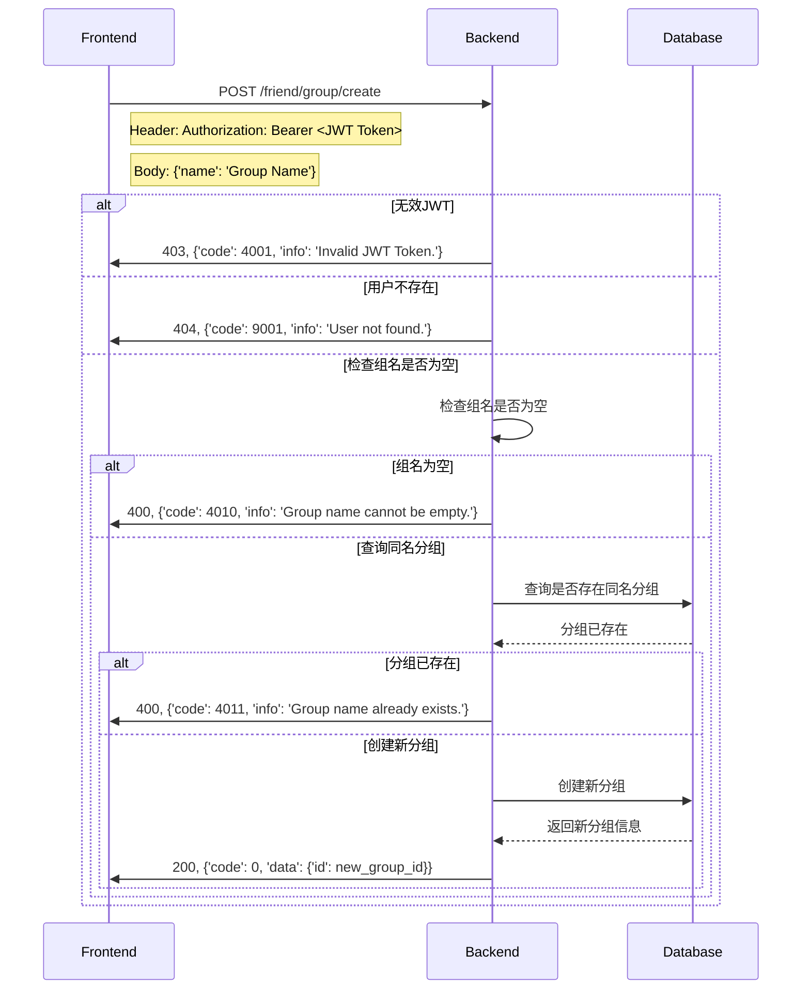
```mermaid

sequenceDiagram
    participant F as Frontend
    participant B as Backend
    participant DB as Database

    F->>B: POST /friend/group/create
    Note right of F: Header: Authorization: Bearer <JWT Token>
    Note right of F: Body: {'name': 'Group Name'}
    alt 无效JWT
        B->>F: 403, {'code': 4001, 'info': 'Invalid JWT Token.'}
    else 用户不存在
        B->>F: 404, {'code': 9001, 'info': 'User not found.'}
    else 检查组名是否为空
        B->>B: 检查组名是否为空
        alt 组名为空
            B->>F: 400, {'code': 4010, 'info': 'Group name cannot be empty.'}
        else 查询同名分组
            B->>DB: 查询是否存在同名分组
            DB-->>B: 分组已存在
            alt 分组已存在
                B->>F: 400, {'code': 4011, 'info': 'Group name already exists.'}
            else 创建新分组
                B->>DB: 创建新分组
                DB-->>B: 返回新分组信息
                B->>F: 200, {'code': 0, 'data': {'id': new_group_id}}
            end
        end
    end


```

#### 列出好友分组
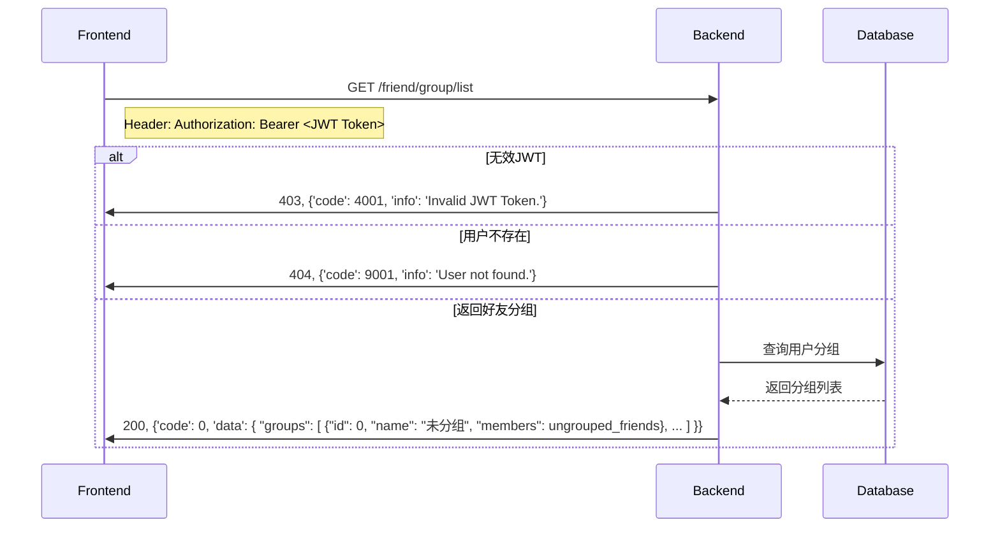
```mermaid

sequenceDiagram
    participant F as Frontend
    participant B as Backend
    participant DB as Database

    F->>B: GET /friend/group/list
    Note right of F: Header: Authorization: Bearer <JWT Token>
    alt 无效JWT
        B->>F: 403, {'code': 4001, 'info': 'Invalid JWT Token.'}
    else 用户不存在
        B->>F: 404, {'code': 9001, 'info': 'User not found.'}
    else 返回好友分组
        B->>DB: 查询用户分组
        DB-->>B: 返回分组列表
        B->>F: 200, {'code': 0, 'data': { "groups": [ {"id": 0, "name": "未分组", "members": ungrouped_friends}, ... ] }}
    end

```

#### 把好友添加到分组里
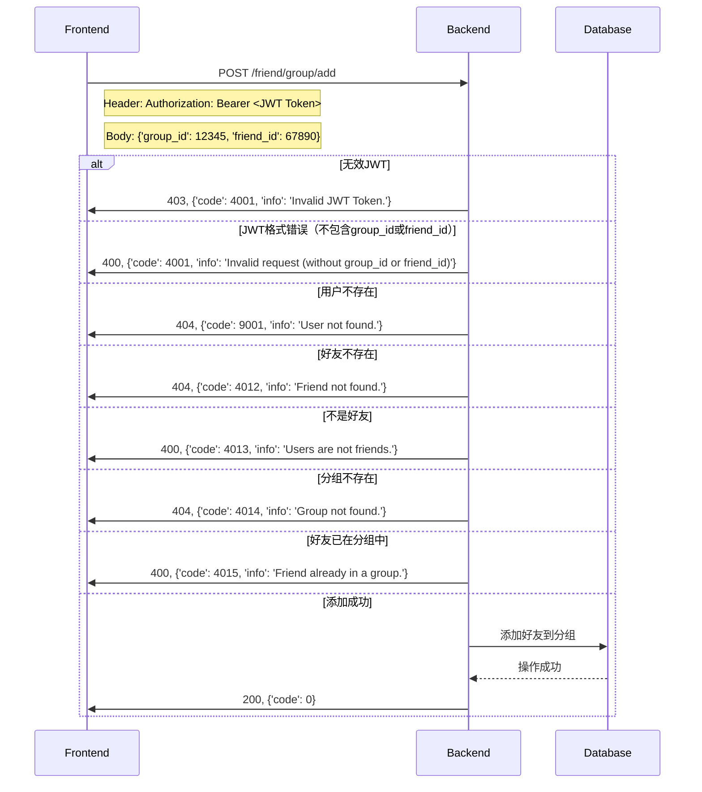
```mermaid

sequenceDiagram
    participant F as Frontend
    participant B as Backend
    participant DB as Database

    F->>B: POST /friend/group/add
    Note right of F: Header: Authorization: Bearer <JWT Token>
    Note right of F: Body: {'group_id': 12345, 'friend_id': 67890}
    alt 无效JWT
        B->>F: 403, {'code': 4001, 'info': 'Invalid JWT Token.'}
    else JWT格式错误（不包含group_id或friend_id）
        B->>F: 400, {'code': 4001, 'info': 'Invalid request (without group_id or friend_id)'}
    else 用户不存在
        B->>F: 404, {'code': 9001, 'info': 'User not found.'}
    else 好友不存在
        B->>F: 404, {'code': 4012, 'info': 'Friend not found.'}
    else 不是好友
        B->>F: 400, {'code': 4013, 'info': 'Users are not friends.'}
    else 分组不存在
        B->>F: 404, {'code': 4014, 'info': 'Group not found.'}
    else 好友已在分组中
        B->>F: 400, {'code': 4015, 'info': 'Friend already in a group.'}
    else 添加成功
        B->>DB: 添加好友到分组
        DB-->>B: 操作成功
        B->>F: 200, {'code': 0}
    end

```

#### 从分组移除好友
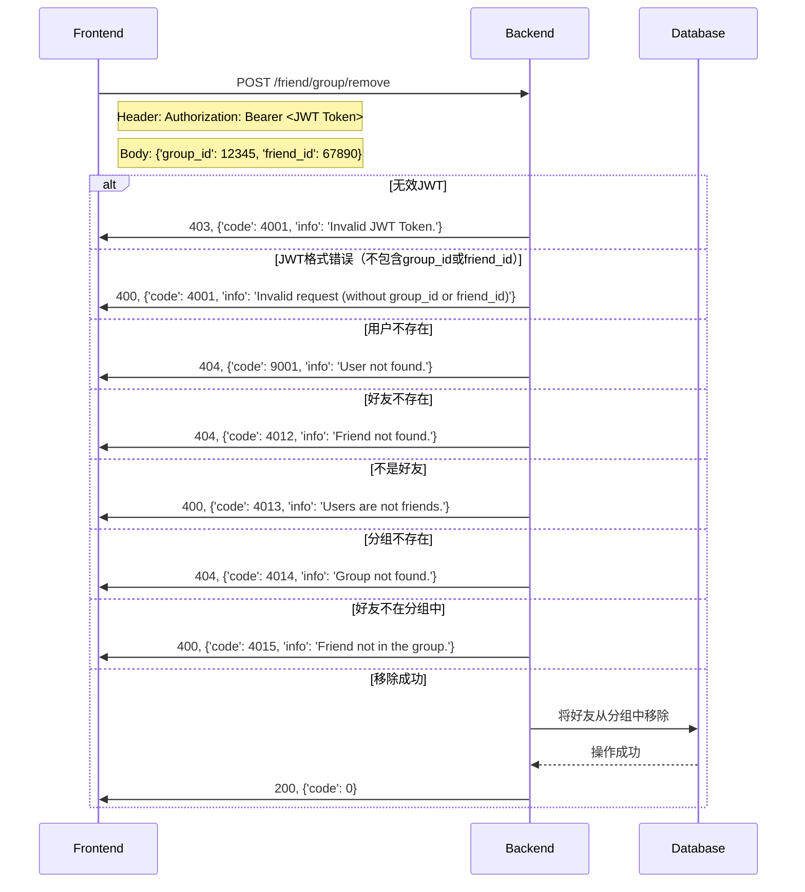
```mermaid

sequenceDiagram
    participant F as Frontend
    participant B as Backend
    participant DB as Database

    F->>B: POST /friend/group/remove
    Note right of F: Header: Authorization: Bearer <JWT Token>
    Note right of F: Body: {'group_id': 12345, 'friend_id': 67890}
    alt 无效JWT
        B->>F: 403, {'code': 4001, 'info': 'Invalid JWT Token.'}
    else JWT格式错误（不包含group_id或friend_id）
        B->>F: 400, {'code': 4001, 'info': 'Invalid request (without group_id or friend_id)'}
    else 用户不存在
        B->>F: 404, {'code': 9001, 'info': 'User not found.'}
    else 好友不存在
        B->>F: 404, {'code': 4012, 'info': 'Friend not found.'}
    else 不是好友
        B->>F: 400, {'code': 4013, 'info': 'Users are not friends.'}
    else 分组不存在
        B->>F: 404, {'code': 4014, 'info': 'Group not found.'}
    else 好友不在分组中
        B->>F: 400, {'code': 4015, 'info': 'Friend not in the group.'}
    else 移除成功
        B->>DB: 将好友从分组中移除
        DB-->>B: 操作成功
        B->>F: 200, {'code': 0}
    end
```

#### 重命名分组
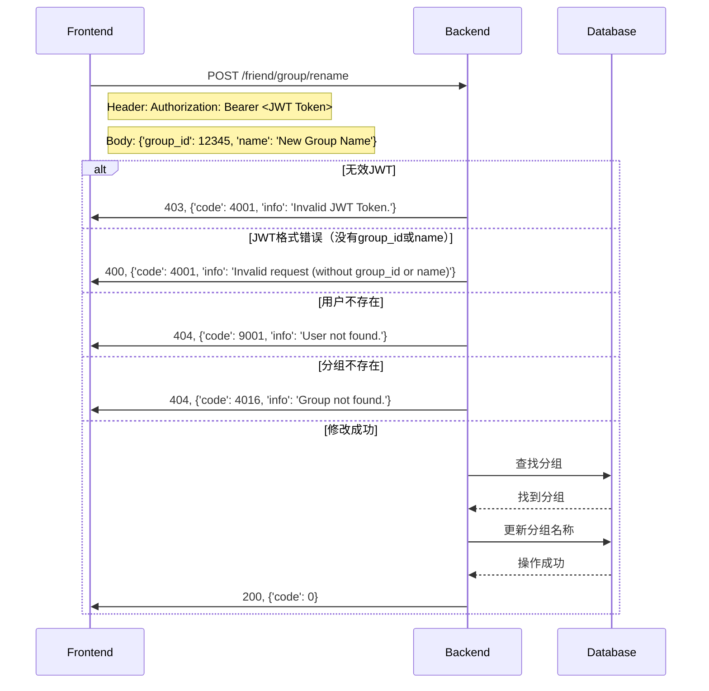
```mermaid

sequenceDiagram
    participant F as Frontend
    participant B as Backend
    participant DB as Database

    F->>B: POST /friend/group/rename
    Note right of F: Header: Authorization: Bearer <JWT Token>
    Note right of F: Body: {'group_id': 12345, 'name': 'New Group Name'}
    alt 无效JWT
        B->>F: 403, {'code': 4001, 'info': 'Invalid JWT Token.'}
    else JWT格式错误（没有group_id或name）
        B->>F: 400, {'code': 4001, 'info': 'Invalid request (without group_id or name)'}
    else 用户不存在
        B->>F: 404, {'code': 9001, 'info': 'User not found.'}
    else 分组不存在
        B->>F: 404, {'code': 4016, 'info': 'Group not found.'}
    else 修改成功
        B->>DB: 查找分组
        DB-->>B: 找到分组
        B->>DB: 更新分组名称
        DB-->>B: 操作成功
        B->>F: 200, {'code': 0}
    end

```

#### 删除分组
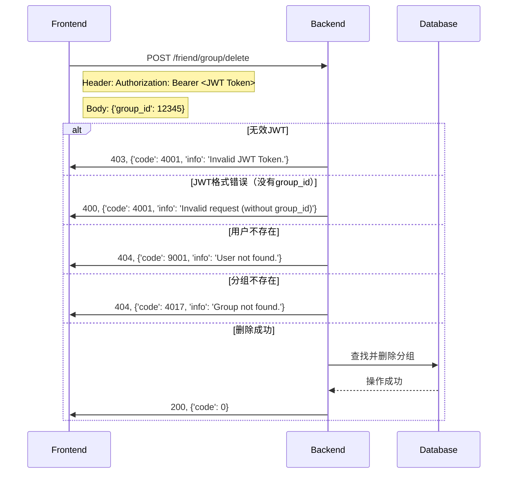
```mermaid

sequenceDiagram
    participant F as Frontend
    participant B as Backend
    participant DB as Database

    F->>B: POST /friend/group/delete
    Note right of F: Header: Authorization: Bearer <JWT Token>
    Note right of F: Body: {'group_id': 12345}
    alt 无效JWT
        B->>F: 403, {'code': 4001, 'info': 'Invalid JWT Token.'}
    else JWT格式错误（没有group_id）
        B->>F: 400, {'code': 4001, 'info': 'Invalid request (without group_id)'}
    else 用户不存在
        B->>F: 404, {'code': 9001, 'info': 'User not found.'}
    else 分组不存在
        B->>F: 404, {'code': 4017, 'info': 'Group not found.'}
    else 删除成功
        B->>DB: 查找并删除分组
        DB-->>B: 操作成功
        B->>F: 200, {'code': 0}
    end

```

## 二、在线会话通用部分（25分）

### 请求消息记录
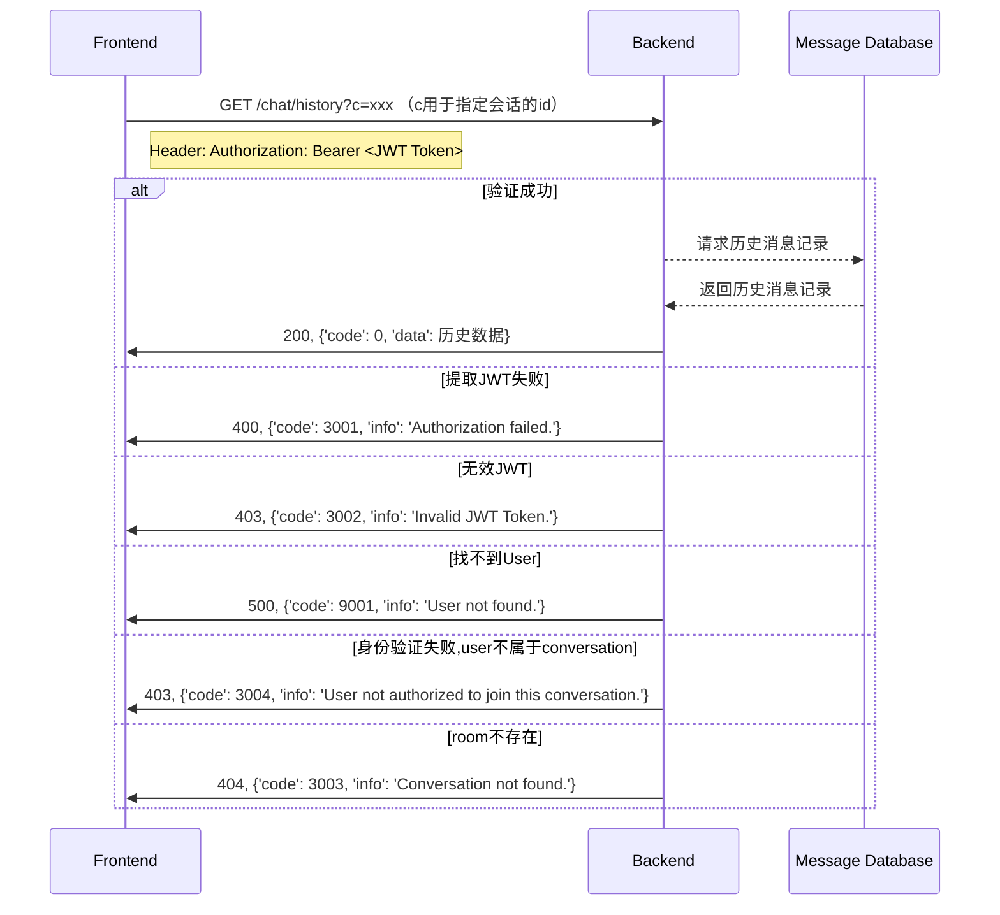
```mermaid
sequenceDiagram
    participant F as Frontend
    participant B as Backend
    participant MDB as Message Database

    F->>B: GET /chat/history?c=xxx （c用于指定会话的id）
    Note right of F: Header: Authorization: Bearer <JWT Token>
    alt 验证成功
        B-->>MDB: 请求历史消息记录
        MDB-->>B: 返回历史消息记录
        B->>F: 200, {'code': 0, 'data': 历史数据}
    else 提取JWT失败
        B->>F: 400, {'code': 3001, 'info': 'Authorization failed.'}
    else 无效JWT
        B->>F: 403, {'code': 3002, 'info': 'Invalid JWT Token.'}
    else 找不到User
        B->>F: 500, {'code': 9001, 'info': 'User not found.'} 
    
    else 身份验证失败,user不属于conversation
        B->>F: 403, {'code': 3004, 'info': 'User not authorized to join this conversation.'}
    else room不存在
        B->>F: 404, {'code': 3003, 'info': 'Conversation not found.'}
    end
```

### 请求创建好友会话
```mermaid
sequenceDiagram
    participant F as Frontend
    participant B as Backend
    participant MDB as Message Database
    participant FDB as Friend Database

    F->>B: POST /chat/create/friend
    Note right of F: Header: Authorization: Bearer <JWT Token>
    Note right of F: Body: {"id": 对方id}
    B-->>FDB: 验证好友身份
    FDB-->>B: 验证结果
    alt 验证成功
        B-->>MDB: 请求创建会话
        MDB-->>B: 创建成功
        B->>F: 200, {'code': 0, "data": {"id": 会话id}}
    else 提取JWT失败
        B->>F: 400, {'code': 3001, 'info': 'Authorization failed.'}
    else 无效JWT
        B->>F: 403, {'code': 3002, 'info': 'Invalid JWT Token.'}
    else 请求体格式错误
        B->>F: 400, {'code': 2001, 'info': 'Invalid request'}
    else 找不到User
        B->>F: 500, {'code': 9001, 'info': 'User not found.'}
    else 不是好友
        B->>F: 403, {'code': 2012, 'info': 'Not authorized to create conversation.'}
    end
```

### 标记已读
```mermaid

sequenceDiagram
    participant F as Frontend
    participant B as Backend
    participant DB as Database
    
    F->>B: POST /chat/message/read
    Note right of F: Body: {conversation: conversation_id, up_to_id?: message_id}
    Note right of F: Header: Authorization: Bearer <JWT Token>
    B-->>F: JWT令牌错误
    Note right of F: 403，{"code":3002, "info":"Invalid JWT Token"}
    B->>DB: 标记消息已读
    DB->>B: 返回标记已读结果
    B->>F: 返回标记成功
    Note right of F: 200, {"code":0}

```

### 编辑消息

```mermaid

sequenceDiagram
    participant F as Frontend
    participant B as Backend
    participant DB as Database
    
    F->>B: POST /chat/message/edit
    Note right of F: Body: {id: message_id, content: str}
    Note right of F: Header: Authorization: Bearer <JWT Token>
    B-->>F: JWT令牌错误
    Note right of F: 403，{"code":3002, "info":"Invalid JWT Token"}
    B->>DB: 编辑消息
    DB->>B: 返回更新后的消息内容
    B->>F: 消息编辑成功
    Note right of F: 200, {"code":0}

```

### 撤回消息

```mermaid

sequenceDiagram
    participant F as Frontend
    participant B as Backend
    participant DB as Database
    
    F->>B: POST /chat/message/recall
    Note right of F: Body: {id: message_id}
    Note right of F: Header: Authorization: Bearer <JWT Token>
    B-->>F: JWT令牌错误
    Note right of F: 403，{"code":3002, "info":"Invalid JWT Token"}
    B->>DB: 撤回消息
    B->>F: 撤回消息成功
    Note right of F: 200, {"code":0}

```

### 删除消息
```mermaid

sequenceDiagram
    participant F as Frontend
    participant B as Backend
    participant DB as Database
    
    F->>B: POST /chat/message/delete
    Note right of F: Body: {id: message_id}
    Note right of F: Header: Authorization: Bearer <JWT Token>
    B-->>F: JWT令牌错误
    Note right of F: 403，{"code":3002, "info":"Invalid JWT Token"}
    B->>DB: 删除消息
    DB->>B: 返回删除成功
    B->>F: 删除成功
    Note right of F: 200, {"code":0}

```
 

### 设置免打扰和置顶
```mermaid

sequenceDiagram
    participant F as Frontend
    participant B as Backend
    participant DB as Database
    
    F->>B: POST /chat/member/set
    Note right of F: Body: {id: conversation_id, mute: bool, pinned: bool}
    Note right of F: Header: Authorization: Bearer <JWT Token>
    B-->>F: JWT令牌错误
    Note right of F: 403，{"code":3002, "info":"Invalid JWT Token"}
    B->>DB: 更新成员的免打扰和置顶状态
    DB->>B: 返回更新后的成员状态
    B->>F: 设置成功
    Note right of F: 200, {"code":0}

```

### 置顶会话
```mermaid
sequenceDiagram
    participant F as Frontend
    participant B as Backend
    participant DB as Database
    
    F->>B: POST /chat/pin
    Note right of F: Body: {id: conversation_id}
    Note right of F: Header: Authorization: Bearer <JWT Token>
    B-->>F: JWT令牌错误
    Note right of F: 403，{"code":3002, "info":"Invalid JWT Token"}
    B-->>F: 会话不存在或用户不是成员
    Note right of F: 404，{"code":3003, "info":"Conversation not found or user not a member."}
    B-->>F: 会话已经置顶
    Note right of F: 400，{"code":3005, "info":"Conversation already pinned."}
    B->>DB: 创建置顶记录
    DB->>B: 返回成功
    B->>F: 置顶成功
    Note right of F: 200, {"code":0}
```

### 取消置顶会话
```mermaid
sequenceDiagram
    participant F as Frontend
    participant B as Backend
    participant DB as Database
    
    F->>B: POST /chat/unpin
    Note right of F: Body: {id: conversation_id}
    Note right of F: Header: Authorization: Bearer <JWT Token>
    B-->>F: JWT令牌错误
    Note right of F: 403，{"code":3002, "info":"Invalid JWT Token"}
    B-->>F: 会话不存在或用户不是成员
    Note right of F: 404，{"code":3003, "info":"Conversation not found or user not a member."}
    B-->>F: 会话未置顶
    Note right of F: 400，{"code":3006, "info":"Conversation not pinned."}
    B->>DB: 删除置顶记录，更新其他置顶会话顺序
    DB->>B: 返回成功
    B->>F: 取消置顶成功
    Note right of F: 200, {"code":0}
```

### 获取置顶会话列表
```mermaid
sequenceDiagram
    participant F as Frontend
    participant B as Backend
    participant DB as Database
    
    F->>B: GET /chat/pinned
    Note right of F: Header: Authorization: Bearer <JWT Token>
    B-->>F: JWT令牌错误
    Note right of F: 403，{"code":3002, "info":"Invalid JWT Token"}
    B->>DB: 查询用户的置顶会话列表
    DB->>B: 返回置顶会话数据
    B->>F: 返回置顶会话列表
    Note right of F: 200, {"code":0, "data": {"pinned": [conversation_id]}}
```


### 文件上传
```mermaid

sequenceDiagram
    participant F as Frontend
    participant B as Backend
    participant DB as Database
    
    F->>B: POST /chat/upload
    Note right of F: Form-data: {file: <file>, type?: "image"/"file"}
    Note right of F: Header: Authorization: Bearer <JWT Token>
    B-->>F: JWT令牌错误
    Note right of F: 403，{"code":3002, "info":"Invalid JWT Token"}
    B->>DB: 存储文件
    DB->>B: 返回文件的可访问URL
    B->>F: 文件上传成功
    Note right of F: 200, {"code":0, "data": {"url": "<file_url>"}}

```

## 三、在线会话群聊部分（12分）

### 创建群聊
```mermaid
sequenceDiagram
    participant F as Frontend
    participant B as Backend
    participant DB as Database
    
    F->>B: POST /chat/group/create
    Note right of F: Body: {name: str, members: [user_id], avatar?: str}
    Note right of F: Header: Authorization: Bearer <JWT Token>
    B-->>F: JWT令牌错误
    Note right of F: 403，{"code":3002, "info":"Invalid JWT Token"}
    B->>DB: 创建群聊，添加群成员
    DB->>B: 返回群聊信息
    B->>F: 群聊创建成功
    Note right of F: 200, {"code":0, "data": {"id": <conversation_id>}}

```

### 更新群信息
```mermaid

sequenceDiagram
    participant F as Frontend
    participant B as Backend
    participant DB as Database
    
    F->>B: POST /chat/group/update
    Note right of F: Body: {id: conversation_id, name?: str, avatar?: str}
    Note right of F: Header: Authorization: Bearer <JWT Token>
    B-->>F: JWT令牌错误
    Note right of F: 403，{"code":3002, "info":"Invalid JWT Token"}
    B->>DB: 更新群聊信息
    DB->>B: 返回更新后的群聊信息
    B->>F: 群聊信息更新成功
    Note right of F: 200, {"code":0}

```

### 查询群聊信息
```mermaid

sequenceDiagram
    participant F as Frontend
    participant B as Backend
    participant DB as Database
    
    F->>B: GET /chat/group/info
    Note right of F: Params: {id: conversation_id}
    Note right of F: Header: Authorization: Bearer <JWT Token>
    B-->>F: JWT令牌错误
    Note right of F: 403，{"code":3002, "info":"Invalid JWT Token"}
    B->>DB: 查询群聊信息
    DB->>B: 返回群聊信息和成员列表
    B->>F: 返回群聊信息
    Note right of F: 200, {"code":0, "data": {"id": <conversation_id>, "name": <name>, "avatar": <avatar>, "role": <role>, "members": [{id, nickname, avatar}]} }

```

### 设置群聊昵称
```mermaid

sequenceDiagram
    participant F as Frontend
    participant B as Backend
    participant DB as Database
    
    F->>B: POST /chat/group/nickname
    Note right of F: Body: {id: conversation_id, nickname: str}
    Note right of F: Header: Authorization: Bearer <JWT Token>
    B-->>F: JWT令牌错误
    Note right of F: 403，{"code":3002, "info":"Invalid JWT Token"}
    B->>DB: 设置群聊昵称
    DB->>B: 返回更新后的成员信息
    B->>F: 返回设置成功
    Note right of F: 200, {"code":0}

```

### 设置成员角色
```mermaid

sequenceDiagram
    participant F as Frontend
    participant B as Backend
    participant DB as Database
    
    F->>B: POST /chat/group/role
    Note right of F: Body: {id: conversation_id, user_id: target_id, role: "admin" or "member"}
    Note right of F: Header: Authorization: Bearer <JWT Token>
    B-->>F: JWT令牌错误
    Note right of F: 403，{"code":3002, "info":"Invalid JWT Token"}
    B->>DB: 设置成员角色
    DB->>B: 返回更新后的成员角色
    B->>F: 成员角色更新成功
    Note right of F: 200, {"code":0}

```

### 转移群主
```mermaid

sequenceDiagram
    participant F as Frontend
    participant B as Backend
    participant DB as Database
    
    F->>B: POST /chat/group/transfer
    Note right of F: Body: {id: conversation_id, to: target_user_id}
    Note right of F: Header: Authorization: Bearer <JWT Token>
    B-->>F: JWT令牌错误
    Note right of F: 403，{"code":3002, "info":"Invalid JWT Token"}
    B->>DB: 转移群主
    DB->>B: 返回更新后的群聊和成员信息
    B->>F: 转移成功
    Note right of F: 200, {"code":0}

```

### 发布公告
```mermaid

sequenceDiagram
    participant F as Frontend
    participant B as Backend
    participant DB as Database
    
    F->>B: POST /chat/group/announce
    Note right of F: Body: {id: conversation_id, content: str}
    Note right of F: Header: Authorization: Bearer <JWT Token>
    B-->>F: JWT令牌错误
    Note right of F: 403，{"code":3002, "info":"Invalid JWT Token"}
    B->>DB: 发布公告
    DB->>B: 返回公告信息
    B->>F: 公告发布成功
    Note right of F: 200, {"code":0}

```

### 移除成员
```mermaid

sequenceDiagram
    participant F as Frontend
    participant B as Backend
    participant DB as Database
    
    F->>B: POST /chat/group/remove
    Note right of F: Body: {id: conversation_id, user_id: target_user_id}
    Note right of F: Header: Authorization: Bearer <JWT Token>
    B-->>F: JWT令牌错误
    Note right of F: 403，{"code":3002, "info":"Invalid JWT Token"}
    B->>DB: 移除成员
    DB->>B: 返回更新后的成员信息
    B->>F: 成员移除成功
    Note right of F: 200, {"code":0}

```

### 退出群聊
```mermaid

sequenceDiagram
    participant F as Frontend
    participant B as Backend
    participant DB as Database
    
    F->>B: POST /chat/group/exit
    Note right of F: Body: {id: conversation_id}
    Note right of F: Header: Authorization: Bearer <JWT Token>
    B-->>F: JWT令牌错误
    Note right of F: 403，{"code":3002, "info":"Invalid JWT Token"}
    B->>DB: 退出群聊
    DB->>B: 返回成功
    B->>F: 退出成功
    Note right of F: 200, {"code":0}

```

### 获取群聊历史公告
```mermaid
sequenceDiagram
    participant F as Frontend
    participant B as Backend
    participant DB as Database
    
    F->>B: GET /chat/group/announcements
    Note right of F: Params: {id: conversation_id, limit?: int, offset?: int}
    Note right of F: Header: Authorization: Bearer <JWT Token>
    B-->>F: JWT令牌错误
    Note right of F: 403，{"code":3002, "info":"Invalid JWT Token"}
    B-->>F: 会话不存在
    Note right of F: 404，{"code":3003, "info":"Conversation not found."}
    B-->>F: 不是群成员
    Note right of F: 403，{"code":3004, "info":"Not a member of this group."}
    B->>DB: 查询群聊公告列表
    DB->>B: 返回公告数据
    B->>F: 返回公告列表
    Note right of F: 200, {"code":0, "data": {"announcements": [{"id", "content", "author_id", "author_name", "author_nickname", "created_at"}]}}
```

### 解散群聊
```mermaid
sequenceDiagram
    participant F as Frontend
    participant B as Backend
    participant DB as Database
    
    F->>B: POST /chat/group/disband
    Note right of F: Body: {id: conversation_id}
    Note right of F: Header: Authorization: Bearer <JWT Token>
    B-->>F: JWT令牌错误
    Note right of F: 403，{"code":3002, "info":"Invalid JWT Token"}
    B-->>F: 会话不存在
    Note right of F: 404，{"code":3003, "info":"Conversation not found."}
    B-->>F: 不是群主
    Note right of F: 403，{"code":2012, "info":"Only owner can disband group."}
    B->>DB: 标记群聊为不可用，失效所有未处理的群邀请
    DB->>B: 返回成功
    B->>F: 解散成功
    Note right of F: 200, {"code":0}
```

### 邀请好友加入群聊
```mermaid
sequenceDiagram
    participant F as Frontend
    participant B as Backend
    participant DB as Database
    
    F->>B: POST /chat/group/invite
    Note right of F: Body: {group_id: int, friend_id: int, message?: str}
    Note right of F: Header: Authorization: Bearer <JWT Token>
    B-->>F: JWT令牌错误
    Note right of F: 403，{"code":3002, "info":"Invalid JWT Token"}
    B-->>F: 缺少group_id或friend_id
    Note right of F: 400，{"code":2001, "info":"Missing group_id or friend_id."}
    B-->>F: 用户不存在
    Note right of F: 404，{"code":9001, "info":"User not found."}
    B-->>F: 好友不存在
    Note right of F: 404，{"code":2004, "info":"Friend not found."}
    B-->>F: 群聊不存在
    Note right of F: 404，{"code":3003, "info":"Group not found."}
    B-->>F: 群聊已解散
    Note right of F: 403，{"code":2012, "info":"Conversation is inactive."}
    B-->>F: 不是群成员
    Note right of F: 403，{"code":3004, "info":"You are not a member of this group."}
    B-->>F: 被邀请者已经是群成员
    Note right of F: 400，{"code":3005, "info":"User is already a member of this group."}
    B-->>F: 不是好友关系
    Note right of F: 403，{"code":3006, "info":"You can only invite your friends."}
    B-->>F: 已有待处理的邀请
    Note right of F: 400，{"code":3007, "info":"There is already a pending invitation for this user."}
    B->>DB: 创建或更新邀请记录
    DB->>B: 返回成功
    B->>F: 邀请创建成功
    Note right of F: 200, {"code":0, "data": {"id": invitation_id}}
```

### 获取群聊邀请列表
```mermaid
sequenceDiagram
    participant F as Frontend
    participant B as Backend
    participant DB as Database
    
    F->>B: GET /chat/group/invitations
    Note right of F: Params: {group_id: int, status?: "pending"/"approved"/"rejected"/"expired"}
    Note right of F: Header: Authorization: Bearer <JWT Token>
    B-->>F: JWT令牌错误
    Note right of F: 403，{"code":3002, "info":"Invalid JWT Token"}
    B-->>F: 缺少group_id
    Note right of F: 400，{"code":2001, "info":"Missing group_id."}
    B-->>F: 群聊不存在
    Note right of F: 404，{"code":3003, "info":"Group not found."}
    B-->>F: 不是群成员
    Note right of F: 403，{"code":3004, "info":"You are not a member of this group."}
    B-->>F: 不是群主或管理员
    Note right of F: 403，{"code":3008, "info":"Only owner and admin can view invitations."}
    B->>DB: 查询群聊邀请列表
    DB->>B: 返回邀请数据
    B->>F: 返回邀请列表
    Note right of F: 200, {"code":0, "data": {"invitations": [{"id", "inviter_id", "inviter_name", "inviter_nickname", "invitee_id", "invitee_name", "invitee_nickname", "status", "created_at", "message", "reviewer_id", "reviewer_name", "reviewer_nickname", "review_time", "review_comment"}]}}
```

### 审核群聊邀请
```mermaid
sequenceDiagram
    participant F as Frontend
    participant B as Backend
    participant DB as Database
    
    F->>B: POST /chat/group/invitation/review
    Note right of F: Body: {invitation_id: int, action: "approve"/"reject", comment?: str}
    Note right of F: Header: Authorization: Bearer <JWT Token>
    B-->>F: JWT令牌错误
    Note right of F: 403，{"code":3002, "info":"Invalid JWT Token"}
    B-->>F: 缺少invitation_id或action
    Note right of F: 400，{"code":2001, "info":"Missing invitation_id or action."}
    B-->>F: action无效
    Note right of F: 400，{"code":2001, "info":"Invalid action. Must be 'approve' or 'reject'."}
    B-->>F: 用户不存在
    Note right of F: 404，{"code":9001, "info":"User not found."}
    B-->>F: 邀请不存在
    Note right of F: 404，{"code":3009, "info":"Invitation not found."}
    B-->>F: 群聊已解散
    Note right of F: 403，{"code":2012, "info":"Conversation is inactive."}
    B-->>F: 邀请已被处理
    Note right of F: 400，{"code":3010, "info":"Invitation has already been processed."}
    B-->>F: 不是群主或管理员
    Note right of F: 403，{"code":3008, "info":"Only owner and admin can review invitations."}
    B->>DB: 更新邀请状态，如果通过则添加成员
    DB->>B: 返回成功
    B->>F: 审核成功
    Note right of F: 200, {"code":0}
```

### 获取用户收到的群聊邀请列表
```mermaid
sequenceDiagram
    participant F as Frontend
    participant B as Backend
    participant DB as Database
    
    F->>B: GET /chat/user/invitations
    Note right of F: Params: {status?: "pending"/"approved"/"rejected"/"expired"}
    Note right of F: Header: Authorization: Bearer <JWT Token>
    B-->>F: JWT令牌错误
    Note right of F: 403，{"code":3002, "info":"Invalid JWT Token"}
    B-->>F: 用户不存在
    Note right of F: 404，{"code":9001, "info":"User not found."}
    B->>DB: 查询用户收到的邀请列表
    DB->>B: 返回邀请数据
    B->>F: 返回邀请列表
    Note right of F: 200, {"code":0, "data": {"invitations": [{"id", "group_id", "group_name", "inviter_id", "inviter_name", "inviter_nickname", "reviewer_id", "reviewer_name", "reviewer_nickname", "status", "created_at", "message"}]}}
```


## 公用

### 显示主界面（请求会话信息）
```mermaid
sequenceDiagram
    participant F as Frontend
    participant B as Backend
    participant UDB as User Database

    F->>B: GET /chat/home
    Note right of F: Header: {"Authorization": "Bearer <jwt_token>"}

    B->>B: 解析并验证 JWT
    alt JWT 无效
        B-->>F: 403 Forbidden
        Note right of F: {"code":5001, "info":"Invalid JWT token."}
    else 找不到用户
        B-->>F: 500, {'code': 9001, 'info': 'User not found.'} 

    else 找到用户
        B->>UDB: 查询用户参与的会话、消息、成员等信息
        UDB-->>B: 返回会话与关联数据
        B-->>F: 200 OK
        Note right of F: 返回数据见下面json
    end
```
```json
{
    "code": 0,
    "data": {
        "conversations": [
            {
                "id": 1,
                "type": "group",
                "name": "Python开发群",
                "avatar": "https://cdn.example.com/group_avatars/python.jpg",
                "unread_count": 3,
                "muted": false,
                "pinned": true,
                "members": [
                    {
                        "id": 1,
                        "nickname": "alice",
                        "avatar": "https://cdn.example.com/avatars/alice.png"
                    }
                ],
                "messages": [
                    {
                        "id": 101,
                        "sender_id": 12,
                        "content": "大家早上好！",
                        "time": "2025-01-15T10:15:00Z",
                        "type": "text",
                        "is_edited": false,
                        "valid": true,
                        "is_read": true
                    }
                ]
            }
        ]
    }
}
```

### 请求个人信息
```mermaid
sequenceDiagram
    participant F as Frontend
    participant B as Backend
    participant UDB as User Database

    F->>B: GET /account/get_info?target=<user_id>
    Note right of F: Header: {"Authorization": "Bearer <jwt_token>"}

    B->>B: 解析并验证 JWT
    alt JWT 无效
        B->>F: 403 Forbidden
        Note right of F: {"code":1101, "info":"Invalid JWT token."}
    else JWT 有效
        B->>UDB: 查询 target 用户信息
        alt 用户不存在
            B->>F: 404 Not Found
            Note right of F: {"code":1102, "info":"User does not exist."}
        else 用户存在
            alt target == jwt_user_id
                alt 用户已注销
                    UDB->>B: 返回已注销信息
                    B->>F: 200 OK
                    Note right of F: {"username": "...", "avatar": "", "email": "", "phone": "", "info": "", "is_active": false}
                else 用户正常
                    UDB->>B: 返回完整信息 (含邮箱、手机号、密码等)
                    B->>F: 200 OK
                    Note right of F: {"username": "...", "avatar": "...", "email": "...", "phone": "...", "info": "...", "is_active": true}
                end
            else target != jwt_user_id
                alt 目标用户已注销
                    UDB->>B: 返回已注销信息
                    B->>F: 200 OK
                    Note right of F: {"username": "...", "avatar": "", "info": "此用户已注销", "is_active": false}
                else 目标用户正常
                    UDB->>B: 返回公开信息 (仅用户名、头像、简介)
                    B->>F: 200 OK
                    Note right of F: {"username": "...", "avatar": "...", "info": "...", "is_active": true}
                end
            end
        end
    end
```


### 发送消息

使用websocket实现

```mermaid
sequenceDiagram
    participant F as Frontend
    participant B as Backend
    participant DB as Database

    F->>B: WS /ws/chat?token=<JWT>
    B->>B: 解析并校验 token
    alt token 缺失/格式错误
        B-->>F: close(code=2010, reason="Invalid url params.")
    else token 无效
        B-->>F: close(code=2010, reason="Invalid jwt token.")
    else 用户不存在/已注销
        B-->>F: close(code=2011, reason="User deactivated.")
    else 连接建立
        B->>B: group_add(user_{user_id})
        B-->>F: accept()
    end

    F->>B: {"type":"message","conversation":3,"message":{"content":"Hello","reply_to":null}}
    B->>B: 校验字段 + 检查会话存在/成员身份 +（私聊）校验好友关系
    B->>DB: 保存 Message
    alt 保存/校验失败
        B-->>F: {"type":"error","error":"..."}
    else 成功
        B->>B: 向会话所有成员的 user_{id} 组广播
        B-->>F: {"type":"message", "conversation":3, "message":{...}}
    end
```

发送消息（客户端 -> 服务端）示例：

```json
{
    "type": "message",
    "conversation": 3,
    "message": {
        "content": "...",
        "reply_to": null
    }
}
```

说明：后端当前 WebSocket 写库逻辑仅使用 `content` 与 `reply_to`。如需发送图片/文件，通常先调用 `POST /chat/upload` 获得 URL，再将该 URL 放入 `content`。

服务端推送给客户端的消息（服务端 -> 客户端）格式：

```json
{
    "type": "message",
    "conversation": 3,
    "message": {
        "id": 123,
        "sender": 7,
        "nickname": "Alice",
        "sender_nickname": "Alice",
        "content": "...",
        "reply_to": null,
        "reply_to_message": null,
        "time": "2025-01-01T00:00:00Z",
        "read_list": [7]
    }
}
```

> 备注：内部 channel event 名称为 `chat_message`，但客户端收到的 `type` 为 `message`。

#### 其他支持的 WebSocket 消息类型

1) 已读回执（客户端 -> 服务端）：

```json
{ "type": "read_receipt", "conversation": 3, "message_id": 123 }
```

服务端广播（服务端 -> 客户端）：

```json
{ "type": "read_receipt_update", "conversation": 3, "message_id": 123, "user_id": 7 }
```

2) 编辑消息（客户端 -> 服务端）：

```json
{ "type": "edit_message", "conversation": 3, "message_id": 123, "content": "new text" }
```

服务端广播（服务端 -> 客户端）：

```json
{ "type": "message_edited", "conversation": 3, "message_id": 123, "content": "new text", "user_id": 7 }
```

3) 撤回消息（客户端 -> 服务端）：

```json
{ "type": "recall_message", "conversation": 3, "message_id": 123 }
```

服务端广播（服务端 -> 客户端）：

```json
{ "type": "message_recalled", "conversation": 3, "message_id": 123, "user_id": 7 }
```

4) 会话事件（服务端 -> 客户端，仅推送）：

当发生“新会话创建、群相关变更、邀请待处理”等事件时，后端会通过用户组推送刷新提示：

```json
{ "type": "conversation_event", "event": "conversation_created", "conversation": 3 }
```

#### 错误消息与当前行为说明

- JSON 解析失败：`{"type":"error","error":"invalid_json"}`
- 消息类型非法：`{"type":"error","error":"invalid_message_type"}`
- 缺少必填字段：`{"type":"error","error":"missing_fields"}`
- 用户/会话状态类错误：`user_not_found` / `user_deactivated` / `conversation_not_found` / `conversation_inactive` / `not_member` / `server_error`
- 私聊非好友：`{"type":"error","error":"not_friends"}`（可能附带 `message` 文本提示）

注意：对某些“权限不满足”的场景（例如：编辑/撤回/已读操作时用户不是成员，或不是消息作者），当前实现可能不会返回任何 WebSocket 消息（表现为前端等待超时）。

#### 发送消息全过程示意图

```mermaid
flowchart TB
    A["用户打开聊天界面"] --> H["HTTP 拉取历史消息<br/>GET /chat/history?c=<conversation_id>"]
    H --> R["渲染历史消息"]
    R --> W["建立 WS 连接<br/>/ws/chat?token=<JWT><br/>加入 user_{id} 组"]
    W --> S["发送新消息<br/>type: message<br/>conversation: c<br/>message: {...}"]
    S --> V["后端校验成员身份/私聊好友关系"]
    V --> P["落库 Message"]
    P --> B["向会话成员广播<br/>各自 user_{id} 组收到 message"]
    B --> U["前端 onmessage 更新 UI"]
    U --> C["离开界面关闭连接<br/>websocket.close()"]
    C --> D["disconnect: group_discard + offline"]
```

<h1 id="appendix">Appendix</h1>

## 返回码一览

#### HTTP返回码
| 200 | OK                 |                               |
|-----|--------------------|-------------------------------|
| 201 | Created            | POST创建新数据                |
| 202 | Accepted           | 请求成功，但还未执行（用于异步） |
| 302 | Found              | 重定向                        |
| 400 | Bad Request        | 请求格式错误                  |
| 401 | Unauthorized       | 身份未认证                    |
| 403 | Forbidden          | 身份已认证，但没有权限         |
| 404 | Not Found          | 资源不存在                    |
| 405 | Method Not Allowed | 请求方法错误                  |

#### WebSocket Close Code
- `2010`: WS 连接参数不合法（缺少 token / query 解析失败）或 JWT 无效
- `2011`: 用户已注销（或用户不存在）

#### 业务返回码
- `-3`: Bad method.
- `0`: 成功（成功响应固定包含 `info="Succeed."`，其余字段由接口决定）

- 注册/登录
    - `1001`: 请求体缺少 `username` 或 `password`（或解析失败）
    - `1002`: 用户名已被占用
    - `1003`: 用户名不存在
    - `1004`: 密码错误
    - `1005`: 用户名格式不合法（注册） / 用户账号已注销（登录时返回 `User account has been deactivated.`）
    - `1006`: 密码格式不合法（注册）

- 用户信息
    - `1101`: JWT 无效（`Invalid JWT token.`）
    - `1102`: 用户不存在（`User does not exist.`）

- 修改个人信息
    - `1201`: JWT 无效（`Invalid JWT Token.`）
    - `1202`: 用户不存在（`User does not exist.`）
    - `1203`: 请求体不合法/缺少字段
    - `1204`: field 不合法
    - `1205`: 修改敏感字段时原密码错误
    - `1206`: 新密码格式不合法

- 用户注销
    - `1301`: JWT 无效
    - `1302`: 用户不存在
    - `1303`: 请求体缺少 `password`
    - `1304`: 密码错误

- 会话/群聊/消息（HTTP）
    - `2001`: 请求体/参数不合法（例如 role/action 不合法等）
    - `2004`: 目标用户不存在 / 好友不存在（依接口场景）
    - `2005`: 涉及“已注销用户”的群聊操作被拒绝（例如：不能邀请/转让/设管理员等）
    - `2006`: 不能与已注销用户私聊
    - `2012`: 会话不可用或无权限（例如：会话已失效、非群主/管理员、或角色约束不满足等）
    - `2013`: 用户账号已注销（`User account is deactivated.`）

- 会话历史/置顶/邀请
    - `3001`: 缺少 Authorization（`Authorization failed.`）
    - `3002`: JWT 无效（`Invalid JWT Token.`）
    - `3003`: 会话/群聊不存在，或用户不是成员
    - `3004`: 成员不存在 / 目标不在会话中 / 非群成员等
    - `3005`: 会话已置顶 / 已是群成员（依接口场景）
    - `3006`: 会话未置顶 / 只能邀请好友（依接口场景）
    - `3007`: 已存在待处理邀请
    - `3008`: 只有群主/管理员可查看或审核邀请
    - `3009`: 邀请不存在
    - `3010`: 邀请已被处理

- 好友与好友分组
    - `4001`: JWT 无效（部分好友分组接口也复用该码表示请求体缺少 `group_id/friend_id`）
    - `4002`: 已经是好友
    - `4003`: 目标用户不存在
    - `4004`: 已存在待处理好友申请
    - `4005`: 好友申请不存在
    - `4006`: 不能对自己发起好友操作（加好友/查好友等）
    - `4007`: 好友关系不存在
    - `4008`: 不是好友关系
    - `4009`: 不能添加已注销用户为好友
    - `4010`: 不能与已注销用户建立好友关系 / 好友分组名为空（依接口场景）
    - `4011`: 好友分组名已存在 / 目标用户已注销（依接口场景）
    - `4012`: 处理好友申请时存在已注销用户 / 好友不存在（依接口场景）
    - `4013`: 不能删除已注销用户的好友关系 / 不是好友关系（依接口场景）
    - `4014`: 分组不存在 / 不能将已注销用户加入分组（依接口场景）
    - `4015`: 好友已在分组中 / 好友不在分组中
    - `4016`: 分组不存在（rename）
    - `4017`: 分组不存在（delete）

- 其他
    - `5001`: 服务器内部失败（例如创建 Pending 失败；部分场景也复用该码表示 JWT 无效）
    - `9001`: 用户不存在（通常表示鉴权成功但数据库记录异常等）

