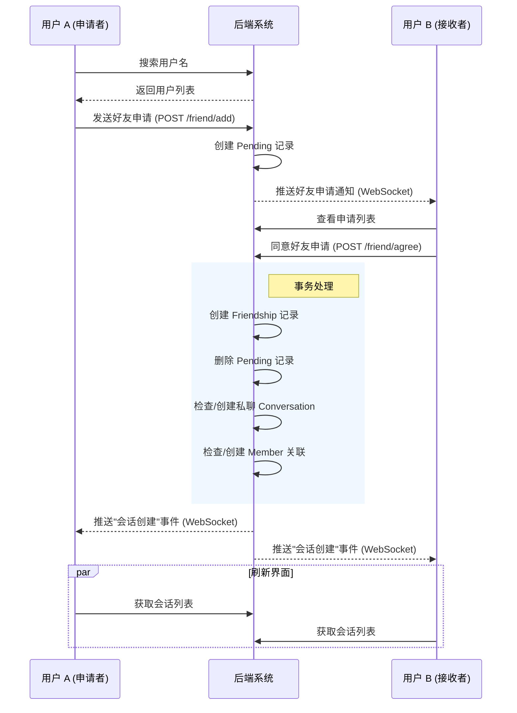
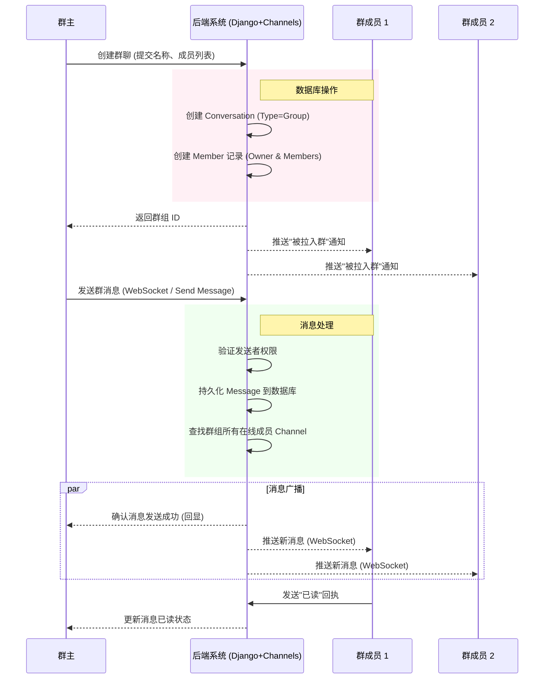
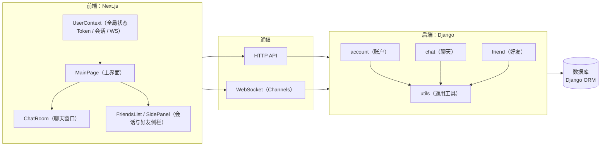
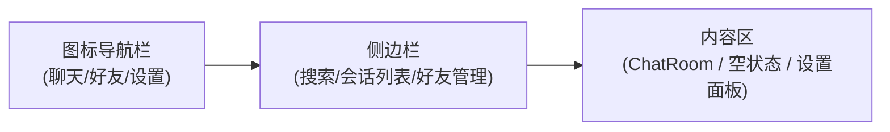

# 即时通讯系统大作业汇总文档

> MrFan (组员：杜逸凡、陈鸣旸、李波、付琮皓)

## 1. 需求分析

### 1.1 用户故事 (User Stories)

#### 1.1.1 账户与个人信息管理
- **US-001**: 作为一名新用户，我希望能够通过用户名和密码注册账号，以便使用系统。
- **US-002**: 作为一名用户，我希望能够安全登录和退出系统，保护我的账户安全。
- **US-003**: 作为一名用户，我希望能够上传和修改我的头像及个人昵称，以便展示个性化信息。
- **US-004**: 作为一名用户，我希望能够查看其他用户的在线状态，以便知道谁可以即时回复。

#### 1.1.2 好友管理
- **US-005**: 作为一名用户，我希望能够通过用户名搜索其他用户，并发送好友申请。
- **US-006**: 作为一名用户，我希望能够查看、接受或拒绝收到的好友申请。
- **US-007**: 作为一名用户，我希望能够将好友进行分组管理（如“家人”、“同事”），以便更好地组织联系人。
- **US-008**: 作为一名用户，我希望能够删除好友，解除好友关系。

#### 1.1.3 消息通信 (单聊/群聊)
- **US-009**: 作为一名用户，我希望能够与好友进行一对一的私聊。
- **US-010**: 作为一名用户，我希望能够发送文本、图片、视频和音频消息，丰富沟通方式。
- **US-011**: 作为一名用户，我希望能够看到消息的“已读”状态，了解对方是否阅读了消息。
- **US-012**: 作为一名用户，我希望能够在发送消息后的一段时间内撤回消息，以纠正发送错误。
- **US-013**: 作为一名用户，我希望能够编辑已发送的消息内容。
- **US-014**: 作为一名用户，我希望能够引用某条特定消息进行回复，保持上下文连贯。
- **US-015**: 作为一名用户，我希望能够查看历史消息记录，支持按关键词或日期搜索。

#### 1.1.4 会话管理
- **US-016**: 作为一名用户，我希望能够将重要的会话（单聊或群聊）置顶，以便快速访问。
- **US-017**: 作为一名用户，我希望能够设置会话免打扰，不再接收特定会话的通知提醒。

#### 1.1.5 群组管理
- **US-018**: 作为一名用户，我希望能够创建群聊，并邀请好友加入。
- **US-019**: 作为群主，我希望能够发布群公告，重要信息置顶显示。
- **US-020**: 作为群主，我希望能够任命管理员、移除群成员或转让群主权限。
- **US-021**: 作为群主，我希望能够解散群聊；作为群成员，我希望能够主动退出群聊。

### 1.2 系统建模与流程图

#### 1.2.1 好友添加与会话建立流程

此流程描述了用户A查找用户B，发送请求，用户B接受后系统自动创建会话的过程。

#### 1.2.2 群聊创建与消息发送流程

此流程描述了用户创建一个群组，并发送一条消息，消息如何分发给所有群成员。

### 1.3 总结

RG 系统通过上述模块的协同工作，实现了一个闭环的社交与通讯生态。
1.  **前端** 负责交互体验与实时数据的展示，利用 WebSocket 保持与服务器的长连接。
2.  **后端** 负责业务逻辑校验、数据持久化以及消息的路由分发。
3.  **数据库** 存储了用户关系、会话结构及海量的历史消息。

该设计满足了用户对于即时性、可靠性和功能丰富性的需求。

---

## 2. 模块设计

### 2.1 技术栈

**后端：**
- 框架：Django + Django Channels（WebSocket支持）
- 数据库：Django ORM
- 认证：自定义JWT Token
- 实时通信：WebSocket（Django Channels）

**前端：**
- 框架：Next.js（React）
- 状态管理：React Context API
- 样式：CSS-in-JS（styled-jsx）
- 类型：TypeScript

#### 2.1.2 整体架构图

### 2.2 后端模块设计

#### 2.2.1 account 模块（账户管理）

##### 2.2.1.1 模块职责

`account` 模块负责用户账户的生命周期管理，包括用户注册、登录、信息修改、账户注销等核心功能。

##### 2.2.1.2 核心数据模型

**User 模型** (`backend/account/models.py`)

- 关键字段：`username`、`avatar`、`info`、`is_active`、`created_at`（以及可选 `email/phone`）
- 约束与校验：用户名/密码/手机号等格式由后端校验器统一约束
- 生命周期：注销采用软删除（`is_active=False`），并保留 `deactivated_username` 用于历史展示

#### 2.2.2 chat 模块

##### 2.2.2.1 模块职责

`chat` 模块负责即时通讯的核心功能，包括：
- 会话（Conversation）管理（私聊和群聊）
- 消息发送、接收、编辑、撤回
- WebSocket 实时通信
- 消息历史记录查询
- 群聊管理（成员管理、权限控制）
- 消息已读状态管理
- 会话置顶和免打扰功能

##### 2.2.2.2 核心数据模型

- `Conversation`：`type`（私聊/群聊）、`name/avatar`（群聊信息）、`is_active`、`created_at`
- `Member`：`mute`（免打扰）、`pinned`（是否置顶）、`role`（member/admin/owner）、`is_active`
- `Message`：`type`、`content`、`reply_to`、`valid`（撤回）、已读/删除关联列表
- `PinnedConversation`：置顶排序（`pin_order`）
- `GroupAnnouncement`：群公告
- `GroupInvitation`：入群邀请（pending/approved/rejected/expired）

##### 2.2.2.3 实时通信

- 客户端通过 WebSocket 建立连接（token 鉴权）
- 服务端按“用户维度”组织连接与事件分发，并将会话相关事件路由到会话成员

#### 2.2.3 friend 模块

##### 2.2.3.1 模块职责

`friend` 模块负责用户之间的好友关系管理，包括：
- 好友申请、同意、拒绝
- 好友删除
- 好友分组管理
- 用户搜索

##### 2.2.3.2 核心数据模型

- `Friendship`：好友关系（按 user_a/user_b 存一条记录）
- `Pending`：好友申请（from/to）
- `FriendGroup`：好友分组（name + user + friends）
#### 2.2.4 utils 模块
##### 2.2.4.1 模块职责

`utils` 模块提供通用的工具函数和类，供其他模块复用。

##### 2.2.4.2 子模块说明

- `utils/jwt.py`：JWT 生成与解析（供 HTTP/WS 鉴权使用）
- `utils/network.py`：统一 JSON 响应封装（成功/失败/方法错误）
- `utils/tools.py`：请求体解析、token 读取等通用工具

### 2.3 前端模块设计

#### 2.3.1 context 模块

##### 2.3.1.1 模块职责

`context` 模块使用 React Context API 管理全局状态，包括用户状态、会话状态、WebSocket 连接等。

##### 2.3.1.2 UserContext

`UserContext` 负责统一管理：
- 登录态（token/selfId 等）与用户信息缓存
- 会话列表与消息增量更新（HTTP 拉取 + WS 推送）
- WebSocket 生命周期（连接、重连、消息分发）
- 置顶/免打扰等会话偏好设置

#### 2.3.2 components 模块（UI组件）

**职责：**
- 应用主布局
- 左侧导航栏（聊天、好友、设置）
- 侧边栏（会话列表/好友管理/设置面板）
- 右侧内容区（聊天室/空状态）

**布局结构：**

##### 2.3.2.2 ChatRoom（聊天室）

**职责：**
- 显示消息列表
- 发送消息（文本、图片、音频、视频）
- 消息操作（回复、编辑、撤回、删除）
- 已读状态显示
- 历史记录搜索
- 文件上传

##### 2.3.2.3 FriendsList（好友/会话列表）

**职责：**
- 显示会话列表
- 会话搜索和过滤
- 显示未读消息数
- 显示置顶和免打扰状态
- 右键菜单（置顶/取消置顶、开启/关闭免打扰）

**排序规则：**
1. 置顶会话在前，按 pinOrder 排序
2. 非置顶会话在后，按最后消息时间排序

##### 2.3.2.4 其他组件

| 组件 | 职责 |
|------|------|
| `Avatar` | 头像显示组件，支持默认头像 |
| `Profile` | 用户资料面板 |
| `SettingsPanel` | 设置面板 |
| `SocialPanel` | 社交面板（好友管理） |
| `GroupInfoPanel` | 群聊信息面板 |
| `GroupInvitationsPanel` | 群聊邀请面板 |
| `SearchBar` | 搜索栏组件 |

---

## 3. 数据库设计

### 3.1 用户模块 (Account)

#### 3.1.1 User (用户表)
继承自 Django 的 `AbstractUser`，存储用户的基本信息。

| 字段名 | 类型 | 必填 | 描述 |
| :--- | :--- | :--- | :--- |
| `id` | AutoField | 是 | 主键 ID |
| `username` | CharField(30) | 是 | 用户名，唯一。支持字母、数字、下划线、点和中文。 |
| `password` | CharField | 是 | 加密后的密码 |
| `email` | EmailField | 否 | 邮箱地址 |
| `phone` | CharField(11) | 否 | 手机号，需符合中国大陆手机号格式 |
| `avatar` | URLField | 否 | 用户头像 URL |
| `info` | TextField(1000) | 否 | 个人简介 |
| `deactivated_username` | CharField(30) | 否 | 注销后的用户名备份，用于历史数据显示 |
| `is_active` | BooleanField | 是 | 账户是否激活 |
| `is_staff` | BooleanField | 是 | 是否为管理员 |
| `is_superuser` | BooleanField | 是 | 是否为超级管理员 |
| `date_joined` | DateTimeField | 是 | 注册时间 |
| `last_login` | DateTimeField | 否 | 最后登录时间 |

**表间关系:** 被 `chat.Member` 引用 (一对多)；被 `chat.PinnedConversation` 引用 (一对多)；被 `chat.GroupInvitation` 引用 (作为邀请人、被邀请人、审核人)；被 `friend.Friendship` 引用 (作为 user_a, user_b)；被 `friend.Pending` 引用 (作为 user_from, user_to)；被 `friend.FriendGroup` 引用 (作为拥有者和分组成员)。

### 3.2 聊天模块 (Chat)

| 字段名 | 类型 | 必填 | 描述 |
| :--- | :--- | :--- | :--- |
| `id` | AutoField | 是 | 主键 ID |
| `name` | CharField(50) | 否 | 会话名称（群聊名称） |
| `type` | CharField(10) | 是 | 会话类型：`private` (私聊), `group` (群聊) |
| `is_active` | BooleanField | 是 | 是否活跃（群解散后为 False） |
| `avatar` | URLField(150) | 否 | 会话头像 |
| `created_at` | DateTimeField | 是 | 创建时间 |

**表间关系:** 被 `chat.Member` 引用 (一对多)；被 `chat.Message` 引用 (一对多)；被 `chat.PinnedConversation` 引用 (一对多)；被 `chat.GroupAnnouncement` 引用 (一对多)；被 `chat.GroupInvitation` 引用 (一对多)。

#### 3.2.2 Member (会话成员表)
存储用户在特定会话中的状态和设置。

| 字段名 | 类型 | 必填 | 描述 |
| :--- | :--- | :--- | :--- |
| `id` | AutoField | 是 | 主键 ID |
| `conversation` | ForeignKey | 是 | 关联的会话 |
| `user` | ForeignKey | 是 | 关联的用户 |
| `nickname` | CharField(30) | 否 | 在该会话中的昵称 |
| `role` | CharField(10) | 是 | 角色：`member` (成员), `admin` (管理员), `owner` (群主) |
| `mute` | BooleanField | 是 | 是否被禁言 |
| `pinned` | BooleanField | 是 | 是否置顶（简单标记） |
| `time` | DateTimeField | 否 | 上次关闭会话的时间（用于计算未读） |
| `is_active` | BooleanField | 是 | 是否活跃（软删除，退出群聊后为 False） |

**表间关系:** 关联 `Conversation` 和 `User`；被 `chat.Message` 引用 (一对多)；被 `chat.Message.read_list` 引用 (多对多)；被 `chat.Message.delete_list` 引用 (多对多)；被 `chat.GroupAnnouncement` 引用 (一对多)。

#### 3.2.3 Message (消息表)
存储会话中的所有消息记录。

| 字段名 | 类型 | 必填 | 描述 |
| :--- | :--- | :--- | :--- |
| `id` | AutoField | 是 | 主键 ID |
| `conversation` | ForeignKey | 是 | 所属会话 |
| `member` | ForeignKey | 是 | 发送者（成员） |
| `type` | CharField(20) | 是 | 消息类型：`text`, `image`, `emoji`, `video`, `audio` |
| `content` | TextField | 否 | 消息内容或资源 URL |
| `reply_to` | ForeignKey | 否 | 回复的消息（自关联） |
| `time` | DateTimeField | 是 | 发送时间 |
| `is_edited` | BooleanField | 是 | 是否已编辑 |
| `valid` | BooleanField | 是 | 是否有效（用于撤回） |
| `read_list` | ManyToMany | 否 | 已读该消息的成员列表 |
| `delete_list` | ManyToMany | 否 | 删除该消息的成员列表（软删除） |

**表间关系:** 关联 `Conversation` 和 `Member`；自关联 `reply_to`。

#### 3.2.4 PinnedConversation (置顶会话表)
存储用户的置顶会话及其顺序。

| 字段名 | 类型 | 必填 | 描述 |
| :--- | :--- | :--- | :--- |
| `id` | AutoField | 是 | 主键 ID |
| `user` | ForeignKey | 是 | 所属用户 |
| `conversation` | ForeignKey | 是 | 被置顶的会话 |
| `pin_order` | PositiveIntegerField | 是 | 置顶顺序（数字越小越靠前） |
| `created_at` | DateTimeField | 是 | 创建时间 |

**表间关系:** 关联 `User` 和 `Conversation`；联合唯一约束：`user` + `conversation`。

#### 3.2.5 GroupAnnouncement (群公告表)
存储群聊的公告信息。

| 字段名 | 类型 | 必填 | 描述 |
| :--- | :--- | :--- | :--- |
| `id` | AutoField | 是 | 主键 ID |
| `conversation` | ForeignKey | 是 | 所属群聊 |
| `author` | ForeignKey | 否 | 发布者（成员） |
| `content` | TextField | 是 | 公告内容 |
| `created_at` | DateTimeField | 是 | 发布时间 |

**表间关系:** 关联 `Conversation` 和 `Member`。

#### 3.2.6 GroupInvitation (群邀请表)
存储群聊邀请记录及审核状态。

| 字段名 | 类型 | 必填 | 描述 |
| :--- | :--- | :--- | :--- |
| `id` | AutoField | 是 | 主键 ID |
| `conversation` | ForeignKey | 是 | 目标群聊 |
| `inviter` | ForeignKey | 是 | 邀请人 (User) |
| `invitee` | ForeignKey | 是 | 被邀请人 (User) |
| `status` | CharField(10) | 是 | 状态：`pending`, `approved`, `rejected`, `expired` |
| `message` | TextField | 否 | 邀请附言 |
| `reviewer` | ForeignKey | 否 | 审核人 (User) |
| `review_comment` | TextField | 否 | 审核意见 |
| `created_at` | DateTimeField | 是 | 创建时间 |
| `updated_at` | DateTimeField | 是 | 更新时间 |
| `review_time` | DateTimeField | 否 | 审核时间 |

**表间关系:** 关联 `Conversation` 和 `User` (inviter, invitee, reviewer)；联合唯一约束：`conversation` + `invitee`。

---

### 3.3 好友模块 (Friend)

#### 3.3.1 Friendship (好友关系表)
存储双向好友关系。
| :--- | :--- | :--- | :--- |
| `id` | AutoField | 是 | 主键 ID |
| `user_a` | ForeignKey | 是 | 用户 A (ID 较小者) |
| `user_b` | ForeignKey | 是 | 用户 B (ID 较大者) |
| `created_at` | DateTimeField | 是 | 建立关系时间 |

**表间关系:** 关联两个 `User`；约束：`user_a` != `user_b`，且 `(user_a, user_b)` 唯一；逻辑上无方向，代码层面强制 `user_a_id < user_b_id`。

#### 3.3.2 Pending (好友申请表)
存储待处理的好友申请。

| 字段名 | 类型 | 必填 | 描述 |
| :--- | :--- | :--- | :--- |
| `id` | AutoField | 是 | 主键 ID |
| `user_from` | ForeignKey | 是 | 申请发起人 |
| `user_to` | ForeignKey | 是 | 申请接收人 |
| `created_at` | DateTimeField | 是 | 申请时间 |

**表间关系:** 关联两个 `User`。

#### 3.3.3 FriendGroup (好友分组表)
存储用户自定义的好友分组。

| 字段名 | 类型 | 必填 | 描述 |
| :--- | :--- | :--- | :--- |
| `id` | AutoField | 是 | 主键 ID |
| `name` | CharField(100) | 是 | 分组名称 |
| `user` | ForeignKey | 是 | 分组所属用户 |
| `friends` | ManyToMany | 否 | 分组内的好友列表 |

**表间关系:** 关联 `User` (作为拥有者)；多对多关联 `User` (作为分组成员)。
