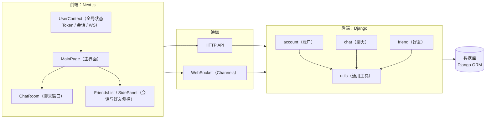
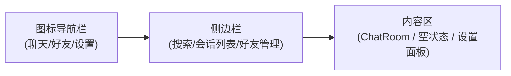

# 即时通讯系统 - 模块设计文档

## 文档概述

本文档用于说明系统的模块划分与前后端主要组件。

---

### 1.1 技术栈

**后端：**
- 框架：Django + Django Channels（WebSocket支持）
- 数据库：Django ORM
- 认证：自定义JWT Token
- 实时通信：WebSocket（Django Channels）

**前端：**
- 框架：Next.js（React）
- 状态管理：React Context API
- 样式：CSS-in-JS（styled-jsx）
- 类型：TypeScript

### 1.2 整体架构图

---

## 二、后端模块设计

### 2.1 account 模块（账户管理）

#### 2.1.1 模块职责

`account` 模块负责用户账户的生命周期管理，包括用户注册、登录、信息修改、账户注销等核心功能。

#### 2.1.2 核心数据模型

**User 模型** (`backend/account/models.py`)

- 关键字段：`username`、`avatar`、`info`、`is_active`、`created_at`（以及可选 `email/phone`）
- 约束与校验：用户名/密码/手机号等格式由后端校验器统一约束
- 生命周期：注销采用软删除（`is_active=False`），并保留 `deactivated_username` 用于历史展示

---

### 2.2 chat 模块（聊天功能）

#### 2.2.1 模块职责

`chat` 模块负责即时通讯的核心功能，包括：
- 会话（Conversation）管理（私聊和群聊）
- 消息发送、接收、编辑、撤回
- WebSocket 实时通信
- 消息历史记录查询
- 群聊管理（成员管理、权限控制）
- 消息已读状态管理
- 会话置顶和免打扰功能

#### 2.2.2 核心数据模型

- `Conversation`：`type`（私聊/群聊）、`name/avatar`（群聊信息）、`is_active`、`created_at`
- `Member`：`mute`（免打扰）、`pinned`（是否置顶）、`role`（member/admin/owner）、`is_active`
- `Message`：`type`、`content`、`reply_to`、`valid`（撤回）、已读/删除关联列表
- `PinnedConversation`：置顶排序（`pin_order`）
- `GroupAnnouncement`：群公告
- `GroupInvitation`：入群邀请（pending/approved/rejected/expired）

#### 2.2.3 实时通信

- 客户端通过 WebSocket 建立连接（token 鉴权）
- 服务端按“用户维度”组织连接与事件分发，并将会话相关事件路由到会话成员

---

### 2.3 friend 模块（好友管理）

#### 2.3.1 模块职责

`friend` 模块负责用户之间的好友关系管理，包括：
- 好友申请、同意、拒绝
- 好友删除
- 好友分组管理
- 用户搜索

#### 2.3.2 核心数据模型

- `Friendship`：好友关系（按 user_a/user_b 存一条记录）
- `Pending`：好友申请（from/to）
- `FriendGroup`：好友分组（name + user + friends）

---

### 2.4 utils 模块（工具模块）

#### 2.4.1 模块职责

`utils` 模块提供通用的工具函数和类，供其他模块复用。

#### 2.4.2 子模块说明

- `utils/jwt.py`：JWT 生成与解析（供 HTTP/WS 鉴权使用）
- `utils/network.py`：统一 JSON 响应封装（成功/失败/方法错误）
- `utils/tools.py`：请求体解析、token 读取等通用工具

---

## 三、前端模块设计

### 3.1 context 模块（状态管理）

#### 3.1.1 模块职责

`context` 模块使用 React Context API 管理全局状态，包括用户状态、会话状态、WebSocket 连接等。

#### 3.1.2 UserContext

`UserContext` 负责统一管理：
- 登录态（token/selfId 等）与用户信息缓存
- 会话列表与消息增量更新（HTTP 拉取 + WS 推送）
- WebSocket 生命周期（连接、重连、消息分发）
- 置顶/免打扰等会话偏好设置

---

### 3.2 components 模块（UI组件）

#### 3.2.1 MainPage（主页面）

**职责：**
- 应用主布局
- 左侧导航栏（聊天、好友、设置）
- 侧边栏（会话列表/好友管理/设置面板）
- 右侧内容区（聊天室/空状态）

**布局结构：**

#### 3.2.2 ChatRoom（聊天室）

**职责：**
- 显示消息列表
- 发送消息（文本、图片、音频、视频）
- 消息操作（回复、编辑、撤回、删除）
- 已读状态显示
- 历史记录搜索
- 文件上传

#### 3.2.3 FriendsList（好友/会话列表）

**职责：**
- 显示会话列表
- 会话搜索和过滤
- 显示未读消息数
- 显示置顶和免打扰状态
- 右键菜单（置顶/取消置顶、开启/关闭免打扰）

**排序规则：**
1. 置顶会话在前，按 pinOrder 排序
2. 非置顶会话在后，按最后消息时间排序

#### 3.2.4 其他组件

| 组件 | 职责 |
|------|------|
| `Avatar` | 头像显示组件，支持默认头像 |
| `Profile` | 用户资料面板 |
| `SettingsPanel` | 设置面板 |
| `SocialPanel` | 社交面板（好友管理） |
| `GroupInfoPanel` | 群聊信息面板 |
| `GroupInvitationsPanel` | 群聊邀请面板 |
| `SearchBar` | 搜索栏组件 |
