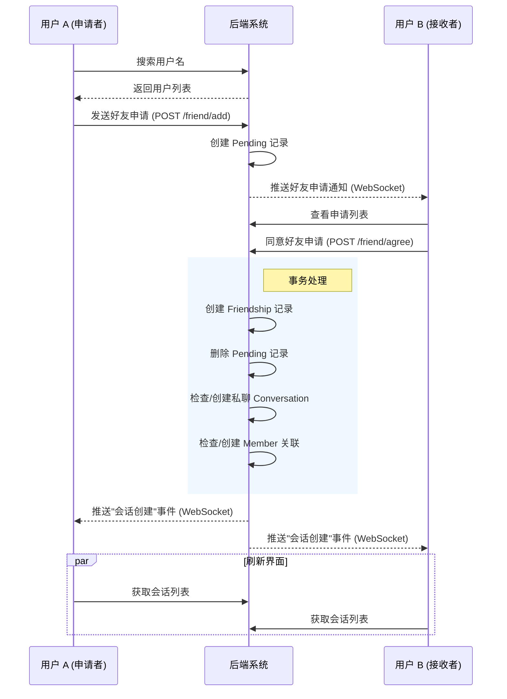
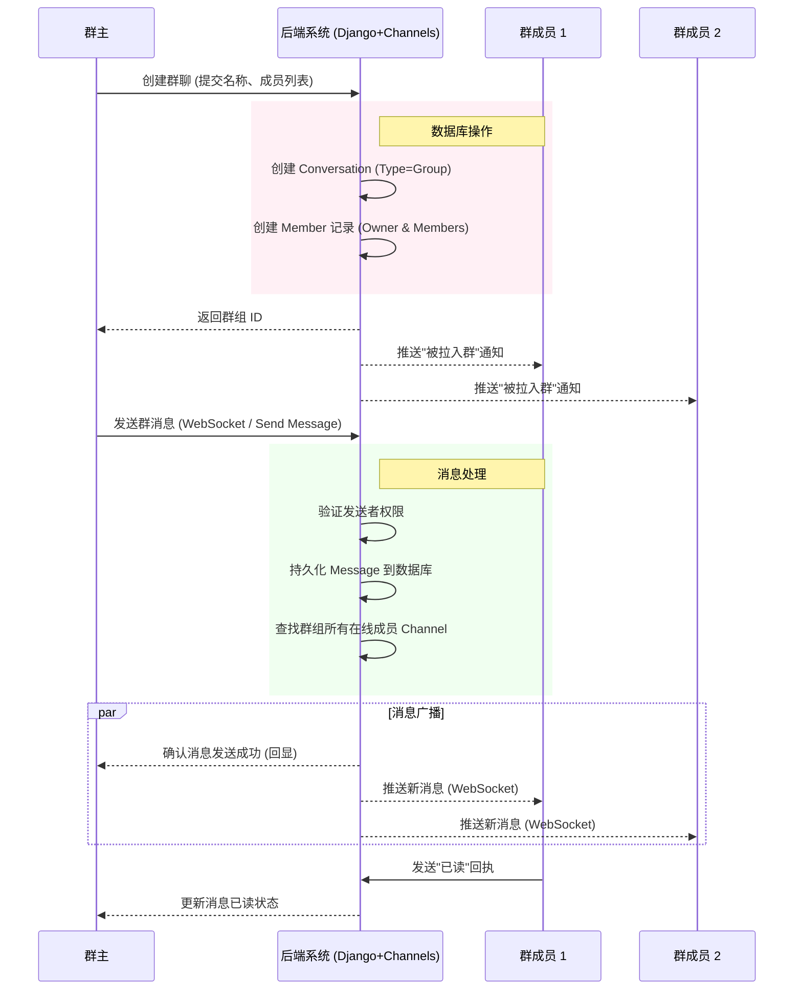

# 需求分析文档

## 1. 用户故事 (User Stories)

### 1.1 账户与个人信息管理
- **US-001**: 作为一名新用户，我希望能够通过用户名和密码注册账号，以便使用系统。
- **US-002**: 作为一名用户，我希望能够安全登录和退出系统，保护我的账户安全。
- **US-003**: 作为一名用户，我希望能够上传和修改我的头像及个人昵称，以便展示个性化信息。
- **US-004**: 作为一名用户，我希望能够查看其他用户的在线状态，以便知道谁可以即时回复。

### 1.2 好友管理
- **US-005**: 作为一名用户，我希望能够通过用户名搜索其他用户，并发送好友申请。
- **US-006**: 作为一名用户，我希望能够查看、接受或拒绝收到的好友申请。
- **US-007**: 作为一名用户，我希望能够将好友进行分组管理（如“家人”、“同事”），以便更好地组织联系人。
- **US-008**: 作为一名用户，我希望能够删除好友，解除好友关系。

### 1.3 消息通信 (单聊/群聊)
- **US-009**: 作为一名用户，我希望能够与好友进行一对一的私聊。
- **US-010**: 作为一名用户，我希望能够发送文本、图片、视频和音频消息，丰富沟通方式。
- **US-011**: 作为一名用户，我希望能够看到消息的“已读”状态，了解对方是否阅读了消息。
- **US-012**: 作为一名用户，我希望能够在发送消息后的一段时间内撤回消息，以纠正发送错误。
- **US-013**: 作为一名用户，我希望能够编辑已发送的消息内容。
- **US-014**: 作为一名用户，我希望能够引用某条特定消息进行回复，保持上下文连贯。
- **US-015**: 作为一名用户，我希望能够查看历史消息记录，支持按关键词或日期搜索。

### 1.4 会话管理
- **US-016**: 作为一名用户，我希望能够将重要的会话（单聊或群聊）置顶，以便快速访问。
- **US-017**: 作为一名用户，我希望能够设置会话免打扰，不再接收特定会话的通知提醒。

### 1.5 群组管理
- **US-018**: 作为一名用户，我希望能够创建群聊，并邀请好友加入。
- **US-019**: 作为群主，我希望能够发布群公告，重要信息置顶显示。
- **US-020**: 作为群主，我希望能够任命管理员、移除群成员或转让群主权限。
- **US-021**: 作为群主，我希望能够解散群聊；作为群成员，我希望能够主动退出群聊。

---

## 2. 系统建模与流程图

### 2.1 业务流程泳道图 (Swimlane Diagrams)

#### 2.1.1 好友添加与会话建立流程

此流程描述了用户A查找用户B，发送请求，用户B接受后系统自动创建会话的过程。

#### 2.1.2 群聊创建与消息发送流程

此流程描述了用户创建一个群组，并发送一条消息，消息如何分发给所有群成员。

## 3. 总结

RG 系统通过上述模块的协同工作，实现了一个闭环的社交与通讯生态。
1.  **前端** 负责交互体验与实时数据的展示，利用 WebSocket 保持与服务器的长连接。
2.  **后端** 负责业务逻辑校验、数据持久化以及消息的路由分发。
3.  **数据库** 存储了用户关系、会话结构及海量的历史消息。

该设计满足了用户对于即时性、可靠性和功能丰富性的需求。
